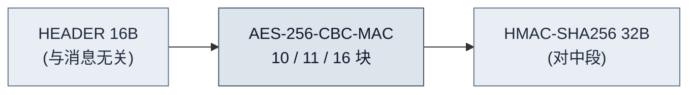
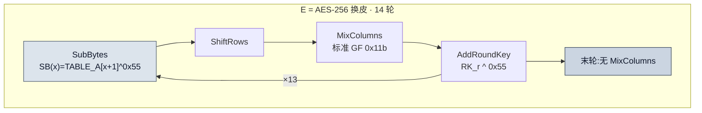
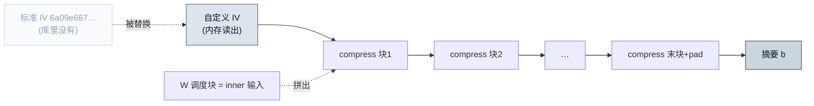
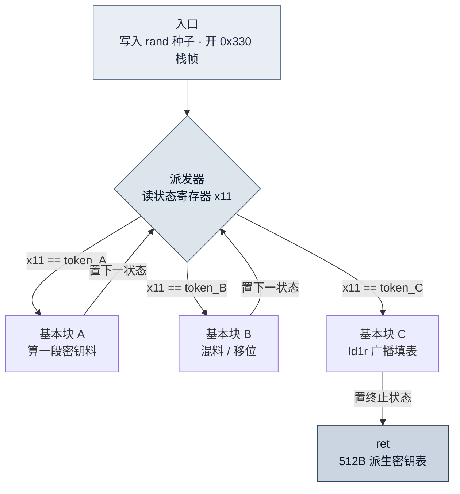

> **目标库**:`libsigner.so`(Adjust ADJSigner,安卓 arm64) · **签名参数**:`adj5`/`adj6`/`adj7`(输出 208/224/304 字节)
> **环境**:unidbg(Unicorn2 后端,才支持 hook)· capstone/lief(反汇编统计)· 自研内存写-trace · 逐字节对拍
> **脱敏说明**:结构、公式、组装步骤、工具代码、密码算法参考实现**全部给出**,可照做复刻整套分析;仅对**可直接当成品钥匙**的完整 S-box 表 / 轮密钥表 / HMAC 密钥 / 自定义 IV 做**前缀脱敏**(如 `2a4cc079…`)。仅供技术交流。

---

## 0. 目标形态

`libsigner.so` 把签名算法虚拟化成了一台**字节码 VM**。lief+capstone 直读 `.text`:

```python
import lief, capstone
from collections import Counter
sec  = [s for s in lief.parse("libsigner.so").sections if s.name == ".text"][0]
code, base = bytes(sec.content), sec.virtual_address
md   = capstone.Cs(capstone.CS_ARCH_ARM64, capstone.CS_MODE_ARM)
ins  = list(md.disasm(code, base))
bl   = Counter(int(i.op_str.lstrip("#"),16) for i in ins if i.mnemonic == "bl")
print("指令数", len(ins), " bl 调用", sum(bl.values()), " 不同 bl 目标", len(bl))
```

```text
指令数 271119   bl 调用 8676   不同 bl 目标 364
```

27 万条指令里没有可读的密码逻辑,真正干活的是**极少数被复用几千次的 helper**;逐条读没有意义。可利用的先验只有一条:

> 工业签名 = **标准密码算法 + 换常数 + 加壳混淆**,极少自研新密码。逆的目标不是那 27 万条指令,而是**认出密码结构** + **定位被换掉的那几张常数表**。

全文按能跟着做的顺序走:**搭 oracle → 黑盒定结构 → 白盒抽表 → AES14 正逆 + 逆 MSG → 内存取证攻内层 → CBC-MAC/HMAC 组装对拍**。

---

## 1. 搭一台可信 oracle

用 unidbg 把库塞进模拟器、直接调它的 native 签名入口。

**① 建 emulator、固定随机数**:

```java
AndroidEmulator emu = AndroidEmulatorBuilder.for64Bit()
        .addBackendFactory(new Unicorn2Factory(true))     // Unicorn2 后端才支持 hook
        .build();
emu.getMemory().setLibraryResolver(new AndroidResolver(23));
VM vm = emu.createDalvikVM();
Module m = vm.loadLibrary(new File("libsigner.so"), false).getModule();

// 库内部取随机数当 nonce,不固定就每次签名都不同、没法对拍 → hook rand 返回固定序列
XHookImpl.getInstance(emu).register(soName, "rand", new ReplaceCallback(){
    int i = 0;
    public void postCall(Emulator<?> e, HookContext c){
        e.getBackend().reg_write(Arm64Const.UC_ARM64_REG_W0, FIXED_RAND[i++ % N]);
    }
}, true);
```

**② 按 native ABI 组参数**。签名入口 `vm_execute` 收一串"(长度, 指针)对"结构。封装一个 helper 把 Java 字节数组塞进模拟器内存、返回该 16 字节对:

```java
// AdjustPair: 16 字节 = int64 len ‖ int64 dataPtr
AdjustPair pair(byte[] data){
    UnidbgPointer pd = null;
    long ptr = 0;
    if (data.length > 0){ MemoryBlock b = memory.malloc(data.length, true);
        pd = b.getPointer(); pd.write(data); ptr = pd.peer; }
    byte[] ap = ByteBuffer.allocate(16).order(LITTLE_ENDIAN).putLong(data.length).putLong(ptr).array();
    MemoryBlock bp = memory.malloc(16, true); bp.getPointer().write(ap);
    return new AdjustPair(bp.getPointer());
}
```

**③ 调 `vm_execute`,读回结果**。偏移由反汇编定位;9 个参数分别是上下文、apkSign、rand 表片段、rand、明文长度、排序拼接后的业务明文 `arr_plain` 等:

```java
module.callFunction(emu, off_vm_execute,
        new PointerNumber(pErr), new PointerNumber(pRes), 9,
        p560.ptr, p576_apkSign.ptr, p568.ptr, p48_randtbl.ptr, p32_rand.ptr,
        pPlainLen.ptr, pPlain.ptr, p640.ptr, p648.ptr);
// 结果结构体里是"指针的指针",逐层解引用后按小端读出 208/224/304 字节
String sig = readResult(pRes);
```

真跑一次(固定 `rand=0x12345678`),oracle 出真签名、rand 表确定:

```text
randtable(0x12345678)[0:16] = 00000001000000000000000104000000   确定性: true
SIGN = 5168D5FA18F7C46B64A45A7E7E535F92 … C362543FCD0831C   (304 字节)
```

`arr_plain` 怎么来:把 URL/body 的 kv 解码,按一张固定字典 `sOrderDct` 排序后顺次拼接(这张字典本身也是逆出来的,adj7 比 adj6 多 13 个字段,见 §7):

```java
byte[] sortMap(String kvPlain, String activityKind, String sdk){
    Map<String,String> m = new HashMap<>();
    m.put("adj_signing_id", SIGNING_ID); m.put("activity_kind", activityKind); m.put("client_sdk", sdk);
    for (String p : kvPlain.split("&")){ int e = p.indexOf('=');
        if (e > 0) m.put(p.substring(0,e), urlDecode(p.substring(e+1))); }
    StringBuilder sb = new StringBuilder();
    for (String k : sOrderDct.split(",")) if (m.containsKey(k)) sb.append(m.get(k));
    return sb.toString().getBytes(UTF_8);
}
```

有了这台 oracle,后面每一步都拿它大样本对拍:差一个字节,就是还有东西没对齐。

---

## 2. 黑盒定结构:三段式 + CBC-MAC 链

**边界扰动**先框定宏观结构。固定其余输入,循环翻转某一路输入的每个字节,记录输出哪些字节跟着动:

```python
base = oracle(body)
for i in range(len(body)):
    diff = xor(oracle(flip_byte(body, i)), base)
    print(i, first_changed_block(diff), num_changed_blocks(diff))
```

规律很清楚:

- 翻 body / apkSign 任一字节 → `sig[0:16]` **恒不变** ⇒ 头部与消息无关(HEADER);
- 被影响的最早块之后,**其后所有块连锁全变** ⇒ 前向链式反馈(CBC 型);
- 末 32 字节**只要中段任一字节变就变**、且只是中段的函数 ⇒ 对中段整体再做一层 MAC。

三段式成形:

$$
\text{sig} = \text{HEADER} \parallel \text{AES-256-CBC-MAC} \parallel \text{HMAC-SHA256}
$$

| 版本 | 总长 | HEADER | CBC-MAC 块数 | HMAC |
|---|---|---|---|---|
| adj5 | 208 | 16 | 10 | 32 |
| adj6 | 224 | 16 | 11 | 32 |
| adj7 | 304 | 16 | 16 | 32 |



CBC-MAC 递推(逐块喂"前一块 ⊕ 本块消息 ⊕ 白化常量"进 14 轮分组密码 `E`):

$$
B_0 = E(\text{HEADER} \oplus \text{INIT}), \qquad B_i = E(B_{i-1} \oplus \text{MSG}_i \oplus \text{Krk}),\quad \text{Krk} = \text{RK}[0{:}16] \oplus \mathtt{0x55}
$$

CBC-MAC 里我们能控 `MSG_i`(经 body)又能观 `B_i`(读签名),等于拿到分组密码在固定密钥下的明文/密文预言机:16 字节进出、单字节扰动两轮扩散到整块(128 位 SPN);VM 里数出 14 次轮密钥加、末轮无列混淆,就是 AES-256 轮结构。只有两处被换:S-box 换成自定义表、每个部件输出再异或单字节掩码 `0x55`。

**别急着信"它就是 AES":先用雪崩把轮数坐实。** 拿抽到表后的 `AES14`(见 §4)做逐轮扩散:只翻输入首字节 1 个比特,数每轮后有多少输出字节/比特跟基准不同。SPN 的宽轨迹性质要求"1 轮内 MixColumns 把差分铺满一列、2 轮内铺满全 16 字节":

```python
def aes14_upto(s, R):                       # 跑到第 R 轮结束
    s = ark(mc(sr(sub(s))), 0)
    if R == 0: return s
    for rnd in range(1, 13):
        s = ark(mc(sr(sub(s))), rnd)
        if rnd == R: return s
    return ark(sr(sub(s)), 13)              # 末轮无 MixColumns
base = list(range(16)); alt = base[:]; alt[0] ^= 0x01
for R in range(14):
    a, b = aes14_upto(base[:], R), aes14_upto(alt[:], R)
    print(R, sum(x!=y for x,y in zip(a,b)), sum(bin(x^y).count("1") for x,y in zip(a,b)))
```

```text
轮次  变化字节/16  变化比特/128
  0        4           17      ← 首轮 MixColumns 把差分铺满 1 列(4 字节)
  1       16           76      ← 第 2 轮铺满全 16 字节
  2..13   16        58~76      ← 此后稳定全扩散
严格雪崩(随机翻 1 比特 ×2000):末轮平均变化 64.03/128 (理想 64)
```

"0→4→16"这条扩散曲线,和 128 位 SPN 的宽轨迹完全吻合;末轮 64.03/128 命中理想雪崩点。到这一步,"14 轮 AES-256 换皮"已由扩散行为直接验证,不必再靠数轮数推断。

---

## 3. 白盒抽表:capstone 找 helper + hook `V.set`(动手)

要让 `E` 跑起来得拿到 S-box 和轮密钥。先试搜表:静态文件、运行内存快照、几百万条内存写日志里搜那张 0..255 排列,全部零命中。原因是字节代换用的是计算式 gather(逐字节算,不查连续表),状态寄存器驻留不落内存,槽位还反复复用覆盖。

破法是下沉到 VM 的**逻辑数据层**:解释器把工作数据放在逻辑 **V 向量**里,靠少数 helper 存取。第一步用上面 §0 的 bl 频次找 VM 内核 helper:

```text
0x110978 2554    0x110a94 2321     ← 最热:V 访问原语(见下,不是普通取值)
0x112730  681    0x110504  327
0x110bc8  309    0x10fe08  280     ← 下一步认出:V.set
0x1111c0  277    0x111018  252
```

**最热的 `0x110978` 是什么?** 一次签名调 2554 次,直觉是 `V.get`。反汇编却揭出更关键的机制:它每次都 `malloc` 一个 16 字节小结点、把"要访问的下标"塞进去、再挂到一条链表头上:

```text
=== 0x110978（V 访问原语,非普通取值）===
  stp  x29,x30,[sp,#-0x30]!
  mov  x20,x1 ; mov x21,x0
  mov  w0,#1  ; mov w1,#0x10               ← 申请 1×0x10 = 16 字节
  mov  w19,w2                              ← w19 = 本次访问的下标 idx
  bl   #0x112d40                           ← 分配 16B 结点
  … （CFF 派发略）…
  ldr  w14,[x20]                           ← 取当前结点计数
  str  w19,[x0]                            ← 结点[0] = idx
  ldr  x15,[x20,#8]                        ← 旧链头
  str  x0,[x20,#8]                         ← 新结点成为链头
  str  x15,[x0,#8]                         ← 结点[8] = 旧链头(next 指针)
  add  w16,w14,#1 ; str w16,[x20]          ← 计数 +1
```

**这直接解释了"为什么扫内存扫不到 S-box":** VM 不把工作数据放在一块连续数组里按下标索引,而是**每次 V 访问都新建一个 `{idx, next}` 结点串进链表**:数据被打散成几千个 16 字节堆块、访问路径是指针追逐而非数组寻址。一张 256 项的表在任何瞬间都不以连续排列存在,`memmem` 式扫描必然零命中。抽表只能靠下面的 hook + 时序重放。

**怎么认出 `V.set`?** 给候选下 `CodeHook`,进函数打参数,看第三个参数(`x2 = idx`)的动态取值范围:恰好、且仅仅覆盖 `[0, |V|)` 的那个就是它:

```java
long addr = base + 0x10fe08;
final List<long[]> log = new ArrayList<>();
final long[] seq = {0};
emu.getBackend().hook_add_new((CodeHook)(backend, address, size, u) -> {
    if (address != addr) return;
    long idx = backend.reg_read(Arm64Const.UC_ARM64_REG_X2).longValue();
    long val = backend.reg_read(Arm64Const.UC_ARM64_REG_X3).longValue();
    log.add(new long[]{ seq[0]++, idx, val });          // 记 (seq, idx, val)
}, addr, addr + 4, emu);
// 观测:idx ∈ [0,770) 恰等于 |V| ⇒ 这就是 V.set。反汇编入口 `stp w2,w3,[sp,#8]` 也佐证。
// 两版:adj7 V.set@0x10fe08 |V|=770;adj6 V.set@0x0ea424 |V|=690。
```

**顺带把 VM 内部结构也看清**(反汇编实录)。在上面"每次访问都新建结点"之外,存值路径本身又叠了一层打散:

```text
=== vm_execute @0xb6c50(变参派发器)===
  mrs  x27, tpidr_el0 ; ldr x8,[x27,#0x28]      ← 栈金丝雀
  stp  q0,q1,[sp,#0x20] … stp q6,q7,[sp,#0x80]   ← 保存 q0-q7 变参
  cbz  w2, 0xb6e18                               ← w2=argc(=9),为 0 则跳出
  （满屏 mov/movk 拼 64 位魔数 = 混淆常量池）

=== V.set @0x10fe08（存值,含计算式寻址）===
  ldr  w8,[x1,#0x14]                             ← 上下文[0x14] = |V|
  ldr  x9,[x1,#0x18]                             ← 上下文[0x18] = V 数据指针
  stp  w2,w3,[sp,#8]                             ← 暂存 (idx=w2, val=w3)
  sub  w8,w8,#1 ; ldr w8,[x9,w8,uxtw#2]          ← 取 V[|V|-1]
  add  w8,w8,w2                                  ← 用「末元素 + idx」参与散列式寻址
```

上下文结构 `{[0x14]=|V|, [0x18]=数据指针}`;`V.set` 存值前先把 `V[|V|-1]` 取出、与 `idx` 相加参与散列式寻址;加上前面的结点链,存和取两头都不按连续下标走。常数表**不以连续内存存在、内存扫描零命中**,到这里闭环了。

拿到完整写入流后,**时序重放**绕开槽位复用:按 `seq` 回放,在"目标区段刚写满、下一步就要被读消费"的边界快照 V,再按固定下标切片:

```python
V, snap = {}, None
for seq, idx, val in log:
    V[idx] = val
    if region_filled(V, 1, 257) and not snap:     # S-box 区段刚写满、尚未被覆盖
        snap = dict(V)
sbox = [snap[i] for i in range(1, 257)]           # S-box 源  head=[54,41,34,46,167,62,58,144,…](全表脱敏)
rk   = [snap[i] for i in range(257, 513)]         # 轮密钥源  256 值(脱敏)
```

两个副产品:① S-box 表在 iOS / 安卓 / adj5·6·7 之间共享(每版专属的只是轮密钥、HEADER、内层 IV、HMAC 密钥);② `INIT` 无需单独抽,由 `E⁻¹(B_0) ⊕ \text{HEADER}` 反解即可。

---

## 4. AES14 正/逆变换 + 用 E⁻¹ 逆出 MSG(动手)

抽到两张表,`AES14` 就完全确定。**正变换参考实现**(表值脱敏,下同):

```python
TABLE_A = [97, 54, 41, 34, 46, 167, 62, 58, ...]   # 257 项,脱敏
RK      = [ ... ]                                   # 256 项,脱敏
Krk     = [RK[i] ^ 0x55 for i in range(16)]

def xt(x):                        # GF(2^8) ×2, 模 0x11b
    x &= 0xff; r = (x << 1) & 0xff
    return r ^ 0x1b if (x & 0x80) else r
def m3(x):  return x ^ xt(x)      # ×3
def SB(x):  return TABLE_A[(x & 0xff) + 1] ^ 0x55  # 自定义 S-box + 掩码

def sub(s): return [SB(v) for v in s]
def sr(s):                         # 列主序 ShiftRows
    r = [0]*16
    for c in range(4):
        for row in range(4): r[c*4+row] = s[((c+row) % 4)*4 + row]
    return r
def mc(s):                         # MixColumns [2 3 1 1]
    r = [0]*16
    for c in range(4):
        a0,a1,a2,a3 = s[c*4:c*4+4]
        r[c*4]   = xt(a0) ^ m3(a1) ^ a2 ^ a3
        r[c*4+1] = a0 ^ xt(a1) ^ m3(a2) ^ a3
        r[c*4+2] = a0 ^ a1 ^ xt(a2) ^ m3(a3)
        r[c*4+3] = m3(a0) ^ a1 ^ a2 ^ xt(a3)
    return [v & 0xff for v in r]
def ark(s, rnd): return [(s[i] ^ (RK[16 + 16*rnd + i] ^ 0x55)) & 0xff for i in range(16)]

def AES14(s):
    s = ark(mc(sr(sub(s))), 0)
    for rnd in range(1, 13): s = ark(mc(sr(sub(s))), rnd)
    return ark(sr(sub(s)), 13)     # 末轮无 MixColumns
```

**逆变换**:AddRoundKey 自逆、ShiftRows→InvShiftRows、SubBytes→查 SB 的逆表、MixColumns→逆矩阵 `[14 11 13 9]`:

```python
INV = [0]*256
for x in range(256): INV[SB(x)] = x               # SB 的逆表
def gmul(a, b):                                    # GF(2^8) 乘
    p = 0
    for _ in range(8):
        if b & 1: p ^= a
        hi = a & 0x80; a = (a << 1) & 0xff
        if hi: a ^= 0x1b
        b >>= 1
    return p
def isub(s): return [INV[v] for v in s]
def isr(s):
    r = [0]*16
    for c in range(4):
        for row in range(4): r[((c+row) % 4)*4 + row] = s[c*4+row]
    return r
def imc(s):
    r = [0]*16
    for c in range(4):
        a0,a1,a2,a3 = s[c*4:c*4+4]
        r[c*4]   = gmul(a0,14)^gmul(a1,11)^gmul(a2,13)^gmul(a3,9)
        r[c*4+1] = gmul(a0,9) ^gmul(a1,14)^gmul(a2,11)^gmul(a3,13)
        r[c*4+2] = gmul(a0,13)^gmul(a1,9) ^gmul(a2,14)^gmul(a3,11)
        r[c*4+3] = gmul(a0,11)^gmul(a1,13)^gmul(a2,9) ^gmul(a3,14)
    return [v & 0xff for v in r]

def AES14_inv(b):
    s = isub(isr(ark(list(b), 13)))                # 撤末轮
    for rnd in range(12, 0, -1): s = isub(isr(imc(ark(s, rnd))))
    return isub(isr(imc(ark(s, 0))))
```

**分组密码可逆 ⇒ 反推被签消息。** 把签名中段切成 16 个块 `B_i`,逐块逆:

$$
\text{MSG}_i = \mathrm{AES14}^{-1}(B_i) \oplus B_{i-1} \oplus \text{Krk}
$$

```python
B   = [sig[16+16*i : 16+16*(i+1)] for i in range(16)]
msg = b""
for i in range(1, 16):
    p    = AES14_inv(B[i])
    msg += bytes((p[j] ^ B[i-1][j] ^ Krk[j]) & 0xff for j in range(16))
print(msg)
```

跑出来是**完全可读的结构化帧**,这是"结构 + 常数全对"的判定性证据(错一处常数,逆出来必是乱码):

```text
946018821326 ,"b": "A1954C00B6FA9855869D7D73156726C591FB48231040E3E917CBEECB8FEE2A52",
              "c": "02DCA884E69CDD233760B8FA34DD0475C3E29DB3",
              "d": "78563412",
              "e": "E3B0C44298FC1C149AFBF4C8996FB92427AE41E4649B934CA495991B7852B855" }
              尾部 00 10 10 10 … 补齐到 15 块(240B)
```

字段:`b`=内层摘要(随 body 变)、`c`=apkSign、`d`=rand 小端 hex、`e`=`SHA256("")` 常量(adj6 无)、前缀 `946018821326`=rand 派生数字。除 `b` 外的字段都是已知量或固定常量,**唯一还需现算的只剩内层摘要 `b`**。



---

## 5. 内层摘要 b:走 VM 外原生路径的自定义 IV 哈希(动手取证)

内层摘要 `b` 最硬,三条原因各废掉一种常规手段:

1. **b 的 8 个输出字完全不在 `V.set` 流里**:它走 **VM 外的原生代码路径**,§3 的 hook 抓不到(V 里只出现 `b` 的 hex 字符串结果);
2. **`.so` 里连一个 SHA-256 常数都没有**:K 表、标准 IV 全无(连 `e`=SHA256("") 都是硬编码字符串);
3. 拿标准 IV 配各种输入穷举 `b` 全不中 ⇒ 它是**自定义初始向量的非标准 SHA-256**。

代数上无从下手(SHA 前馈不可逆)。**再下沉一层到原生内存做取证**。抓手是 SHA 绕不开的两件事:H 数组(8×32bit)逐块 `H += compress(H,W)` 演化到摘要,消息调度 `W` 就是输入块。

**① 值过滤的全内存写 trace(先降噪)。** 挂全地址段 `WriteHook`,只落盘"写入值命中摘要 8 个字(含大小端反转)"的写:

```java
Set<Long> tgt = new HashSet<>();
for (long w : wordsOf(b)) { tgt.add(w & 0xffffffffL); tgt.add(Integer.reverseBytes((int)w) & 0xffffffffL); }
emu.getBackend().hook_add_new((WriteHook)(backend, address, size, value, u) -> {
    long v = value & 0xffffffffL;
    if (tgt.contains(v) || (size >= 8 && tgt.contains((value >>> 32) & 0xffffffffL)))
        record(address, size, value, seq++);   // 每条 24B: addr(8)+size(4)+value(8)+seq(4)
}, 0x1000L, 0x8_0000_0000L, emu);               // 全地址段
// 实测(adj7 EX):65,683,859 次写 → 命中 751 条(落盘 751×24 = 18024B)
```

**② 定位 H 数组**:找 `base` 使 `base+4*i` 都写过摘要字 `b[i]`(连续升序):

```python
recs  = [struct.unpack("<QIQI", dump[o:o+24]) for o in range(0, len(dump), 24)]  # addr,size,value,seq
wrote = defaultdict(set)
for addr, size, value, seq in recs: wrote[addr].add(value & 0xffffffff)
H_base = next(b0 for b0 in wrote
              if all(b[i] in wrote.get(b0 + 4*i, set()) for i in range(8)))
```

真跑后解析这 751 条,定位结果:

```text
不同被写地址 96 个;H 数组候选 base(H 本体 + 3 个复用副本):
  0x12472400   0x12477000   0x124772b8   0x124773bc
候选 0x12472400:8 个 H 字各被写 2 次;摘要 8 字在 seq≈6.83M 处依次落地(总写入 6568 万的末段)
```

这 4 个候选正是缓冲区复用的实证(同一摘要在多处副本出现);下一步靠 compress 对齐,从这堆副本里挑出真链。

**③ 区间全写 dump(memrange)**:第二次运行只挂 `[H_base-δ, H_base+32+δ)`、**不做值过滤、抓全部写**,重建每个 H 字的写入历史(8 字节写一次覆盖相邻两字,按 size 拆)。

**④ compress 逐块对齐(破缓冲区复用)。** 需要标准 SHA-256 压缩函数当判据(K 表是公开标准值):

```python
KS = [0x428a2f98, 0x71374491, 0xb5c0fbcf, ...]     # 64 个标准 SHA-256 常量
def rotr(x, n): return ((x >> n) | (x << (32-n))) & 0xffffffff
def compress(H, block):                            # 标准 SHA-256 单块压缩
    w = list(struct.unpack(">16I", block))
    for t in range(16, 64):
        s0 = rotr(w[t-15],7) ^ rotr(w[t-15],18) ^ (w[t-15] >> 3)
        s1 = rotr(w[t-2],17) ^ rotr(w[t-2],19) ^ (w[t-2] >> 10)
        w.append((w[t-16] + s0 + w[t-7] + s1) & 0xffffffff)
    a,b_,c,d,e,f,g,h = H
    for t in range(64):
        S1 = rotr(e,6) ^ rotr(e,11) ^ rotr(e,25); ch = (e & f) ^ (~e & g)
        t1 = (h + S1 + ch + KS[t] + w[t]) & 0xffffffff
        S0 = rotr(a,2) ^ rotr(a,13) ^ rotr(a,22); mj = (a & b_) ^ (a & c) ^ (b_ & c)
        t2 = (S0 + mj) & 0xffffffff
        h=g; g=f; f=e; e=(d+t1)&0xffffffff; d=c; c=b_; b_=a; a=(t1+t2)&0xffffffff
    return [(x+y) & 0xffffffff for x,y in zip(H, [a,b_,c,d,e,f,g,h])]
```

**难点是同一块 H/W 内存被 `e`、`h1`、`b` 等多个哈希轮流复用**,朴素按地址分组会串味。破法是**不信地址、只信密码学约束**:一条边成立当且仅当能在同期 `W` 写里找到 `block_k` 使 `compress(S_{k-1}, block_k) == S_k`。从"状态 == 摘要 `b`"往回走链,链首(第一块之前的 H)即自定义 IV:

```python
def walk_back(states, blocks, end):                # end = 摘要 b
    chain, cur = [end], end
    while True:
        hit = next(((prev, blk) for prev in states for blk in blocks
                    if compress(prev, blk) == cur), None)
        if hit is None: break
        prev, blk = hit; chain.append((prev, blk)); cur = prev
    return chain
custom_IV = walk_back(states, blocks, b)[-1][0]    # 链首状态,直接读出,无需破解
```

回放对齐后的 H 演化(真实数据,自定义 IV 前缀脱敏):标准 IV 库里没有,但中途冒出 `e3b0c442…`(=SHA256(""),即 MSG 的 `e` 字段),坐实**轮函数/ K 是标准 SHA-256,只有初始态被换**:

```text
标准 SHA-256 IV : 6a09e667 bb67ae85 3c6ef372 a54ff53a 510e527f 9b05688c 1f83d9ab 5be0cd19   ← 库里根本没有
自定义 IV       : 16ba6d02 ········ ········ ········ ········ ········ ········ ········   ← 内存读出(脱敏)
──────────────────────────────────────────────────────────────────────────────
H after blk 1 : dcdff02b 36f29886 2eb648f1 f8103cbb 3f9e99a4 87473b7f b168d442 7799fed2
H after blk 2 : c36d968f 487ed83a e6452b1f c3474583 b65a0b1a 0c59de9e 2061da40 c9fff11b
H after blk 3 : efe379a3 d3b4aa62 585ac806 7ada157e d0546f57 1624919e 70be267b d52fd39a
H after blk 4 : a1954c00 b6fa9855 869d7d73 156726c5 91fb4823 1040e3e9 17cbeecb 8fee2a52   ← 末块 = 摘要 b
──────────────────────────────────────────────────────────────────────────────
b = A1954C00B6FA9855869D7D73156726C5…   与第 4 节 E⁻¹ 逆出的 b 完全一致 ✓
```



**踩过的坑(实证 compress 对齐的必要性)**:一度按地址朴素分组,把某副本缓冲的几块当成 `b` 的输入,SHA 出来是另一个哈希的值 `fd73dd94…`,正因它过不了 `compress(prev,block)==next` 校验,才没被误采。

读出自定义 IV 后,换 body、换 apkSign 复算,同一个 IV 依然复现新 `b` ⇒ 与消息无关、是固定 rand 下的常量。`W` 调度块直接读成 ASCII,inner 拼法也就明确了(IV 前缀脱敏):

$$
\text{adj7: } b = \mathrm{SHA256}\big(\underbrace{\mathtt{16ba6d02\ldots}}_{\text{自定义IV}},\ \text{apkSign}\,\|\,\text{ctx560}\,\|\,\text{rand}_{LE}\,\|\,\mathrm{HEX}(\mathrm{SHA256}(""))\,\|\,\text{arr\_plain}\big)
$$

$$
\text{adj6: } b = \mathrm{SHA256}\big(\underbrace{\mathtt{f9d511f5\ldots}}_{\text{自定义IV}},\ \text{apkSign}\,\|\,\text{ctx560}\,\|\,\text{rand}_{LE}\,\|\,\text{arr\_plain}\big)\quad(\text{无 HEX}(e)\text{ 段})
$$

把对齐后的 `W` 调度块按 ASCII 打出来,inner 分段立刻清楚(块 3–4 直接读得出拼接的业务串):

```text
inner(205B) = apkSign[0:40] ‖ ctx560[40:48] ‖ rand_LE[48:52] ‖ HEX(SHA256(""))[52:116] ‖ arr_plain[116:205]
块1: 02DCA884E69CDD233760B8FA34DD0475C3E29DB3···$-···xV4·E3B0C44298FC
块2: 1C149AFBF4C8996FB92427AE41E4649B934CA495991B7852B85533l5njnrkv6a
块3: yo2.9USphoneTQ3A.230901.001.C2android1313000001sessionunity5.5.0
块4: @android5.5.0···········(0x80 + 补零 + 末 8B 大端长度 = 1640 bits)
```

**非标准 SHA-256 参考实现**(把标准 IV 换成自定义 `STATE0`,轮函数/padding 都是标准):

```python
def sha256_custom(msg, STATE0):                    # STATE0 = 自定义 IV(脱敏)
    ml = len(msg) * 8
    m  = bytearray(msg); m.append(0x80)
    while len(m) % 64 != 56: m.append(0)
    m += struct.pack(">Q", ml)                      # 标准 padding
    H = list(STATE0)
    for o in range(0, len(m), 64): H = compress(H, bytes(m[o:o+64]))
    return b"".join(struct.pack(">I", x) for x in H)
```

---

## 6. 收口:CBC-MAC 组装 + HMAC 自校验扫描 + 对拍(动手)

**① 组装 MSG + CBC-MAC**。先算 `b`,填进 MSG 帧、pad 到整块,再跑 CBC-MAC:

```python
b   = sha256_custom(apk + ctx560 + rand_le + HEX_E + arr_plain, STATE0)
msg = NUM_PREFIX + b' ,"b": "' + b.hex().upper().encode() + b'","c": "' + apk \
    + b'","d": "' + rand_le.hex().encode() + b'","e": "' + HEX_E + b'" }'
msg += bytes([0x00] + [0x10] * (240 - len(msg) - 1))          # pad 到 15 块(adj7)

B  = [None]*16
B[0] = AES14([HEADER[i] ^ INIT[i] for i in range(16)])        # B0 = E(HEADER ⊕ INIT)
for i in range(1, 16):
    x = [(B[i-1][j] ^ msg[16*(i-1)+j] ^ Krk[j]) & 0xff for j in range(16)]
    B[i] = AES14(x)                                           # Bi = E(B_{i-1} ⊕ MSG_i ⊕ Krk)
gh = bytes(sum(B, []))                                        # 中段 256 字节
```

**② HMAC 密钥的自校验扫描。** 末 32 字节 `= HMAC-SHA256(K, sig[16:n])`,`K` 未知。不猜:HMAC 内部把密钥异或 `ipad`/`opad`,实测 V 向量里存的正是 `K ⊕ ipad`。遍历 V 的每个 32 字节窗口,以它为密钥料算 HMAC,拿签名末段当判据,命中即得:

```python
def hmac_try(window, msg):                # window = 疑似 K ⊕ ipad
    K = bytes(x ^ 0x36 for x in window)   # 还原 K
    return hmac.new(K, msg, hashlib.sha256).digest()
for w in windows(V, 32):
    if hmac_try(w, gh) == sig[-32:]:
        HMAC_K = bytes(x ^ 0x36 for x in w); break            # 命中,无暴力空间
tail = hmac.new(HMAC_K, gh, hashlib.sha256).digest()
signature = HEADER + gh + tail                                # 拼齐 304 字节
```

**③ 对拍。** 全部常数到齐,接 oracle 大样本逐字节比对:差一字节就是还有常数没对齐。

```text
=== 纯算法 vs unidbg oracle 逐字节对拍 ===
adj6  EX  224/224  ✓        adj7  EX  304/304  ✓
```

| 版本 | 覆盖 | 结果 |
|---|---|---|
| adj5 | 60 组 · 多 nonce/body | ✅ 208/208 |
| adj6 | apkSign/body/GET·POST/多 path | ✅ 224/224 |
| adj7 | apkSign/body/GET·POST/多 path | ✅ 304/304 |

三版全部逐字节精确,签名算法逆清楚。

---

## 7. 三版差异:adj6/adj7 多出来的两层

| 版本 | 输出 | 轮密钥来源 | 内层 b 的 IV | inner 组成 | 难点增量 |
|---|---|---|---|---|---|
| adj5 | 208 B | **固定表** | 固定自定义 IV | 无 HEX(e) | gather 编码常数表 |
| adj6 | 224 B | **rand 派生** | 自定义 IV `f9d511f5…` | 无 HEX(e) | + 原生路径哈希 |
| adj7 | 304 B | **rand 派生** | 自定义 IV `16ba6d02…` | 带 HEX(e) | + 字段字典扩展 |

adj5 轮密钥是固定表;adj6/adj7 升级成 per-签名 rand 派生密钥调度:4 字节 `rand` 经一个生成器扩成一大块密钥料,轮密钥 / HEADER / 内层 IV 全由它派生,`rand` 嵌进签名 `"d"` 字段供服务端重建密钥验签。

**这个生成器 `f_create_rand_table` 是全库最硬的一块混淆。** 反汇编统计:入口 `0x107b34`、单函数 541 条指令 / ~2.1KB,栈帧开到 `0x330`(816 字节,正好容下 512 字节派生表 + 工作区),里面 180 条 `movk`、46 条 SIMD、**0 条 `eor`**。特征极清楚,控制流平坦化(CFF):把线性的密钥扩展拆成一堆基本块,用一个状态寄存器 `x11` 和满屏 64 位魔数 token 做派发;真正的混料靠 SIMD `ld1r` 广播完成:

```text
=== f_create_rand_table @0x107b34（CFF 密钥调度生成器,节选）===
  stp  x29,x30,[sp,#-0x60]! … sub sp,sp,#0x330   ← 816B 栈帧(容 512B 派生表)
  str  w1,[x9],#0x10                              ← w1 = rand 种子写入表头
  bl   #0x102858                                  ← 初始化子过程
  … 一大片 mov/movk 拼 64 位 token（CFF 状态常量池,180 条 movk）…
--- 派发骨架(状态机核心)---
  cmp  x11, x26                                   ← x11 = 当前状态
  b.le #0x107e74
  mov  x8,#0xdafc ; movk x8,#0x41b1,lsl#16
  movk x8,#0x8084,lsl#32 ; movk x8,#0xf615,lsl#48 ← 拼下一个状态 token
  cmp  x11, x8
  b.eq #0x1081b8                                  ← 命中 → 跳该状态的基本块
--- 填表(SIMD 广播)---
  ld1r {v0.2d},[x9]                               ← 从密钥料广播
  str  q0,[sp,#0x80]                              ← 落到派生表
```

平坦化后的控制流长这样:一个派发器循环,每个基本块干完活只负责"置下一个状态 token"再跳回派发器,直到终止态才落表返回:



`mov/movk/cmp/b.eq` 的比例(180 : 31 : ...)就是 CFF 指纹:线性算法被拆成十几个基本块、用状态 token 首尾相连,逐条静态读几乎无法还原它到底怎么把 4 字节种子铺成 512 字节。**但没必要硬刚它。** 密钥调度是 `rand` 的确定函数,而 `rand` 已被我们固定成 `0x12345678`,那就让它在 oracle 里真跑一遍,把生成器**吐出来的派生量直接从 V 向量里读走**,与 §3 抽 S-box/轮密钥是同一套 hook。固定 `rand` 下,下游派生量全部落定:

| 派生量 | 尺寸 | adj6 vs adj7 | 去向 |
|---|---|---|---|
| 轮密钥 RK | 256 B | **不同**(各版专属) | AES14 的 14 组轮密钥 + `Krk` |
| HEADER | 16 B | 不同 | 签名头 16 字节 |
| CBC 初值 INIT | 16 B | 不同 | `B_0 = E(HEADER ⊕ INIT)` |
| 内层哈希 IV | 32 B | 不同(`f9d511f5…` / `16ba6d02…`) | §5 的自定义 SHA-256 初始态 |
| HMAC 密钥 | 32 B | 不同 | 末段 HMAC-SHA256 |
| S-box `TABLE_A` | 257 项 | **相同**(iOS/安卓/各版共享) | 唯一跨版不变的常数表 |

于是"逆密钥调度"被降级成"读一次派生表":CFF 挡得住静态反汇编,挡不住"固定输入 + 动态取值"。**换 body/apkSign 复算,这些派生量恒不变 ⇒ 它们只是固定 `rand` 下的常量**,把它们连同 S-box 一起写死进纯算法即可。真要做通用 `rand`(任意 nonce)才需回头啃 CFF,那是另一条战线。

**adj6 与 adj7 是不是同一套密钥调度?** 两版分属不同宿主 App、各带一份 `libsigner.so`,`f_create_rand_table` 偏移都不一样(adj7 `0x107b34` / adj6 `0xe8aa4`)。但把两个函数的静态指纹并排一放,除了 adj6 少几个基本块,常量池、栈帧、指令构成几乎逐项对齐:

| 静态指纹 | adj6(`0xe8aa4`) | adj7(`0x107b34`) |
|---|---|---|
| 栈帧 `sub sp` | **`0x330`** | **`0x330`** |
| `movk` 常量池 | **180** | **180** |
| `cmp` / `b.eq`(CFF 派发) | 31 / 10 | 31 / 11 |
| SIMD(`ld1r`/`q` 填表) | 43 | 46 |
| `eor` | **0** | **0** |
| 函数规模 | 495 指令 / 1980 B | 541 指令 / 2164 B |
| 所在 `.text` 总指令 | 233,495 | 271,119 |

同样 816 字节栈帧、同样 180 条 `movk` 常量池、同样 0 条 `eor`,"adj6/adj7 复用同一套 CFF 密钥调度、只是随版本重排了几个基本块"已由三项静态指纹逐一坐实。所以对 adj6 走完全相同的绕行:定位它的 V.set(`0xea424`,`|V|=690`,比 adj7 的 770 少 80 槽)、固定 `rand` 抽出它专属的 RK / IV / HMAC 密钥,同一套代码换套常数即可。

一个隐蔽坑:adj7 的参数排序字典 `sOrderDct` 比 adj5 悄悄多了 13 个字段(`ff_*`/`odm_*`/`store_*`/`seq`/`order_id` 等),用旧字典会在含这些 key 的 body 上"偶尔"出错,不做逐字节大样本对拍很难暴露。

---

## 8. 方法论小结

**核心一条:抓不到,就往下沉一层。**

| 层 | 抓什么 | 手段(对应本文动手环节) |
|---|---|---|
| 黑盒 I/O | 宏观结构、CBC 链、AES 轮数 | oracle + 边界扰动 + 逐轮 I/O 差分(§1·§2) |
| VM 逻辑层(V 向量) | S-box、轮密钥、HMAC 密钥 | capstone 找 helper + `V.set` hook + 时序重放(§3) |
| 密码结构可逆 | 被签消息 MSG | `AES14⁻¹` 逆推(§4) |
| 原生内存层(V 外) | 内层哈希的自定义 IV 与 inner | 值过滤 `WriteHook` + memrange + `compress` 逐块对齐(§5) |
| 判据 | 一切结论 | 大样本逐字节对拍(贯穿) |

要点:密码结构可逆就用来反推明文;常数别硬猜、能从 helper 流或内存历史**读出来**就读出来;缓冲区复用不靠地址靠密码学约束认链;自定义 IV 不破解、直接取"摘要前的状态"。
