root 环境下，`com.xxx.finance`(某ID的 bank类App) 打开就白屏卡死随后闪退。简单记录下逆向分析过程: 梆梆加固查了什么、查到之后会做什么、怎么一层层把它压住让 App 运行起来，最后怎么把加密的业务 dex 从内存里 dump 出来。

## 先看崩溃性质

root环境一启动就白屏，几十秒后退回桌面。`logcat -b crash` 抓崩溃现场，:

```
signal 11 (SIGSEGV)， code 1 (SEGV_MAPERR)， fault addr 0x00000000000001f4
Cause: null pointer dereference
    sp  0000000000000000  lr  0000000000000000  pc  00000000000001f4
backtrace:
  #00 pc 00000000000001f4  <unknown>
  #01 pc 0000000000000000  <unknown>
```

`Cause` 那行写着 "null pointer dereference"。普通野指针崩溃，`pc` 会落在某个真实的 `.so` 里，回溯能还原几帧调用栈。这里不一样:`pc` 落在 `0x1f4`(= 500，比任何合法映射都小得多)，控制流明显被劫持跳飞了;`backtrace` 只有两帧还全空，是 `lr` 被清 0、栈根本回溯不出来;`fault addr` 又正好等于 `pc`，说明它直接执行到了这个非法低地址。这大概率是加固壳主动自毁，`sp=0` 不是崩溃的副作用，是加固壳主动清的;回溯打空是反分析的结果。低地址具体是 `0x1f4` 还是 `0x61c`、`0x79c`，不同自毁点会变。

## 分析特征

这次案例中梆梆防护由三块组成:

```
lib/arm64/libDexHelper.so                       ← 梆梆脱壳/加载核心(本文主角)
assets/classes.dve                              ← 梆梆加密的 App dex("dve" 大概是 dex 变体)
assets/meta-data/{manifest.mf，rsa.pub，rsa.sig}  ← 用于验签
```

`libDexHelper.so` 里明文串带 `classes.dve`、`art::DexFile::OpenMemory`、`XZ-compressed data is corrupt`、`assets/meta-data/rsa.sig` 这些脱壳器专属特征。`AndroidManifest` 的 Application/入口 Activity 指向 `com.byb.splash.activity.SplashActivity`，包名 `com.bnc.finance`，业务类却在 `com.byb.*`。

## 它只加密了自己的代码

把 APK 里的 `classes.dex` 拿出来，纯静态数一遍 `class_def`:3358 个，清一色 `androidx/*`、`com.google.*`、`com.alibaba.*`、`okhttp3` 这些框架和库，`com/byb`、`com/bnc` 的业务类**一个都没有**。

也就是说框架层是明文的，梆梆只把 App 自研的 `com.byb.*` 抽出来加密进了 `classes.dve`。这对分析很关键:**在 `classes.dex` 里翻不到业务逻辑，不是你找错了，是它压根不在这**，得脱壳才拿得到。反过来说，这也是选择性加固给分析者留的口子，想抓框架层的 hook 点，根本不用脱壳，明文就能逆;只有要动业务自身逻辑时才非脱不可。

## 从"梆梆怎么嵌进 App"到"密文怎么变成内存里的 dex"

先看它怎么在进程里落脚。libDexHelper 的初始化分三级:

```
.init_array(1 个构造器 @0xf8b0)
   └─ 预解码一张 base64 表:mMainThread / android.app.ActivityThread /
      android.app.LoadedApk / mApplication / mProviderMap / mLocalProvider …
JNI_OnLoad(@0x14ef8)
   └─ inline 扫 /proc/self/maps、定位 libc、铺 syscall 指针表(见检测面那节)
      └─ sub_1D3F4(29.8KB "反篡改主调度器"，总编排)
```

那张 base64 表里，`ActivityThread`/`LoadedApk`/`mApplication`/`mProviderMap` 正是**反射接管 App 的 `Application`/`ContentProvider` 创建**要用的字段，梆梆靠反射把自己嵌进启动流程，在真 `Application` 跑起来前先接管。顺便，这也是**第二套串混淆**:框架反射名用 base64 藏，检测串则用 XOR(0xAC)(见检测面那节)。

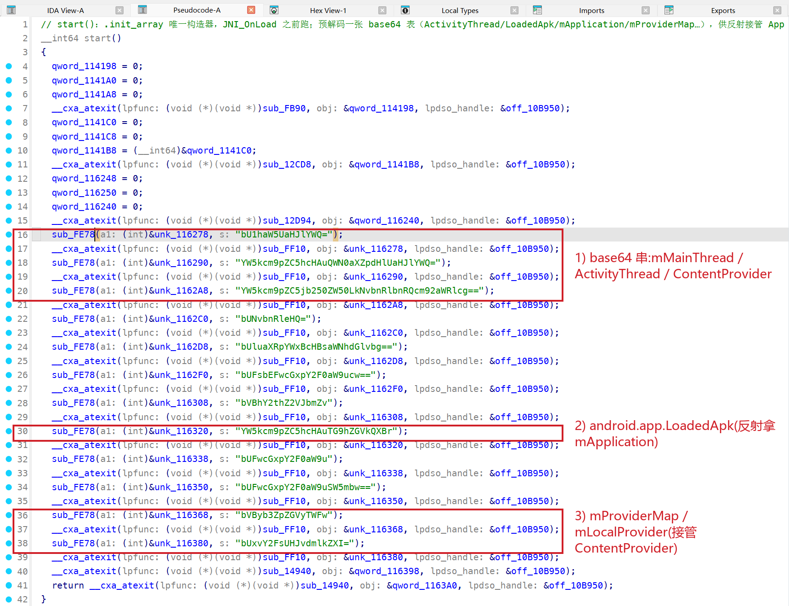

`sub_1D3F4` 是真正的总编排，**解密 dex、加载 dex、反篡改自毁全在这一个 29.8KB 的函数里**(它调解密器 `sub_355BC`、调 OpenMemory 桥 `sub_FBA8`，自己又引用 ptrace ×3、内嵌自毁序列)。dex 落地的完整流水线:

| 阶段 | 处理 | 函数 / 落点 | 判据(串 / 资产) |
|---|---|---|---|
| 输入 | `classes.dve`(密文)+ 验签资产 | — | `assets/meta-data/{manifest.mf， rsa.pub， rsa.sig}` |
| 1 验签 | RSA 校验 manifest，防替换 | — | `rsa.pub` / `rsa.sig` |
| 2 解密 | 自定义 SIMD 分组密码解密 | `sub_355BC` | 无标准 crypto 库、仅 zlib `crc32` |
| 3 解压 | 静态内嵌 XZ/LZMA 解压 + 校验 | 内嵌(无 liblzma 导入) | `XZ-compressed data is corrupt` / `Restored data doesn't match checksum` |
| 4 落地 | dlsym 未导出符号，把内存 buffer 交给 ART | `sub_FBA8` | `art::DexFile::OpenMemory(base， size， "Anonymous-DexFile"， …)` |

`sub_FBA8` 我叫它"OpenMemory 桥":它不 link ART，而是 **dlsym 未导出的 `art::DexFile::OpenMemory`**，按 ART 版本挑不同签名分支(so 里躺着好几个 `OpenMemory` 的 mangled 名)，最后拿假 location 串 `Anonymous-DexFile` 把内存 dex 送进 ART。

解密算法(`sub_355BC`)是一大段内联 SIMD、不调任何标准 crypto 库(细节见上表)。诚实边界:本文靠运行时 dump 拿明文 dex(见脱壳那节)，**没有把这段 SIMD 密码 + key 派生逆到能离线解密**，想纯静态完整脱壳，那段还得单独啃，不在本文范围。

这条链末尾还有一个反脱壳机关:ART 拿到的是 native heap 缓冲、**就地(in-place)用**，不 copy 到标准 `[anon:dalvik-DEX data]` 区。为什么这让常规脱壳工具集体失灵，留到脱壳那节。

## 检测面:它到底在查什么

要绕过一只壳，得先知道它查什么。但在定位任何一个检测点之前，得先过两道反静态门槛。

### 先过两道反静态门槛

**第一道，`.text` 里撒垃圾字节。** capstone 线性反汇编撞到非法指令就停，一次 pass 只覆盖到第一段。直接扫 `/proc/self/maps` 的引用点会得 **0 个**，不是没有，是反汇编撞上第一颗垃圾字节就断了。改成"每 4 字节 try 一条、失败就跳过"的容错扫描，引用点就变成 **10 个**。

**第二道，检测串 XOR(key=0xAC) 加密。** 明文串(`MAGISK`/`ptrace`/`crc32`)在 `.rodata` 里 `strings` 得出来，但代码对它们**零直接 `adrp+add` 引用**，真正用的是加密 blob，运行时才解。解密循环在 cmdline 检查那段(`0x23f94` 附近)实锤，一次解 16 字节:

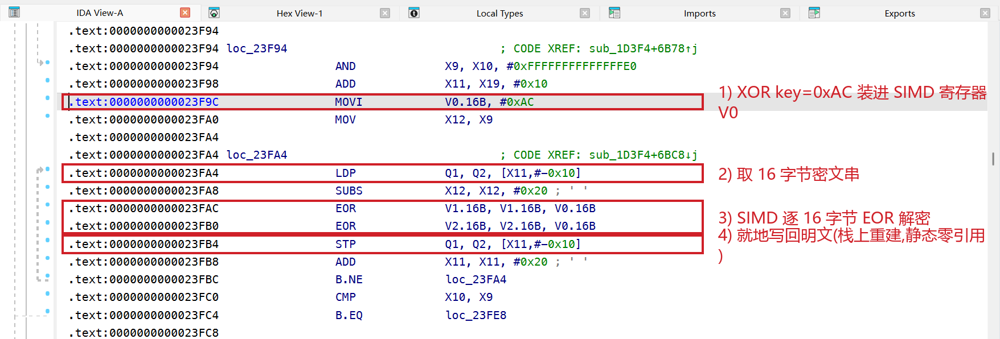

所以对梆梆这种壳，`strings | grep -i magisk` 出来的东西八成是诱饵。要找的是**解密循环 + 加密 blob**组合。

### 反调试:一个请求码就能触发自毁

`sub_12FA4` 是个 ptrace 反调试薄壳，但它把检测和处置合在了一处:

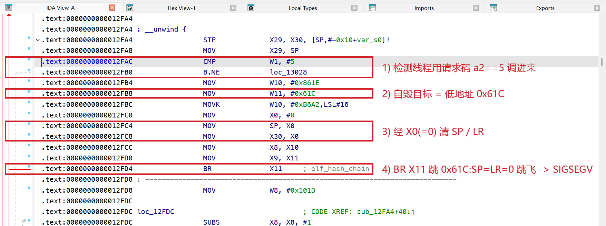

反篡改线程判定环境有问题后，不需要另调什么"自杀函数"，直接拿**请求码 5** 调这个薄壳就地引爆:清 SP、清 LR、`BR` 到低地址 `0x61C`，一次 `pc` 落在 `0x61C`、回溯打空的 SIGSEGV。魔数 `0xB6A2` 也在这儿露了个头(自毁点那节会讲为什么它是个陷阱、不能拿来当自毁判据)。请求码不是 5 的正常调用，则转到下面那条经指针表间接调 ptrace 的路(见本节最后)。动态里还能看到它 `open("/proc/self/cmdline")`、`open("/proc/self/exe")`，确认自己是以预期包名在跑，防重打包、防壳外调试。

### 扫自己:找注入库，顺手把 libc 基址拿到手

`/proc/self/maps`(@0xdcc15)在这份 so 里被引用了 **10 处**。核心是 `sub_AF28C`，它干的事比"扫 maps"多一层:

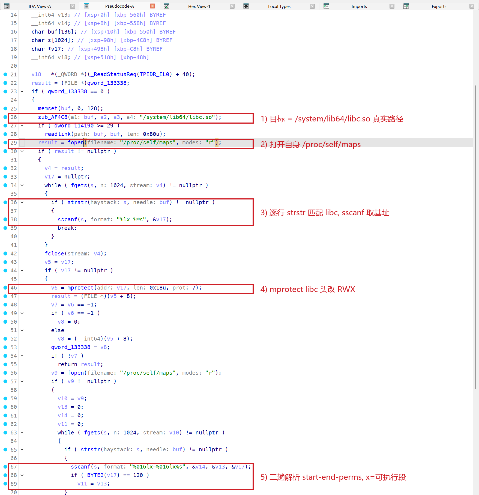

一是遍历全部映射，比对有没有注入库、异常段;二是解析出 `/system/lib64/libc.so` 的基址，`mprotect` 一段成 RWX，把结果缓存在 `qword_133338`。这个缓存后面供给 syscall 指针表(本节最后)。动态确证:`fopen("/proc/self/maps")` 反复出现，初始化窗口里就 ×3。

### 扫别人:遍历全系统进程抓 frida

光扫自己不够，它还挨个翻别的进程:

- **`/proc/%d/maps`(`0x35828`，另有 `0x3bbc0`/`0x6b9a8`)**:枚举 PID → `snprintf("/proc/%d/maps"，pid)` → `fopen` → 逐行找 frida-server / 注入 gadget / tracer 的特征段，还会拿存好的进程名逐字节过滤。
- **`/proc/%d/fd`(`0x3678c`)+ `/proc/%d/fd/%d`(`0x3681c`)**:`opendir` → `readdir` → 对每个 fd `readlink`，靠"某进程打开了哪些文件/socket"抓 frida(frida-server 那个 unix socket 很显眼)。动态里对它自己的 fd 也能看到 `readlink("/proc/self/fd/89")` ×14。

这两条在启动初始化那一小段窗口里不一定跑满，但静态引用摆在那，是常驻能力。

### 还有三处:挂载表扫 root、dl_iterate_phdr、socket 探测

顺着导入表往下摸，还有三条也接了线，跟 ptrace 一样走 `0x10fXXX` 指针表间接调(`getmntent`@0x10fb18、`dl_iterate_phdr`@0x10f670、`sendto`@0x10f818)，不是死代码:

- **`setmntent`/`getmntent` 扫挂载表**，就在 `JNI_OnLoad` 里(`0x193b0`)。挂载路径串是栈上逐字节 XOR 重建的(和别的检测串一套)，`setmntent` 打开后 `getmntent` 逐项读挂载记录(取 mntent 结构偏移 `0x28` 处)，结果 `write` 进一个 pipe 交给另一个进程判定;紧挨着还夹了几条直接 `svc 0` 的 syscall(`x8=0xAC` 即 getpid 等)，不走 libc。用途是找 su/magisk/overlay/tmpfs 这类 root 与注入框架留下的挂载痕迹，和前面"扫 maps"互补，一个看内存映射、一个看文件系统挂载。
- **`dl_iterate_phdr`**，枚举已加载 ELF 的第二条路，不读 `/proc/self/maps`，直接走链接器的 `dl_phdr_info` 回调。把 maps 那条堵了，这条还在。
- **socket 探测(`connect`/`sendto`/`recvfrom`)**，`0x4e2f0` 一带的一个函数:`connect` 一个运行时构造的 `sockaddr_in`(端口是运行时算出来的，静态定不下来)，发一行 `%s\r\n` 文本，`usleep(100)` 后 `recvfrom` 读回 **6 字节**，再和解密出的 needle 逐字节比。这个"发一行、读 6 字节应答、比签名"的形状是**探测某个监听服务**(典型如 frida-server 默认端口、或本地代理/调试服务)，不是大流量的数据回传。报文格式和目标端口我没进一步坐实，只到"形状"这一层。

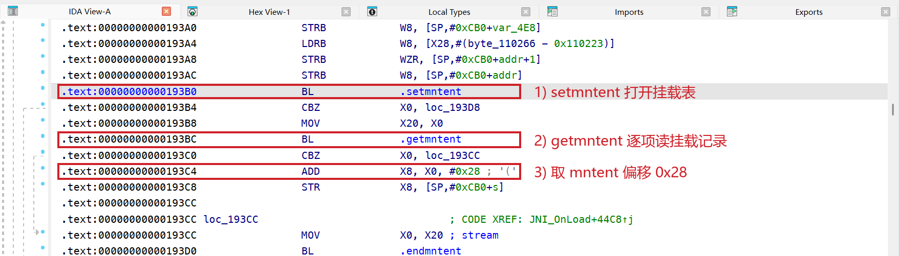

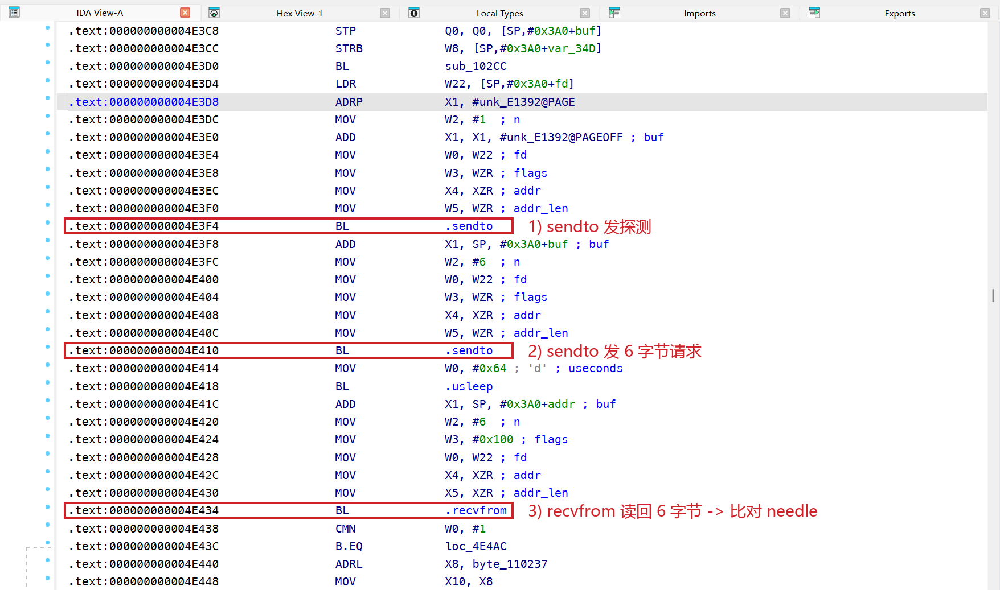

### 完整性:CRC 自校验 + inotify 自监视

- **CRC32 自校验**:`.rodata` 有 `crc32`/`get_crc_table`(zlib 那套)，经指针表调，对自身代码和资源算 CRC 跟内置值比。动态里反复 `stat`/`open` 自己的 `base.apk`/`split_config.apk`/`base.vdex`/`base.odex`/`base.art`/`libDexHelper.so`，走的就是这一路。
- **inotify 自监视**(`0xab0e0` 那张事件名表):`ATTRIB`/`CLOSE_WRITE`/`DELETE_SELF`/`MOVE_SELF` 一整套，盯着自己的 `.so`/`apk`/`dex` 有没有被删被改。这条对脱壳落地时**尤其要留意**，往磁盘落 dump 时可能正好触发它。

### syscall 走指针表:PLT/inline hook 从根上失效

前面几处都提到"经指针表调"。这是梆梆反 hook 的底座，也最难绕过:关键 syscall(ptrace 这些)不 `bl` libc 的 PLT，而是:

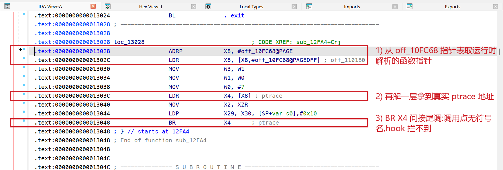

表里的项是运行时用前面 `sub_AF28C` 拿到的 libc 基址填进去的。调用点看不到任何符号名，PLT 桩和 inline hook 都落不下去。这条我动态反证过:hook 了 libc 的 `ptrace` 导出，进程从启动到自毁全程**零命中**，它根本不碰 libc 的 `ptrace`。反过来这也说明，对付它得在更底层动手(seccomp 拦 syscall 入口)，这是后面绕过思路的来源。

### 环境指纹(动态补出来的一把)

这些静态也在，但动态跑一遍更全:

- `getprop("debug.atrace.tags.enableflags")`、`debug.atrace.app_number`、`heapprofd.enable` → atrace + Perfetto/heapprofd 检测。
- `getprop("hw_sc.anco.enable")` → 华为 anco 云手机/容器检测。
- `access("/system/lib/libdvm.so")`/`libart.so`、`getprop("persist.sys.dalvik.vm.lib")` → Dalvik/ART 运行时判定。
- `prctl(PR_SET_VMA)` ×154(给匿名区命名，包括后面藏 dex 的那块缓冲)、`prctl(PR_GET_DUMPABLE)` → 反 dump。

检测手法五花八门，处置却收口，全汇到同一个自毁原语。下面拆它。

## 自毁点:字节指纹与随 build 变的编码

检测面那节反调试那张图里，前面已经在 `sub_12FA4` 见过自毁模板了(`a2==5` 那条)。这里把它当"自毁"正面拆:字节指纹、系统性，以及"别照抄偏移"这一点。伪代码如下:

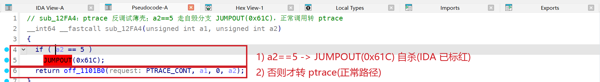

`if (a2 == 5) JUMPOUT(0x61C);`，`0x61C` 是个小于 `0x1000` 的低地址，落在第 0 页，正常没映射，跳过去就是 SIGSEGV。反汇编看得更透，同款自毁在 `sub_567E0` 里是这么一串:

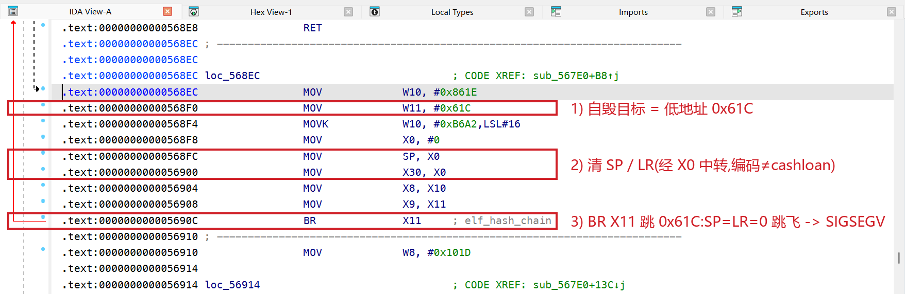

拆开就是:清 SP、清 LR、`BR` 到低地址。对照先判性质那节的 tombstone 完全吻合，`BR` 到 `0x1f4`/`0x61c` 给出 `pc`，`MOV SP，X0`(X0=0)给出 `sp=0`，`MOV X30，X0` 给出 `lr=0`。达到的就是既崩、又让工具还原不出栈的效果。

这套序列有个字节级不变量，可以当指纹:

```
MOV X0， #0     = 0xD2800000
MOV SP， X0     = 0x9100001F
MOV X30， X0    = 0xAA0003FE
```

三条连着的 `D2800000 9100001F AA0003FE` 紧跟一条 `BR Xn`，正常编译代码里不会出现(谁会先把 X0 清零、再拿它同时盖掉 SP 和 LR)，是很可靠的定位锚。它也不是孤例，反篡改主调度器 `sub_1D3F4`(约 29.8KB，内部引用 ptrace 三次)里，同款序列逐字节一致:

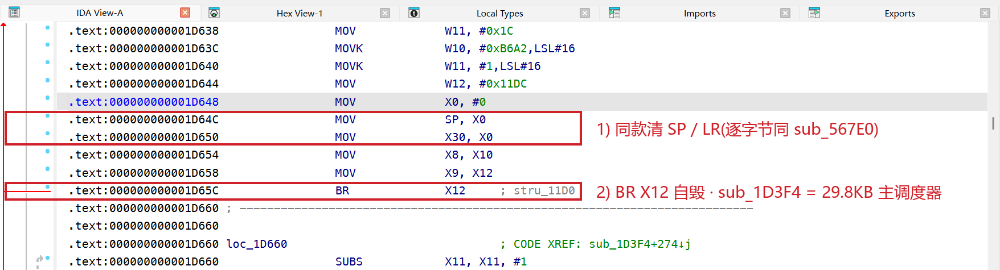

**自毁序列的编码会随 build 变**，这点尤其要注意。最典型的是清 SP/LR 这两条，梆梆有两种写法，一种直接拿零寄存器 `mov sp， xzr`(`0x910003ff`)/`mov lr， xzr`(`0xaa1f03fe`)，另一种经 X0 中转 `mov sp， x0`(`0x9100001f`)/`mov x30， x0`(`0xaa0003fe`)，这份样本走的是后一种，两种字节完全不同。所以拿一份现成的自毁签名 scanner 来扫，很可能一条都命中不了;偏移就更别提了，不同 build 同一偏移指向完全不同的函数，照搬只会认错地方。**判自毁点只能对着手上这份 so、锚整段序列重新逆一遍。**

把两种清 SP/LR 编码都纳入识别后再扫，全 `.text` 里 486 个 `br xN`，只命中 5 个自杀点，`sub_12FA4`/`sub_1304C`/`sub_1D3F4`(×2)/`sub_567E0`，零误伤。

同一个加固厂、不同 App、不同壳版本，检测点和自毁编码都会变，别人的偏移和签名只能当参考，手上这份 so 一定得自己重新逆一遍。另外，上面序列里那个 `MOVK #0xB6A2` 看着像自毁标记，其实是梆梆遍布全 so(60+ 处)的通用魔数哨兵，很多普通业务代码也用它:

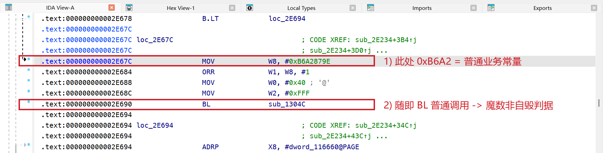

拿 `0xB6A2` 单独当判据，会大面积误伤。

## 破局:把自毁一层层压住

### 先冻看门狗，再冻 main

有了自毁点，最直觉的绕法是"把进程冻住再 dump"。但直接 `kill -STOP` 冻住 main，**300 毫秒内 main 就被 SIGKILL**。冻住的进程自己跑不了代码，那必然是**外部进程**在反制。查一下进程结构:

```
PID    PPID   NAME               THREADS
24942  311    com.bnc.finance    107   ← main(zygote 子)
24998  24942  com.bnc.finance    1     ← 看门狗子进程
25003  24942  com.bnc.finance    2     ← 看门狗子进程
```

main fork 出两个看门狗子进程盯着它，main 一被冻/被改，看门狗就 SIGKILL 它。顺序反过来就行:

```sh
# 先冻两个看门狗(它们冻住就没法反制)
for pid in $WATCHDOGS; do kill -STOP $pid; done
# 再冻 main(此时 main 冻住也没法再 fork 新看门狗)
kill -STOP $MAIN
```

三进程全 `State: T (stopped)`、main 存活。有序 SIGSTOP 破多进程守护，是对付多进程自守的通用手法。

### 自毁会升级，所以得按"终止原语类"兜底

把自毁的 `BR` 源头 NOP 掉之后，梆梆会换一种自毁方式;每压一层，它就升一级:

```
检测命中(反篡改线程)
  ├─ 变种 1  清 SP/LR + BR 0x79c(页内对齐)     → SIGSEGV
  │         被页0 retstub 压掉:0x79c 落在页0，填满 RET 就无害
  ├─ 变种 2  BR 非对齐地址 0x1(顺手把 lr 也毒成 1) → SIGBUS(BUS_ADRALN)
  │         专门绕页0 retstub(RET 只在对齐地址有效)，还废掉"PC=LR 干净返回"
  └─ 变种 3  __stack_chk_fail → abort            → SIGABRT(在 worker 线程)
            栈金丝雀失败，seccomp 得拦 kill 家族
```

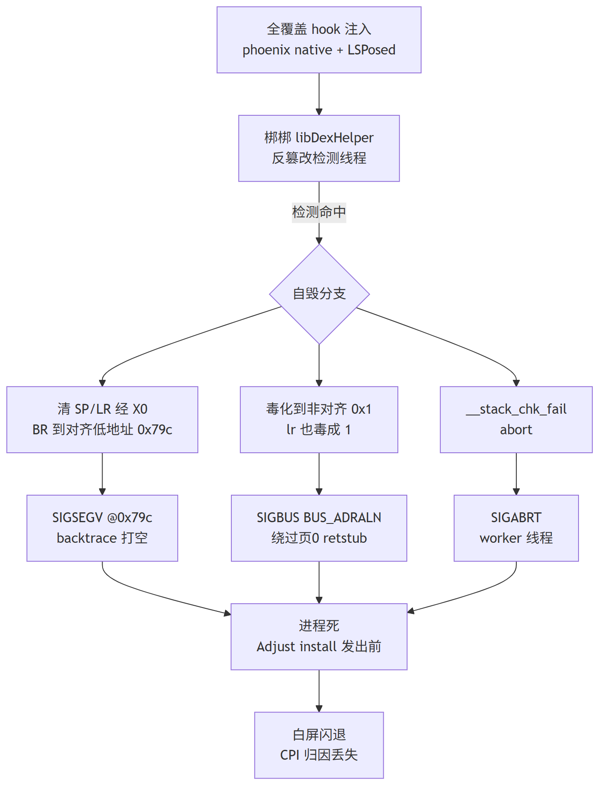

变种 2 那个 `BR 0x1` 更难缠:ARM64 取指要求 4 字节对齐，`pc=0x1` 直接 `SIGBUS`，页0 retstub 的 `RET` 在非对齐地址上根本不生效;它还把 `lr` 也毒成 `0x1`，专门把"PC=LR 干净返回"这招也堵死。

```
signal 7 (SIGBUS)， BUS_ADRALN， fault addr 0x1
    sp=0x7dfb548ae0(有效)  lr=0x1  pc=0x1
```

**所以逐点堵永远跟不上它的变化，防御必须按"硬件 fault / abort / kill / exit 这几类终止原语"兜底，才收敛。** 因为自毁点的地址、对齐、寄存器、信号类型都能变，但"让进程终止"的手段就那么有限几类。

### 分层中和:把每一类终止原语都堵上

顺着上面的结论，针对这份 build 叠了几层来兜底，逻辑是"能不让它 fire 就别等它 fire，fire 了再按信号类兜"。

最外面按包名 gate，再从源头扫。gate 得用前缀匹配把主进程和 `:filedownloader` 之类子进程一起纳入，子进程也加载 libDexHelper、一样会自毁，漏掉就变成"主进程活着但子进程崩溃循环"，照样弹 "keeps stopping";扫到的自毁字节指纹逐点改成 `NOP;NOP;NOP;RET`，保住 SP/LR、函数干净返回。源头扫描够不着运行时动态生成的自毁点，就再补一层页0 retstub:把第 0 页(0x0~0xFFF)映射成可执行、填满 `RET`，任何跳到低地址的漏网自毁执行到的都是 RET，无害;这页会被壳反复写脏，得有个短周期线程持续把 `RET` 重填回去。更底下，seccomp 把 `kill/tkill/tgkill(SIGKILL)` 拦成 EPERM，堵变种 3 那条 kill 路;SIGSEGV/SIGBUS/SIGABRT 三个 handler 对齐、非对齐、abort 各自兜底恢复，worker 线程崩就静默 `syscall(SYS_exit)` 只退这条线程、主进程留着。

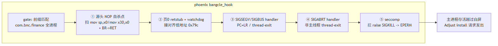

有一条经验:源头 NOP 才是主力，signal handler 只是兜底。因为自毁一旦 fire，SP 已经清 0，无论 handler 还是 retstub 都很难"干净恢复"(栈帧信息已经没了);能干净解决的是不让它 fire。所以主线程的静态自杀点务必在源头 NOP，匿名内存里扫不到的动态自毁，才退回 retstub / handler。

### 页0 retstub 的环境依赖

同一套绕过，**云机上直接 work，Pixel 6 却还是崩**。logcat 定位到第 2 层塌了，页0 那块 mmap 不上:`mmap page 0 failed: Operation not permitted`。

页0 retstub 装不上 → 源头扫描漏掉的动态自毁点跳页0 无兜底 → 崩。根因两条:一是 `vm.mmap_min_addr` 非 0(Pixel 6 = 32768)，内核不让 mmap 页0;二是即便把它改成 0，**SELinux Enforcing 还是拦 app 域 mmap 页0**。Pixel 6 上补两刀:

```sh
echo 0 > /proc/sys/vm/mmap_min_addr
setenforce 0            # permissive，放开 app mmap 页0
```

再启动，页0 retstub 装上、主进程稳定(199 线程)，不再 crash。云机上不用管这一层:redroid 容器的 `mmap_min_addr` 和 SELinux 对页0 本就宽松，第 2 层无障碍就装上。**同样的绕过，第 2 层成败也由宿主环境决定**，跨设备移植时，这一层的环境前提要单独确认。

## 脱壳:从 native heap 里把 dex 完整 dump 出来

App 活了，dump 时却发现 main 进程**没有任何 `[anon:dalvik-DEX data]` 区**(只有 `dalvik-LinearAlloc` 那些元数据)。常规脱壳工具全靠"扫 `dalvik-DEX data` 区 + dex 魔数"定位，对它完全失效。

根因在前面 dex 流水线:梆梆解密出的明文 dex 放在 `[anon:scudo:secondary]` 这块 native heap 大分配里，`OpenMemory` 就地引用，ART 不 copy 到自己的 mmap 区。dex 在 native heap、不在 dalvik 区，工具自然扫不到。所以得绕开"扫标准 dex 区"这个前提，直接从 native heap 里找。

前提是让 dex 先在内存里解密出来:把自毁完整压住(见破局那节)、App 正常跑起来，ART 这时已经把 `classes.dve` 解密、解压成明文 dex 加载进内存，活体进程里就有明文了。

接着是定位。读 `/proc/<pid>/maps`，在匿名 rw 区里找，先把 1GB 级的 GC region-space(`dalvik-LinearAlloc`/`main space`/`free list large object space` 这些几百 MB 起的托管堆)排掉，盯 `[anon:scudo:secondary]`。判据是拿业务类描述符核对，本案目标进程里最大的一块 scudo:secondary 在 `0x78012a4000`、52MB，`strings` 一扫就是 2147 个 `Lcom/byb`、15008 个 `Lcom/bnc`、6 个 `SplashActivity`，dex 就在这;其余 scudo:secondary 都是 1MB 上下的小块，不含业务类。

拉这块区用 `dd if=/proc/<pid>/mem bs=4096 skip=<起始VA/4096> count=<区大小/4096> conv=noerror，sync`。有一处要当心:`skip` 是 64 位块号，得在 host 上算好、当十进制字面量传进去，设备 shell 的 `$(( ))` 对 `0x78…` 这种高地址会截成 32 位;`conv=noerror，sync` 兜偶发坏页。拉出来就是那 52MB 原样内存。

一块区里是多个 dex 首尾相接，得逐个 dump。dex 头有个天然锚点:`endian_tag = 0x12345678`(小端 `78 56 34 12`)固定落在头偏移 `0x28`，照它扫就行:

```
for 每一处字节序列 78 56 34 12 (偏移 j):
    base = j - 0x28                          # 候选 dex 头
    需 [base+0x24] == 70 00 00 00            # header_size == 0x70
    file_size = u32(base+0x20)               # 且落在缓冲内
    class_defs = u32(base+0x60)              # 合理(非 0、不过大)
    dex = buf[base : base+file_size]
    if dex[:4] != "dex\n": dex[0:8] = "dex\n035\0"   # 补被抹掉的魔数
    dump(dex)
```

梆梆抹掉的只是那 8 字节魔数，`header_size`/`file_size`/`endian_tag`/各段 offset 都原样自洽，补回 `dex\n035\0` 就是合法 dex(checksum/signature 对静态分析无所谓，jadx 不校验)。

这 52MB 里最后 dump 出 6 个 dex、共 44，724 个类，每个 magic `dex\n035`、头字段自洽、jadx 直接反编译:

```
off 0x00745000  10659 类   含 Lcom/byb/splash/activity/SplashActivity; + 12504 处 Lcom/bnc
off 0x01f21000  10460 类   含 SplashActivity
off 0x012e6000  11038 类
off 0x00002000   6985 类
off 0x02a29000   5225 类
off 0x03143000    357 类
(重度 R8 混淆，包名压成单双字母 v/A/H9/Di/Cc…)
```

这 6 个 dex 就是 ART 为该进程加载的**全部业务 dex**，App 自研的 `com.byb.*`/`com.bnc.*` 悉数在内(框架与三方库本就明文躺在 `classes.dex`，不用脱)。至此梆梆保护的代码完整落地、可静态分析。整条链只依赖"进程存活 + 读 `/proc/pid/mem` + host 侧算好 skip"，不需要冻结进程或 ptrace，重跑结果一致。
## 收尾

回头看，梆梆的难点主要在"藏"和"变"上:检测串藏在 XOR 后面、syscall 藏在指针表后面、dex 藏在 native heap 里，自毁则随 build 变编码、被堵就升级。对付它的思路也就三条，认签名别认字面、锚整段序列别抄偏移、按终止原语类兜底别逐点堵。工程上还有一条:页0 retstub 这类手段吃宿主环境，云机宽松直接能用，严格 SELinux 的真机要先 `mmap_min_addr=0 + setenforce 0`，移植时别想当然。脱壳产物 6 dex / 44，724 类、jadx 直接反编译，含全部 `com.byb.*` 业务逻辑。
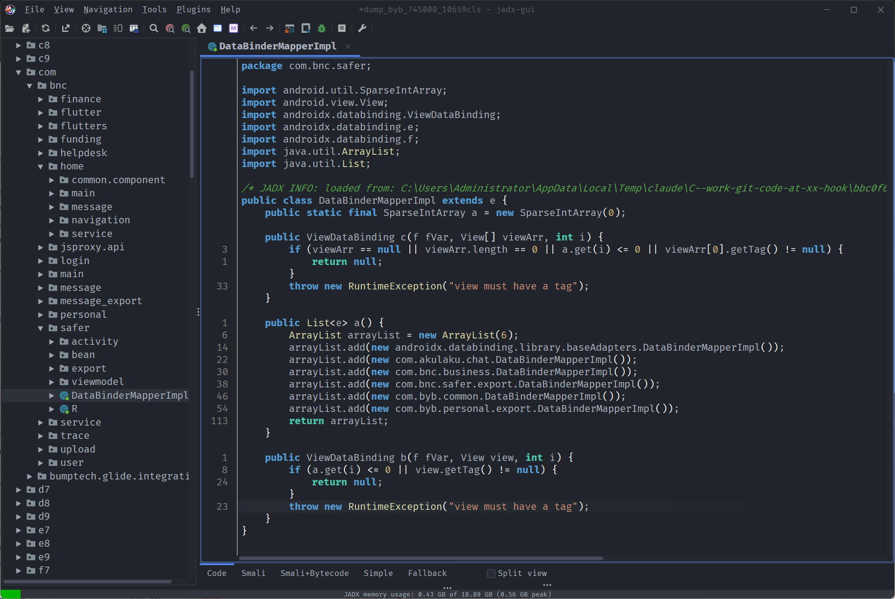


最后留一张对照表，绕过要点:

| 障碍 | 对策 |
|---|---|
| 自毁签名(pc 低地址 + backtrace 空) | 认签名，别当空指针 bug |
| 自毁编码随 build 变 | 锚整段序列，别照抄偏移/魔数 |
| 三进程守护 | 先冻看门狗子进程、再冻 main |
| 自毁自适应升级 | 按终止原语类兜底(fault/abort/kill/exit) |
| 动态自毁点漏网 | 页0 retstub + watchdog 重填 RET |
| 页0 装不上(Pixel 6) | mmap_min_addr=0 + setenforce 0 |
| dex 不落 dalvik 区 | 先抑制自毁跑起来，再搜 scudo native heap |
| dd 读高地址 0 字节 | host 侧 64 位算 skip，当字面量喂 dd |

相关工具:

| 工具 | 用途 |
|---|---|
| [jadx-headless-mcp](https://github.com/1013503897/jadx-headless-mcp) | dex 反编译 |
| [ida-pro-mcp](https://github.com/mrexodia/ida-pro-mcp) | so 反汇编 / 伪代码 |
| Claude Opus 5 | AI 辅助分析 / 编排 |
