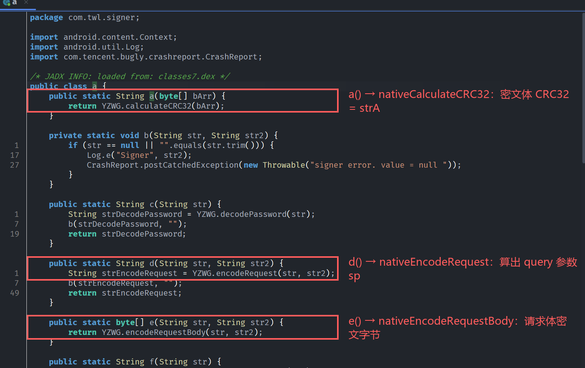
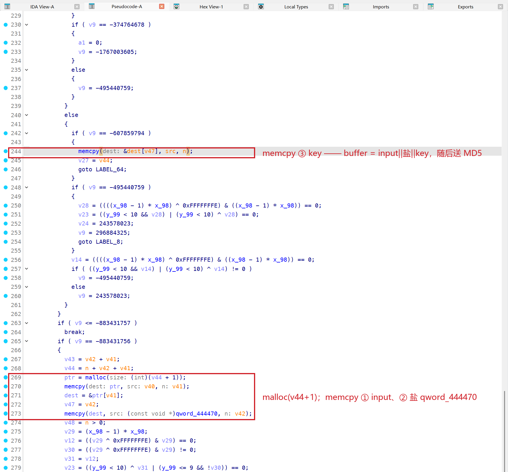
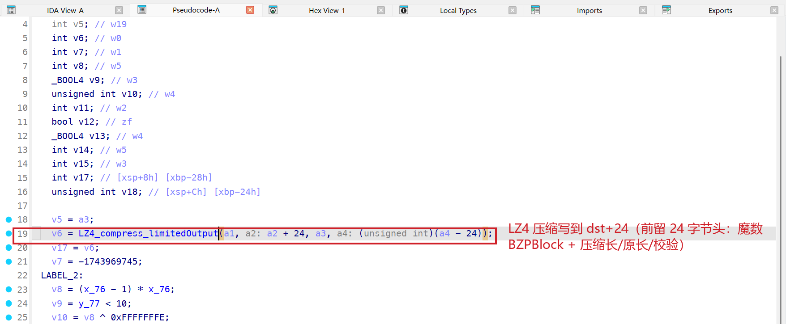
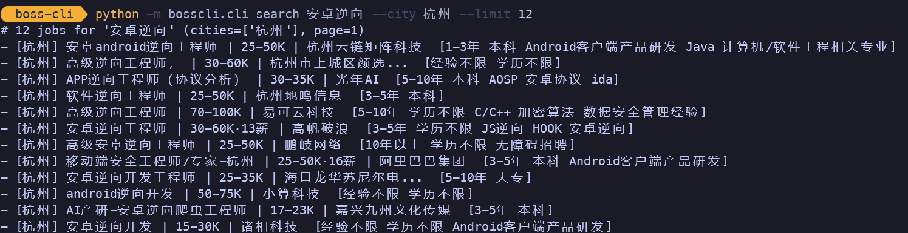

最近在看BOSS直聘 的职位搜索接口，把 native 层简单逆了下，实现纯算复现协议签名。

抓包：搜索请求的 query 里挂着一个 `sp`（几百字符的密文串）和一个 `sig`（`V3.0` 开头的 32 位 hex），请求体是一坨二进制，响应体也是密文。这三样都出自一个 native 库 `libyzwg.so`（JNI 包装类 `com.twl.signer.YZWG`，Java 侧薄封装 `com.twl.signer.a`）。

样本是 v14.050（`com.hpbr.bosszhipin`）。要的是纯 Python 复现，跑的时候不带真机也不带 unidbg，最后真发一次请求，看服务器认不认：`sig`/`sp` 怎么算，请求体和响应体怎么编解码，搜索为什么走「批量壳」端点。

环境：

| 层 | 用什么 |
|---|---|
| 静态 | jadx+ IDA（反编译 `libyzwg.so` ） |
| 预言机 | unidbg 加载 `libyzwg.so`，做黑盒差分 |
| 动态 | Pixel 6（root）+ 反检测 frida |
| 复现 | 纯 Python（`lz4` + `requests`） |

---

## 一、静态先把加签公式挖出来

搜索结果列表顺着 `GeekSearchCardRequest` 摸到端点，但真正决定「请求长什么样」的是通用加签层 `net.bosszhipin.base.m`。它的 `c()` 给每个请求补公共参数（`curidentity`/`v`/`req_time`/`uniqid`/`client_info`），然后按请求是不是批量，分流到 `e()`（普通）或 `f()`（批量）。搜索走批量，`f()` 反编译结果如下（去噪后）：

```java
private static void f(mf0.b bVar, String url, boolean z11) {
    BatchBodyBean body = bVar.d();
    Map<String,String> params = bVar.c();
    String key = z11 ? LBase.getSecretKey() : null;          // 白名单决定是否带 key
    String strD = d(params);                                  // 排序 + URLEncoder + k=v&
    byte[] encBody = com.twl.signer.a.e(bg0.n.h(body), key); // nativeEncodeRequestBody(bodyJson, key)
    bVar.y(encBody);                                          // 请求体 = 密文字节
    String strA = com.twl.signer.a.a(encBody);               // nativeCalculateCRC32(密文体)
    String sp  = com.twl.signer.a.d(strD, key);              // nativeEncodeRequest -> 参数 sp
    bVar.w("sp", sp);
    if (strD.length() > 5000) strD = strD.substring(0, 5000);
    String sig = com.twl.signer.a.i(config.m.f(url) + strD + strA, key);  // nativeSignature -> 参数 sig
    bVar.w("sig", sig);
}
```

- `strD` = 参数按 key 字典序排序、value 走 `URLEncoder.encode(...,"UTF-8")`、拼 `k=v&`（`d()` 就是干这个）。
- `sp = nativeEncodeRequest(strD, key)`，作为 query 参数。
- `sig = nativeSignature(f(url) + strD + strA, key)`，`f(url)` 是 URL 从 `/api/` 起的路径，`strA` 是加密后请求体的 CRC32。
- `key` 由 `config.m.j(url)` 白名单决定，批量端点 `/api/batch/requests` 落在白名单里 → key=null。
- 还有一个坑先记下：`strD` 超过 5000 字符时，签名用的是截断到 5000 的 strD（但 `sp` 用的是完整的）。

`com.twl.signer.a` 就是这层 native 的 Java 薄封装，jadx 里看得很直白，每个方法都只是转发到对应的 `nativeXxx`：



剩下的全在 native `libyzwg.so` 里：`nativeSignature / nativeEncodeRequest / nativeEncodeRequestBody / nativeCalculateCRC32 / nativeDecodeContent`。

---

## 二、把 so 跑成一个差分预言机

`libyzwg.so` 4.47MB、OLLVM 平坦化、字符串加密、JNI_OnLoad 里带反重打包自检，反汇编难度较大。更省事的是先让这个 so 在 unidbg 里跑起来，当一个可以任意喂输入、看输出的黑盒预言机，用差分探针把算法的形状摸出来。

跑 unidbg 的门槛是 `JNI_OnLoad` 的反篡改自检，用 `-Dvmverbose=1` 看 JNI upcall 序列就现形了：它 `getPackagesForUid` 要真实包名、`getPackageInfo(pkg, GET_SIGNATURES).signatures[0].toCharsString().hashCode()` 要等于内嵌常量。满足它（喂真实证书 DER + 补一个真的 `String.hashCode`），`JNI_OnLoad` 就正常返回、native 方法注册上了。这套后续会另写文章详细展开，这里只用结论。

签名侧：

```
sig(base, K)   = V3.0626c2a6ae2afe24c4b71c8021de5fe2a
sig(base, null)= V3.0b327810b631fb33ea5ebced128511edc      # key 参与运算
sig(base, K2)  = V3.0917a6ac34d4f4f44c6231c4bcc32d8d5
sig(flip1bit)  = V3.09763ceb2d98f7b8c2017bd3735887d5f      # 1 bit 翻转全变 = 哈希
sig("")        = V3.0a86fce5b188c8c0f6c61392d2cea407c
```

全部是 `V3.0` + 32 hex（=16 字节，MD5 家族），前导 `0` 恒定，key 参与。但拿真机抓的一条 `(input, key, sig)` 三元组去对撞 `md5(input+key)`、`md5(key+input)`、`hmac` 等等，一个都不中。哈希里还包含一个内嵌盐。黑盒推不出盐，这步必须分析汇编。

`sp` 探针也有信息：

```
sp(inlen= 0)  outlen=36    # 空输入密文就有开销
sp(inlen=16)  outlen=56
sp(inlen=32)  outlen=56    # 32 字节和 16 字节几乎等长 -> 压缩
sp(16*'A')  ... 和 sp(32*'A') 长度几乎一样
```

把 base64 解回原始字节观察：同一个 key 下，前 12 字节恒定（`70e22488554382feca2200f2`，换 key 就变）；再把 `16*'A'` 和 `32*'A'` 两条 payload 逐字节 XOR，结果几乎全 `00`，keystream 被抵消了。`sp = 头(仅由 key 决定) + [ compress(input) XOR keystream(key) ]`，是流密码、不是分组，且密钥流只由 key 决定（sp 确定、无随机 IV）。这跟之前分析过的 GCash APSE 的 `zipAndEncryptData` 很类似。

---

## 三、攻坚 sig：从 RegisterNatives 到内嵌salt

`JNI_OnLoad`（OLLVM 平坦化，状态机在一个 `v5` 上转）里能看到 `(*env + 1720)` 就是 `RegisterNatives`，注册表 `off_443030`、10 个方法，类名走 `FindClass(0x443130)`。类名那串 `5f 53 51 13 48 4b 50 13...` 用 `XOR 0x3c` 一解就是 `com/twl/signer/YZWG`。so 里的字符串都是 XOR 混淆，而且每个字符串用不同的单字节 key，末尾那个字节就是 key（存的是 `0x00^key`）。照这个规律把 name/sig 表整个解出来：

```
nativeSignature      [BLjava/lang/String;)[B                 -> 0x23b6c
nativeEncodeRequest  [BLjava/lang/String;)Ljava/lang/String; -> 0x1f6ac
nativeEncodeRequestBody                                      -> 0x206b8
nativeCalculateCRC32 [B)Ljava/lang/String;                   -> 0x28388
nativeDecodeContent  (两个重载)                              -> 0x24980 / 0x26404
```

反编译 `nativeSignature`（0x23b6c），OLLVM 归 OLLVM，核心那块 buffer 拼接看得很清楚：

```c
v43 = keylen? + input_len;
v44 = key_len + salt_len + input_len;
ptr = malloc(v44 + 1);
memcpy(ptr,            input,          input_len);   // ① input
memcpy(&ptr[input_len],qword_444470,   salt_len);    // ② 盐 = qword_444470
if (key_len > 0)
    memcpy(&ptr[input_len+salt_len], key, key_len);  // ③ key
v15 = sub_1C6E0(ptr, v44);                            // 哈希(整个 buffer)
v18 = sub_1C5CC(&byte_443804, v15);                  // 前缀 + hash
```



`sig = 前缀 + HASH(input ‖ qword_444470 ‖ key)`。前缀 `byte_443804`（`cb ae b3 ad`，XOR key `0x9d`）解出来是 `"V3.0"`。`qword_444470` 是 `JNI_OnLoad` 里算好缓存的一个 32 字符串，由证书签名的 hashCode 派生（就是反篡改校验那个常量），对官方签名是定值。

salt 的值直接从 unidbg 内存里 dump：

```
[salt] qword_444470 -> salt="a308f3628b3f39f7d35cdebeb6920e21" len=32
```

真机 oracle：

```
target(after V3.) = 0648236f9e4faf41e4446836fb756c1e7
md5(input|salt|key) = 0648236f9e4faf41e4446836fb756c1e7   match=True
```

`sig = "V3.0" + md5(input ‖ salt ‖ key)`，字节级命中。

---

## 四、攻坚 sp：BZPBlock + LZ4 + 混淆的 RC4

反编译 `nativeEncodeRequest`（0x1f6ac），管线一条龙：

1. `s = SALT ‖ key`（key 为空则 s=SALT），作为后面的密钥材料；
2. `sub_1D338` 压缩：`LZ4_compress_limitedOutput(input)` 写到 `dst+24`，前面补 24 字节头：`*(u64)dst = 0x6B636F6C42505A42`（小端就是 `"BZPBlock"`）+ `u32(0)` + `u32(压缩长)` + `u32(原长)` + `u32(原长 ^ 压缩长)`；
3. `sub_340CC(ctx, s, len)` + `sub_34740(ctx, buf, buf, len)` 就地加密压缩数据，`ctx` 是 `_BYTE[264]`，正好一个 RC4 S-box；
4. `sub_2EA54` base64、`sub_1CD94` 把 `+/=` 换成 `-_~`。



头前 12 字节 `"BZPBlock"+u32(0)` 是常量明文，RC4 keystream 固定，异或出来就是固定的 12 字节密文；后面 `压缩长/原长/校验` 才随输入变。

`sub_340CC` 是标准 RC4 KSA（`S[i]=i` 初始化，`j = j + S[i] + key[i%len]` 交换）；`sub_34740` 是 RC4 PRGA，但每个字节套了一层 `TWIST(x) = (~x & 0xCF) | (x & 0x30)`：

```c
out[n] = TWIST(keystream_byte) ^ TWIST(in[n]);
```

`0xCF | 0x30 == 0xFF` 且不重叠，所以 `TWIST(x) == x ^ 0xCF`，两次 TWIST 在 XOR 时相互抵消，`out = keystream ^ in` 就是标准 RC4，TWIST 纯属混淆外衣。

![sub_34740：整段就是标准 RC4 PRGA（i/j 更新 + swap + keystream = S[(S[i]+S[j])&0xff]），最后一行输出 = TWIST(keystream) ^ TWIST(明文)，0xCF 位两次异或抵消](./assets/images-03-rc4-twist.png)

纯 Python 复现，对照 unidbg 的全部合成样本 + 真机样本：

```
== sp verification ==
  in=b''                 key=82a8b7 match=True
  in=b'ABCDEFGHIJKLMNOP' key=82a8b7 match=True
  in=b'A'*16 / b'A'*32 / mixed / key=null / key=K2   全 True
== real-device oracle ==
  sig match=True
  sp  leading chars identical to device capture: 16/400
  round-trip my sp -> plaintext == input : True   meta={complen,origlen,chk_ok}
```

真机 2086 字节样本只有前 16 个 b64 字符（=那 12 字节恒定头）逐字节相同，往后就对不上了：设备的 liblz4 和 python-lz4 对同一输入做了不同但都合法的压缩选择，头里的压缩长不一样。但我的 sp round-trip 解回原文成功、校验位对，服务器只解压不比字节，所以照样接受（后面实测证明了）。

剩下三个原语：`nativeCalculateCRC32` = `snprintf(..., "%u", crc32(x))`（IEEE CRC32 的无符号十进制串，空输入返 `""`）；`nativeEncodeRequestBody` 和 sp 同管线、只是最后返回原始字节不 base64；`nativeDecodeContent` 是逆（RC4 解密，视情况再 BZPBlock/LZ4 解压）。

---

## 五、纯算协议复现

搜索走 `GET /api/batch/requests`，body 里带上请求：

```json
{"subReqs":[{"method":"GET","path":"/api/zpgeek/app/geek/search/cardlist","query":"query=Python&city=...&page=1&..."}]}
```

外层 `strD` 的参数（`client_info`/`curidentity`/`req_time`/`uniqid`/`v`）要用 Java `URLEncoder` 风格编码：`~`→`%7E`、空格→`+`、保留 `.-*_`。这点很容易踩：Python 默认 `quote` 会保留 `~`，编出来的 strD 和服务器重算的对不上、sig 就废。按 Java 规则实现一个 `java_url_encode`，逐字节对拍捕获的 strD 和子 query，两个都 `match=True`，才敢用它重建查询。

踩着服务器的报错往前走：

```
# 第一版：query 只放 strD + sp + sig，body = encBody
HTTP 200  {"code":-1001,"message":"请求参数非法."}
```

分析装配代码，`app_id` 是在 `f()` 签名之后才 `bVar.w("app_id", ...)` 加进去的：它不进 strD 签名，但要发在 query 里，第一版漏了。补上 `app_id=1003` + 刷新 `req_time`（strD 变、重算 sp/sig）：

```
HTTP 200  {"code":0,"message":"Success","zpData":{
  "/api/zpgeek/app/geek/search/cardlist":{"code":1,"message":"invalid auth"}}}
```

外层 `code:0 Success`，sp/sig/参数/body/CRC 全过了；内层搜索子接口 `invalid auth`，缺登录态。auth 藏在哪？wire 层的公共头是更底层的 okhttp 拦截器加的（它把 okhttp3 整个混淆成了 `okhttp3.h0/a0/c0`，按原名 hook 不到）。从它自己的响应解码拦截器 `net.bosszhipin.base.a` 里取 `chain.request()` dump 头：

```
t2: <auth-token>
zp-accept-encrypting: 1     zp-accept-compressing: 3
User-Agent: NetType/wifi Screen/1080X2209 <App>/14.050 Android 36
```

`t2` 就是账号登录 token。补上 `t2` + `zp-accept-*` + 正确 UA 再发：

```
HTTP 200 len 12937  resp-hdrs {zp-encrypting:1, zp-compressing:2}
outer: 0 Success
cardlist: 0 Success
jobs: 15
  - Python代码运维（远程兼职） | 4000-4500元/月 | x码 | 杭州
  - python工程师（app逆向） | 18-30K | 浙江xx传媒科技 | 杭州
  - ...（共 15 条，与搜索结果逐条对上）
```

响应头 `zp-encrypting:1 / zp-compressing:2`，响应体是 `RC4(BZPBlock+LZ4(json))` 的二进制（不是小响应那种 base64 字符串）。用 `nativeDecodeContent` 的 RC4 解密 + BZPBlock 解 frame 就还原成 JSON。纯 Python、离设备，真实职位数据到手。搜索器等于搬到了 PC 上，`t2` 是唯一需要从登录设备取一次的账号态输入。

把整条链路封装成命令行工具，一条命令就能离设备搜真实职位：



---

## 六、复盘

- **差分预言机 + IDA 定点**，对付「带内嵌盐/密钥的混淆 native 加签」最省时间。纯黑盒推不出内嵌盐（等价求原像），纯静态啃 OLLVM 又慢；先用 unidbg 把 so 跑成预言机，差分探针把算法形状（MD5？流密码？压缩？key 是否参与）摸清，再拿这些先验去 IDA 定点盐和框架。两边对着看，比单啃一边快。
- **「跑对」要以字节级对拍为准**。sig 我坚持对到 `md5(input|salt|key)` 完全一致才算数；sp 因 liblz4 编码器差异不可能字节全等，就换成「round-trip 解回原文 + 头 16 字符一致」这种能证明语义正确的判据，同时想清楚它为什么服务器还认（只解压、不比字节）。判据选错，就会把「以为对」当成「对」。
- **签名签的是加密体的 CRC，这类设计对离设备复现其实友好**：只要我自己的 `body→crc→sig` 自洽，服务器按收到的 body 重算 CRC 校验就过，不要求和某个设备抓的字节一致。
- **报错驱动装配**：`-1001 请求参数非法` → 补 `app_id`；`invalid auth` → 补 `t2`。每一步服务器的错误码都在指出还差什么，比盲猜 wire 格式快得多。

### 关键地址/公式（v14.050 arm64-v8a）

```
SALT = a308f3628b3f39f7d35cdebeb6920e21          # 绑官方签名的定值
sig  = "V3.0" + md5(input ‖ SALT ‖ key)          # nativeSignature @0x23b6c
sp   = b64url(-_~)( RC4(SALT‖key, "BZPBlock"+u32(0)+u32(clen)+u32(olen)+u32(olen^clen)+LZ4(input)) )
                                                  # nativeEncodeRequest @0x1f6ac
encodeRequestBody = 上式去掉 base64 的原始字节     # @0x206b8
crc32 = "%u" % ieee_crc32(x)                      # nativeCalculateCRC32 @0x28388
strA = crc32(encBody) ; sig 输入 = "/api/batch/requests" + strD + strA
批量端点 key=null；app_id=1003 不进签名；auth 头 = t2
```

字符串 XOR 混淆：类名 `XOR 0x3c`，name/sig 表每串单字节 key=末字节。RC4 PRGA 的 `TWIST(x)=(~x&0xCF|x&0x30)` 在 XOR 时抵消，等价标准 RC4。
