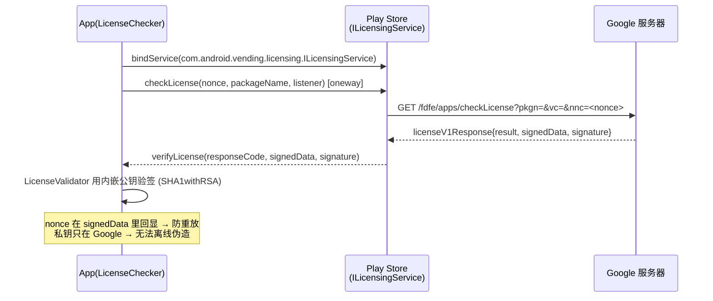
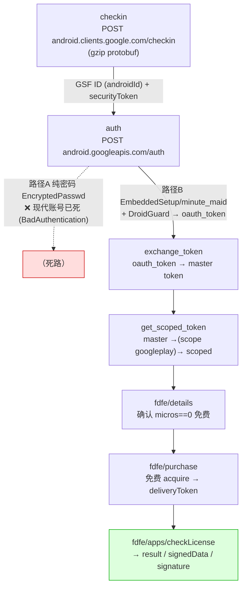
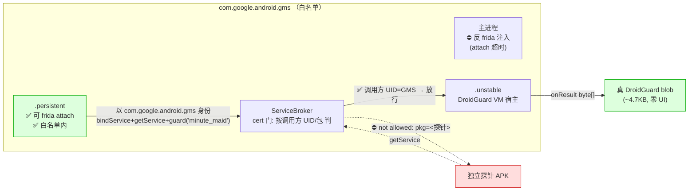

> 本文仅用于安全研究与协议理解，实验对象限于自有/授权的测试账号与受控环境。文中涉及的账号、令牌、出口 IP、设备编号等均已脱敏，只保留可公开考证的协议与机制细节。

最近在研究 Google Play 的授权验证机制——LVL（License Verification Library，官方叫 Google Play Licensing）。这套东西的用途很单纯：一个上架 Play 的付费 app（或者虽然免费但想防盗版/防白嫖的 app），想在运行时问一句"当前登录的这个 Google 账号，到底有没有从 Play 合法获得过我这个 app"，就集成 LVL，让它去 Google 服务器要一份带签名的回执。

我想搞清楚三个问题：

1. 这份"授权回执"到底长什么样，签名是谁签的，能不能**离线伪造**一份出来？
2. 如果伪造不了，那能不能**不开 Play Store 界面、纯 headless**（甚至完全离设备）地，当一个"真客户端"去把这份回执**合法地要出来**？
3. 这条链上到底有没有绕不开的硬门？如果有，它是什么，能不能拆掉？

先把结论摆在前面，免得读者中途走神：

- **回执伪造不了。** signedData 是用开发者的 licensing 私钥签的，私钥只在 Google 服务器上，客户端 APK 里只有配套公钥。密码学上没有离线造一份合法签名的路。
- **但可以"合法地要"。** 只要你有一个真实拥有该 app 的 Google 账号，就能纯 HTTP 把 Google 亲笔签的回执要出来；对免费 app，"拥有"这件事本身也能自动化——大约 2~3 次 HTTP 调用就能让账号"领取"再拿到真授权。这条链**完全设备无关**。
- **唯一绕不开的硬门是 DroidGuard**：拿登录令牌那一次，必须在一个"能通过自检的 Android 运行时"里跑一段 Google 下发的字节码。除这一个原子外，checkin / 令牌交换 / fdfe / checkLicense / 下载全部可离线。本文最后会讲怎么把这个硬门降成"一个跑在白名单 GMS 进程里、按需产结果的小服务"。

下面按逆向的顺序展开。参考实现主要是 microG 的 GmsCore（`vending-app` 模块，一手 clone 读源码）、AOSP 的 `google/play-licensing` 库，以及官方 licensing 文档三方交叉。

---

## 一、先看 LVL 在客户端长什么样

LVL 在客户端侧是一套很老实的 AIDL 调用。app 里集成的 `LicenseChecker` 干的事情是：

```
App(LicenseChecker)
 → bindService(Intent("com.android.vending.licensing.ILicensingService")
                 .setPackage("com.android.vending"), BIND_AUTO_CREATE)
 → ILicensingService.checkLicense(nonce: long, packageName: String, ILicenseResultListener)   // oneway
 → [Play Store 转发 ↔ Google 服务器]
 → listener.verifyLicense(responseCode: int, signedData: String, signature: String)           // 回调
 → LicenseValidator 用 APK 内嵌的公钥验签 → Policy.processServerResponse() → callback.allow()/dontAllow()
```

几个要点：

- 绑的是 Play Store（`com.android.vending`）导出的 `ILicensingService`，action 固定 `com.android.vending.licensing.ILicensingService`。
- `nonce` 由客户端用 `SecureRandom` 生成，随请求带上去，**服务器会在回执里原样回显**——这是防重放的关键，等下活体验证会用到它。
- 调用方 app 要在 manifest 里声明 `com.android.vending.CHECK_LICENSE` 权限（普通权限，声明即得，无弹窗）。
- `checkLicense` 是 `oneway` 异步，10 秒无回调就判 `ERROR_CONTACTING_SERVER`。

除了这套老 V1 接口，逆 microG 的 AIDL 还能看到一套官方文档/AOSP 里都没有的**现代 V2 接口**：

```aidl
oneway void checkLicenseV2(String packageName, ILicenseV2ResultListener listener, in Bundle extraParams);
// ILicenseV2ResultListener.verifyLicense(int responseCode, in Bundle responsePayload)
// responsePayload["LICENSE_DATA"] = 一个 JWT
```

V1 和 V2 的差别，本质是"验证责任放在哪一侧"：

- **V1** = 一段管道符分隔的 `signedData` + 一段 RSA 签名，**客户端本地用内嵌公钥验签**。
- **V2** = 一个 JWT，客户端不再自己做 RSA 验签，验证责任收回服务端——这个方向和后面要讲的 Play Integrity 是一脉相承的。

客户端这一侧的调用时序（App ↔ Play Store ↔ Google，V1 回执在客户端本地验签）：



---

## 二、为什么"伪造一份许可"这条路走不通

要判断能不能伪造，得先把 V1 回执的字节格式抠清楚。`signedData` 是一个 ASCII 字符串，`ResponseData.parse()` 的解析规则是：

```
responseCode|nonce|packageName|versionCode|userId|timestamp:extra
```

先按第一个 `:` 切成"主体"和"extra"两段；主体按 `|` split，至少 6 个字段：

| 下标 | 字段 | 说明 |
|---|---|---|
| [0] | responseCode | 授权结果码（见下表） |
| [1] | nonce | **回显**客户端传入的那个随机数 |
| [2] | packageName | 包名 |
| [3] | versionCode | 版本号 |
| [4] | userId | 每个 app 各不相同的用户标识 |
| [5] | timestamp | epoch 毫秒 |

`extra` 是一段 URI query，携带 `VT`（缓存过期时间）/`GT`（宽限截止）/`GR`（最大重试）/`UT`（换 key 时间）/`LU`（购买跳转 URL）/`FILE_URL|NAME|SIZE`（OBB 扩展文件）等。

`responseCode` 的取值（`LicenseValidator` 与 microG 数值一致）：

| 常量 | 值 | 含义 | 带签名 |
|---|---|---|---|
| LICENSED | 0x0 | 已授权 | 是 |
| NOT_LICENSED | 0x1 | 未授权 | 否 |
| LICENSED_OLD_KEY | 0x2 | 授权但版本换过签名 key | 是 |
| ERROR_NOT_MARKET_MANAGED | 0x3 | 包名未被 Play 识别 | 否 |
| ERROR_SERVER_FAILURE | 0x4 | 服务端加载 app 密钥失败 | 否 |
| ERROR_OVER_QUOTA | 0x5 | 超配额 | 否 |
| ERROR_CONTACTING_SERVER | 0x101 | 联不上授权服务器 | 否 |
| ERROR_INVALID_PACKAGE_NAME | 0x102 | 包未安装 | 否 |
| ERROR_NON_MATCHING_UID | 0x103 | UID 不匹配 | 否 |

**签名**：对整段 `signedData` 的字节做 `SHA1withRSA`。关键在私钥的位置——**私钥完全在 Google 服务器上**。开发者在 Play Console 的「Services & APIs」页面拿到的，只是一段 Base64(X.509) 的**公钥**，硬编码进 APK，用来在客户端验签。

所以"伪造一份 result=0 的合法回执"这件事，在密码学上是**不成立**的：你没有私钥，签不出能通过那段公钥校验的签名。这也是官方文档反复强调"纯客户端验证不可靠、建议服务端二次校验"的根本原因——它防的不是"伪造签名"，而是"客户端被改，让验签逻辑恒真"（这是另一回事，第六节会讲）。

一句话总结这一节：**想拿到一份"真"的授权回执，唯一的路不是造，而是去问 Google——用一个真实拥有该 app 的账号，当一个合规的 licensing 客户端把它要出来。** 而且要注意，Google **不存在**一个"server-to-server 查某账号是否拥有某 app"的公开 API，你必须从设备侧这条 licensing 通道拿。

---

## 三、换个思路：当一个真的 licensing 客户端

microG 的 `vending-app` 就是这条路的现成参考实现，而且它揭示了一个很关键的事实：**它全程只是转发真 Google 服务器，模块里没有任何本地签名/自签逻辑**。它的 `LicensingService.kt` 做的是：

1. 遍历 `AccountManager` 里真实的 Google 账号；
2. 对账号 `getAuthToken(...)` 拿到 licensing 作用域的 OAuth token；
3. 直接 `GET` 一个 fdfe 端点，把 Google 返回的 `signedData`/`signature` 原样回传给调用方。

验签之所以能过，不是因为它伪造得好，而是因为**那本来就是 Google 亲笔签的**。

顺着 microG 把服务端协议逆出来，端点都在 `play-fe.googleapis.com/fdfe` 下（注意这里有个 base URL 漂移：老客户端用的是 `android.clients.google.com/fdfe`，microG 近期代码用的是 `play-fe.googleapis.com/fdfe`）：

| 端点 | 方法 | 用途 |
|---|---|---|
| `/fdfe/apps/checkLicense?pkgn=<pkg>&vc=<vc>&nnc=<nonce>` | GET | **LVL V1**，返回 protobuf `licenseV1Response{result, signedData, signature}` |
| `/fdfe/apps/checkLicenseServerFallback?pkgn=<pkg>&vc=<vc>` | GET | **LVL V2**，返回 `licenseV2Response.license.jwt`（无 nonce 参数） |
| `/fdfe/details?doc=<pkg>` | GET | 拉详情/价格（`offer.micros==0` 即免费），acquire 前置 |
| `/fdfe/purchase` | POST | 领取/购买（免费 = $0 acquire），成功回 `BuyResponse.deliveryToken` |
| `/fdfe/uploadDeviceConfig` | POST | 部分场景（HTTP 400）需先传设备配置换 token 再重试 purchase |

请求头是标准 Finsky 客户端那一套（`extensions.kt::buildRequestHeaders`），逐字段照抄真机抓包常量即可：

- `Authorization: Bearer <oauth>`
- `X-DFE-Device-Id: <checkin 拿到的 androidId 的十六进制>`
- `X-DFE-Client-Id: am-google`（注意旧客户端是 `am-android-google`）
- `X-DFE-Encoded-Targets` / `X-DFE-Phenotype`（写死常量）
- `X-PS-RH`：一段 gzip + base64 的 protobuf（`RequestHeader`），里面装 androidId/sdk/finsky 版本/时间戳
- `User-Agent`：Finsky 版本串，形如 `Android-Finsky/52.1.26-31 [0] [PR] <...>`

OAuth 作用域方面，checkLicense 用 `oauth2:https://www.googleapis.com/auth/googleplay`；billing/purchase 另有更宽的作用域。

### 免费 app 的"自动购买"——最有实操价值的一段

microG 里有个开关 `vending_licensing_purchase_free_apps`，对应 `acquireFreeAppLicense()`。当所有账号都查不到 LICENSED 时，它会自动：

1. `GET /fdfe/details?doc=<pkg>`，确认 `offer.micros == 0`（免费）；
2. `POST /fdfe/purchase` 领取（返回的 `deliveryToken` 非空即成功）；
3. 重新 `checkLicense` —— 此时账号已"拥有"该 app —— 拿到真实的 LICENSED。

也就是说，**纯 HTTP + 一个真账号的 OAuth token，就能让 Google 把这个账号标记为"已拥有"并签发真授权，全程不需要任何 Play Store 界面或人工点击**。对一个免费 app 来说，"拿到一份真 LVL 凭据"就约等于 2~3 次 HTTP 调用。

---

## 四、把整条链 headless 化

到这里，"要许可"这半段已经清楚了，但它有个前置：你得先有一个"能换 googleplay 作用域 token"的真实 Google 账号身份。把这半段也 headless 化，就是完整的协议依赖链：



> fdfe/* 请求头统一带 `Authorization(Bearer)` + `X-DFE-Device-Id`(=checkin 的 androidId) + `X-PS-RH`；auth 路径 A 的纯密码 `EncryptedPasswd(RSA-OAEP)` 对现代账号已死，只剩路径 B。

### checkin 是干净的

`checkin` 这一段协议很稳，我用 Python 按 `CheckinRequest` 造 gzip protobuf 打 `android.clients.google.com/checkin`，线上直接返回真的 `androidId` + `securityToken`，多次调用每次给新 id，**不吃 DroidGuard、也与出口 IP 无关**。这个 androidId 后面要在 auth 的 `device` 头、fdfe 的 `X-DFE-Device-Id` 里复用，Play 后端会校验一致性。

### 纯密码路（gpsoauth 那条）在现代账号上已经死了

很多老资料和公开库（gpsoauth、旧 microG 路径）走的是"账号 + 密码 + `EncryptedPasswd`(RSA-OAEP) → master token"。我实测这条路在现代账号上**已经废了**：`POST /auth` 直接回 `HTTP 403 Error=BadAuthentication`。而且我做了两个对照实验把常见甩锅方向排掉：

| 假设 | 实验 | 结果 |
|---|---|---|
| 我的 `EncryptedPasswd` 加密算错了 | 用**明文 `Passwd`** 同参重试 | 一样 BadAuthentication → 不是加密问题 |
| 是机房 IP 风控 | 换一个干净的住宅 IP 重试 | 仍旧 BadAuthentication → 不是 IP 问题 |

根因是 Google 已经把遗留的 ClientLogin/纯密码 master 路按账号策略禁掉了。公开实现能"复现"的，其实是这条**死路**。

### 现代登录：绕不开 DroidGuard

真正能用的现代登录，是走 `embedded-setup` / `minute_maid`：由一个（受控的）WebView 承载密码与挑战，其中 `mm.getDroidGuardResult` 会要一段 DroidGuard 结果塞回页面，最终拿到一个 `oauth_token`（cookie），再用它离线兑换 master、换 scoped。

令牌交换这一段是可以纯 Python 忠实复刻的（对应 GmsCore 的 `LoginActivity.retrieveRtToken` / `AuthRequest`）：`oauth_token` + `ACCESS_TOKEN=1` + `add_account=1` + `get_accountid=1` → master；master 复用为 `EncryptedPasswd` 字段 + `service=oauth2:.../googleplay` → scoped。**唯一无法纯 Python 的，就是产出 `oauth_token` 前那一次 DroidGuard**——这就是我们要单独攻的硬门。

---

## 五、唯一绕不开的硬门：DroidGuard，以及怎么把它零 UI 化

### DroidGuard 到底在干什么

逆 GmsCore 的 `play-services-droidguard` + `androidantiabuse` 调用面，DroidGuard 的数据流大致是：

```
① DroidGuardClient.getResults(context, flow, dataMap)
     flow 取值:"attest"(SafetyNet) / "minute_maid"(登录) / "checkin" / "devicekey" / ...
        ▼
② 绑定 IDroidGuardService，Embedded 模式下本地拉字节码 + 跑 VM
        ▼
③ POST protobuf 到 androidantiabuse 端点(UA: DroidGuard/<ver>)：
     请求里带完整 Build.* 快照(FINGERPRINT/SUPPORTED_ABIS 等 26 项) + GMS 版本 + hasAccount + arch + 已缓存 vmChecksum
        ▼
④ 服务器回 SignedResponse{data, signature}，用写死的 RSA 公钥(SHA256withRSA) 验签
        ▼
⑤ 回执含：byteCode(本次 flow 专属定制程序) + content(一个真正的 APK 字节流 = DroidGuard VM 引擎本身)
        ▼
⑥ 把 content 写进 cache，DexClassLoader 动态加载 com.google.ccc.abuse.droidguard.DroidGuard(Google 编译好的真 VM 类)
        ▼
⑦⑧ 反射 init()/run(Map)→byte[]/snapshot()→byte[]/close()，把 byteCode 喂进去执行
        ▼
⑨ 产出 byte[] = DroidGuard blob。登录 flow="minute_maid" 的产物塞回 WebView 的 window.setDgResult('<blob>')
```

有一点很反直觉但很关键：DroidGuard **不是**跑在什么内核级隔离沙箱里，而是就地 `DexClassLoader` 加载进**宿主进程自己的 ART**，和调用方同进程、同权限。它能采集的环境信号只有两条：自己作为普通 DEX 直接调 Android API（读 `/proc`、`Build.*`、`PackageManager`、运行中的服务……），以及宿主注入的 `GuardCallback` 反向回调。它挡人的本事不在"隔离"，而在**下发的字节码每次不同、方法名按名反射不可改、且要在一个能通过它自检的运行时里跑**。

所以硬门的本质是：**你必须有一个"Google 认可的 Android 运行时"来替你跑这段字节码**。这一步没有纯算/纯协议的替代。

### 独立 APK 直接调？撞双保险

我先试了最省事的路——写一个独立的探针 APK，直接按 AIDL 绑 `com.google.android.gms/.droidguard.DroidGuardService` 去调。逐层实测下来撞墙：

1. ✅ AIDL 调用面摸清、service 能绑；
2. ✅ GMS 的 ServiceBroker 握手 + 手写 SafeParcel `GetServiceRequest` 正确（GMS 解析通过）；
3. ⛔ 但 `getService` 撞 **GoogleCertificates 调用方白名单**：`not allowed: pkg=<我的探针包名>` —— 只有 Google 签名/白名单里的包（GMS、Play 自己）才能连 DroidGuard；
4. ⛔ 想 frida hook 掉 GMS 的 cert 校验来放行，结果 **attach 主 `com.google.android.gms` 进程直接超时**——主 GMS 进程是反注入硬化的。

结论：DroidGuard 是**调用方白名单 + 进程反注入**双保险。"独立 APK 完全去 UI 直取 blob"在原生真 GMS 上不现实。这本来就是它作为设备证明引擎要挡的东西。

### 突破：从白名单进程内部发起调用

再往下侦察，发现了一条更聪明的路。GMS 不是只有主进程，它还有一堆子进程，其中 `com.google.android.gms.persistent` 和 `com.google.android.gms.unstable`（DroidGuard VM 的宿主）：

- 它们**本身就是 `com.google.android.gms` 包的进程**，天然在白名单里；
- 而且它们**可以被 frida attach**（不像反注入硬化的主进程）。

而那道 cert 门是按**调用方 UID/包**判的。于是绕过它根本不需要 hook 主进程——**只要把 frida 注进 `.persistent`，从那里以 `com.google.android.gms` 的身份发起 `bindService → getService → guard("minute_maid")`**，调用方 UID 就是 GMS 自己，cert 校验直接放行。

落地下来：一个跑在 `.persistent` 里的 frida agent，`ActivityThread.currentApplication()` 取 Context → `bindService(DroidGuard START)` → 用 `Java.registerClass` 造出 `IGmsCallbacks`/`IDroidGuardCallbacks` 的 binder 回调 → `guard("minute_maid", {dg_minutemaid: <dg>})` → `onResult` 里拿到 **byte[]**。实测**零 UI 拿到一段约 4.7KB 的真 DroidGuard 结果**（不是 error blob），全程不碰 Zygote、不碰反注入的主进程。

（有个 frida 17 的坑记一下：新版 frida 的 Java bridge 不再内置，脚本要用 `frida-compile` + `frida-java-bridge` 打包，否则一跑就 `Java is not defined`。）

整条"从白名单进程内部发起、绕过 cert 门"的路径：



### 端到端零 UI 闭合

把这个 DroidGuard "取 blob" 服务化之后，登录那一段也能去 UI 了：用一个无头 WebView 承载 `EmbeddedSetup`，JS 侧自动填账密、轮询状态；页面里 `mm.getDroidGuardResult` 通过一个本地 socket 向前面那个"白名单 GMS 进程内的 frida 服务"要真 blob 塞回去；捕获到 `oauth_token` 后交给 Python 做 `exchange_token → master → scoped → fdfe/checkLicense`。整条链**零物理屏幕点击**，单号大约十几秒。

还有一个工程上的优化点：如果不追求"新版真机"，直接用一个**常驻的无头 x86 模拟器 + 老版 GMS 镜像**（`google_apis` 那种可 `adb root` 的），登录过 DroidGuard 之后，老版 GMS 的账号库里 `accounts.password` 存的是**明文 master token**（`aas_et/...`）。抽出来就能**永久离线复用**——之后 scoped 随时现换、再也不用碰 DroidGuard。新版真机 GMS 则是 keystore 硬件绑定，master 不落明文，只能抽短效的 scoped。选老镜像，是让 bootstrap 产物可离线复用的要点。

### 一个真实的风控插曲：device-velocity

实战里还撞到一个有意思的风控。在同一台设备上短时间登录多个不同账号时，`EmbeddedSetup` 会反复卡在 identifier 阶段——身份查询根本不触发。这是 Google 的 **device-velocity**（同一设备指纹 + 多号高频）在拦。验证也很直接：给设备挂上改机（每个账号一份独立的设备指纹档），`pm clear` 重启后同一个账号立刻就能走通 identifier → password → consent → oauth_token。改机前后的行为对照，是这个判断的硬证据。

---

## 六、活体验证与诚实边界

协议逆清之后，我在真机 + 真账号上跑了活体验证，也踩到了边界。这里如实记录，包括不成功的部分。

### 拿到的是"真 Google 签名"，不是重放

用一个自购的测试号（一次设备侧 bootstrap 拿到 master 后，后续全 Python 离线）跑通了 `master → scoped → fdfe/details → checkLicense`：

- `get_details` 对某免费 app 返回真数据（`micros=0`、免费）；
- `check_license_v1` 传入一个我指定的 nonce（比如 `0x1122334455667788`），返回的 `signedData` 里 **nonce 字段原样回显了我传的值** + 一段几百字节的真 RSA 签名；
- `check_license_v2` 返回一个 RS256 的 JWT。

nonce 回显是这里最有说服力的一点：它证明这份回执是 **Google 针对我这一次请求实时签发的**，而不是一份录下来重放的静态数据。整套自定义头（`X-PS-RH` 的 gzip protobuf、Finsky UA、`X-DFE-*`）都被 Google 端点接受，说明协议模型是对的。

### 边界一：result=0 卡在账号维度，不是协议/设备维度

想要 `result=0 LICENSED`（正向授权），前提是账号**真的拥有**该 app。对免费 app，前面说的 `acquire_free` 能自动领取；但如果账号本身**没有可用的 Play 购买档**（比如某些全新的、或受管控的 Workspace/Education 号），`purchase` 会回 `DF-DFERH-01` 之类的错误，领取不了，于是 checkLicense 只能得到 `result=1/3`（未拥有），但**它依然是 Google 真签名的响应**。

也就是说：**令牌链和 checkLicense 链是完全设备无关的；能不能拿到正向的 result=0，取决于账号有没有可用的购买档，这是账号维度、和协议/设备正交。**

### 边界二：批量/廉价测试号会被风控封——本次就撞上了

这次准备重跑活体时，我复用了之前一个测试号的长效 master，结果 `master → scoped` 直接 `BadAuthentication`。为了区分是 master 失效、还是 TLS、还是 IP，我用同一个 master 换了三个不同作用域做对照：

```
[googleplay]      HTTP 403  Error='BadAuthentication'
[userinfo.email]  HTTP 403  Error='BadAuthentication'
[ac2dm]           HTTP 403  Error='AccountDisabled'    ← 决定性
```

`ac2dm` 作用域明确回了 `AccountDisabled`——**账号本身被 Google 停用了**。出口 IP 是之前 checkin 跑通过的那个（非机房标记），排除 IP；master 也没坏，是账号被封。这个测试号是批量渠道来的，用了一段时间后被风控清理，非常典型。

这条插曲本身就是一个结论：**这套东西拿到的从来不是"偷来的静态凭据"，而是"可重复的合法查询"**——查询的资格系于账号的存活与信誉，账号一被封，整条链立刻断。它跟"破解签名"是两码事。

### 边界三：满足客户端的 check ≠ 拿到真凭据

如果目标只是让某个 app 的 LVL 校验通过，而不在乎拿一份可移植的真凭据，那是另一套成本更低的活：

- **纯客户端验证的 app**：直接 hook `LicenseCheckerCallback.allow()` 或 `Signature.verify()` 恒真，甚至静态改包替换硬编码公钥 + 自建假 `ILicensingService` 自签（经典的 LVL crack）。这条根本不碰网络。
- **做了服务端二次验证的 app**：本地 hook/改公钥就没用了，决策权在开发者后端，那是针对具体 app 的业务问题，不是通用 LVL 破解。

这两条和"拿真凭据"互不依赖，看你的目标是哪一个。

---

## 七、时代变了：从 LVL 到 Play Integrity

LVL 的文档页目前还在线、没有 deprecated 横幅，Play Console 也仍然是公钥入口，microG 近期也还在维护这套端点逻辑——所以协议大概率仍然工作。但官方的重心明显在转移：licensing 的子页现在叫「Adding **Server-Side** License Verification」，潜台词就是"纯客户端验证不再被信任"。

概念上的继任者是 **Play Integrity 的 `appLicensingVerdict`**（`accountDetails` 里给 `LICENSED / UNLICENSED / UNEVALUATED`）。它把"这个账号是否拥有授权"这件事，折进了一个统一的 JWS token 里，和设备完整性、账号风险、app 完整性打包在一起。这正好呼应了前面 V1→V2 的演化方向：**把验证责任从客户端本地验签，收回到服务端签发的、更难被本地改写的整合令牌**。

站在防御方视角，这套演化的逻辑是自洽的：

- 纯客户端 LVL 的弱点从来不是"签名能被伪造"（伪造不了），而是"验签逻辑跑在攻击者的设备上，可以被 hook 成恒真"。
- 所以对策不是把签名做得更复杂，而是**把判定挪到服务端**——要么服务端自己带上 Play Integrity 令牌去验，要么把关键业务门槛放到开发者后端。
- 但要注意，即便做了服务端二次验证，服务端能做的也只是**校验"Google 签的这份数据"的真伪**；它无法阻止一个合法账号发起合法查询。真正的防线始终是**账号信誉 + 设备证明的强度**，而不是签名本身。

---

## 结语

把这次逆向收束成几句话：

1. **LVL 回执伪造不了**——`SHA1withRSA` + 私钥只在 Google，这是密码学硬约束。
2. **但它可以被合法地"要"出来**——当一个真的 licensing 客户端，用真实拥有该 app 的账号去问 Google；免费 app 连"拥有"都能 2~3 次 HTTP 自动化。整条链设备无关。
3. **唯一绕不开的硬门是 DroidGuard**——拿登录令牌那一次要在能通过自检的 Android 运行时里跑 Google 字节码。它可以被降级成"一个跑在白名单 GMS 进程里、按需产 blob 的 frida 小服务"，从而把设备侧的存在压到最小，但**无法被彻底消除**——这是设备证明的物理底线。
4. **真正的门槛在账号，不在协议**——正向授权要账号有购买档，批量号会被风控封（`AccountDisabled`）。这决定了它是"可重复的合法查询"而非"静态凭据"。

对开发者的启示也很清楚：**不要相信纯客户端的 LVL 判定**——它跑在攻击者的地盘上，hook 一下 `allow()` 就过了。要么上服务端二次验证，要么直接迁到 Play Integrity 的整合令牌。而无论哪种，最终真正在拦人的，都是账号信誉与设备证明强度这两条，而不是那段 RSA 签名。

---

### 参考

- 官方：`developer.android.com/google/play/licensing/*`（overview / client-side / server-side / licensing-reference）、`.../play/integrity/verdicts`
- AOSP：`github.com/google/play-licensing` —— `ILicensingService.aidl` / `LicenseValidator.java` / `LicenseChecker.java` / `ServerManagedPolicy.java` / `ResponseData.java`
- microG GmsCore `vending-app`：`licensing/{LicensingService.kt, LicenseChecker.kt}`、`aidl/{ILicensingService, ILicenseResultListener, ILicenseV2ResultListener}.aidl`、`billing/{AcquireFreeAppLicense.kt, AuthManager.kt}`、`billing/core/GooglePlayApi.kt`、`extensions.kt`
- microG `play-services-droidguard`：`DroidGuardClient / DroidGuardApiClient / DroidGuardHandleImpl`、`auth/login/DroidGuardHandler.kt`

> 免责声明：本文所有实验均在自有/授权的测试账号与受控环境下完成，目的是理解 Google Play 的授权验证与设备证明机制、评估其 headless 可行性与防御边界。请勿将文中内容用于账号盗用、欺诈、未授权访问或任何违法用途。
