## 前言

目标为小牛电动 App（`com.niu.cloud`，版本 5.13.10）。集成了易盾的双层防护：应用加固壳（`libnesec.so`）与 HTProtect 反作弊/风控 SDK（`libNetHTProtect.so`）。

HTProtect 是易盾的风控内核，检测判据全部内联加密，静态扫不到。本文先看加固壳的结构与内存加载，用内核无痕 Hook 脱壳并修复 DEX；再分析 `libNetHTProtect.so` 的字符串混淆、系统属性采集、云手机与反调试检测项。

## 加固特征与加壳架构分析

解压 APK，`lib/` 目录下包含以下关键动态库：`libnesec.so`（加固引擎）、`libNetHTProtect.so`（反作弊主库）、`libhtpcrash.so` / `libhtpcrash_dumper.so`（崩溃捕获模块）。

jadx 载入 `classes.dex`，只有 31 个类，全在 `com.netease.nis.wrapper` 包下，入口是 `MyApplication`（VER = `7.6.3_904`）：

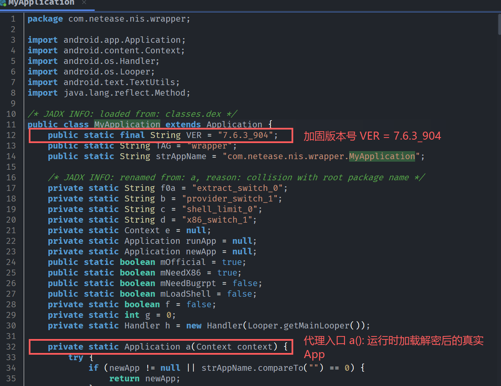

加固库 `libnesec.so` 用了 `.gnu.draft`、`.gnu.stub`、`.gnu.fragment` 等伪段名，实际是整包 DEX 加密加 zlib 压缩。二进制布局与加载流程如下：

#### 1. 二进制布局与加密载荷

ELF 的段分布显示，`libnesec.so` 的可执行代码集中在 `0xE5320`–`0x10D800` 区间。低地址 `0x191`–`0xE1F00` 处为 `.gnu.fragment` 段，存放经过加密压缩的真实 DEX 数据。相邻的 `.gnu.stub` 与 `.gnu.draft` 段作为重定位指针表（包含大量形如 `DCQ qword_F0+2` 的偏移定义），用于引导载荷解密与定位。

#### 2. 内置 zlib 解压引擎与加载流程

模块中代码规模最大的两个函数均为标准 zlib 解压实现：

| 函数          | 功能定位           | 实现要点                                                                                                                                      |
| ----------- | -------------- | ----------------------------------------------------------------------------------------------------------------------------------------- |
| `sub_F1A80` | `inflate_fast` | 位缓冲累加循环 `while (bits <= 0x13) { hold \|= *in << bits; bits += 8; }`；查表 `off_FAEC0`（掩码查找表 `0, 1, 3, 7, 15, ...`）；执行标准的 LZ77 窗口回溯 16 字节展开拷贝 |
| `sub_F12D8` | `inflate` 状态机  | `switch(state)` 处理 0–9 状态分支（`TYPE` / `STORED` / `LEN` / `DIST` / `MATCH` / `CHECK` 等），调度 `sub_F1A80` 与窗口更新例程 `sub_F3694`                  |

`sub_F1A80`（`inflate_fast`）的反编译呈现标准的 zlib 取码结构：包含位缓冲累加 `hold |= *in++ << bits; bits += 8`、`off_FAEC0` 位掩码查找表（`{0,1,3,7,15,…}`）与霍夫曼长度/距离码查表，配合 16 字节展开的 LZ77 窗口回溯拷贝：

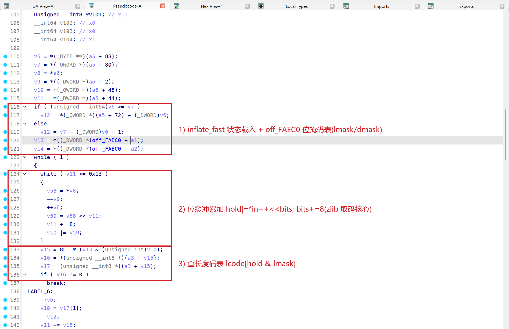

`sub_EEAE8` 是对象化的装载流程：连续调用若干虚函数，依次提取分段载荷、内存解密、`inflate` 解压，最后构造 `DexFile` 注入 ART。

#### 3. 动态符号解析与反分析

导入表中包含加密符号名（如 `B_n5:Bn0_MP:_YTV__R.…`），运行时由壳加载器动态解密并完成 libc 符号地址绑定，隐藏 API 调用关系。

加固壳与 HTProtect 风控层的关系如下：

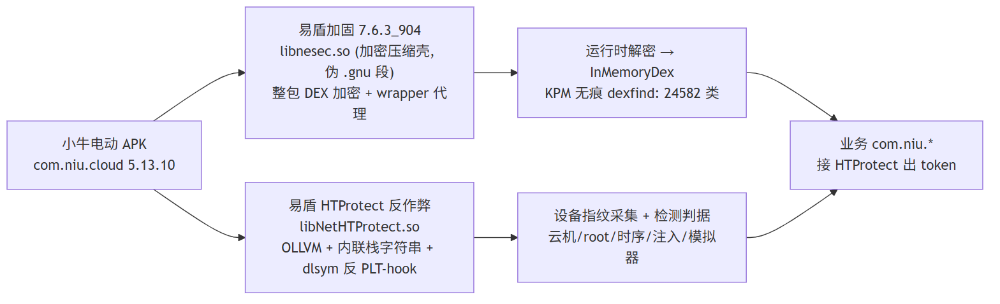

## 内核级无痕脱壳与 DEX 修复

易盾加固具备进程注入与调试检测，常规 frida attach 会直接触发退出。脱壳采用基于内核页表保护的无痕方案，规避易盾对 `/proc/self/maps` 的自检。

启用脱壳工具 `dexfind`（挂钩 ART `ClassLinker::VisitClasses` 遍历 `DexFile` 指针 dump 内存，不依赖文件头魔数），启动目标 App：

```
[unpack] dexfind: FindClass hooked (traceless); self-triggering
[unpack] dexfind: enumerated 24582 class-def(s)
[unpack] dexfind: 8 region(s) recovered
```

内存中共枚举到 24582 个类定义，其中 `com/niu` 业务引用 11773 处，`com/netease/htprotect` 引用 299 处。

脱壳导出的原始内存镜像中，设备 `/data/data/<pkg>/unpack/` 目录下生成了 6 个大小约 8–10MB 的 `region_*.bin` 内存块。易盾在加壳加载时抹除了内存中 DEX 头部的 4 字节魔数 `dex\n`，使得 dump 镜像自 `038\0` 处开始，造成整体偏移。修复时补齐前导 4 字节魔数并修正对齐，截断文件并重新计算 SHA-1 签名与 Adler-32 校验和，即可恢复出完整的合法 DEX 文件。

无痕脱壳与 DEX 修复流程如下：

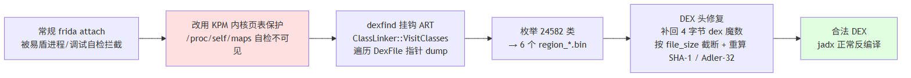

## 设备指纹的几条采集线

脱壳重组后，把 7 个业务 DEX 和 native 库一起排查，该应用的设备信息采集分成几条并行的线：

| 层级 | 采集内容 | 上报通道 | 功能定位 |
| --- | --- | --- | --- |
| 易盾 HTProtect（native 侧） | 系统底层属性、33 处裸 `syscall`、云机判据、root 挂载点、CPU 核数、maps 映射与 fd `mnt_id` | Native 生成加密 Token 并随请求上报后端风控 | 反作弊 / 环境完整性风控 |
| App 自主采集（请求头） | `Build.MODEL`、`Build.BRAND`、系统版本、语言及时区 | HTTP 请求头 `User-Agent` | 基础机型统计（不含 IMEI / android_id） |
| 第三方 SDK（友盟 / 厂商 OAID / 推送） | OAID、IMEI、`android_id`、MAC | 各 SDK 自有数据中心 | 推广归因与统计分析 |

后两类与易盾无关：主 App 只拼了个克制的 `User-Agent`，硬件标识（OAID、IMEI、`android_id`）由友盟、各厂商 OAID 组件和推送 SDK 采集，用于商业归因。

真正做环境完整性校验和强对抗的代码都在 `libNetHTProtect.so` 里，下面集中分析这个 so。

## libNetHTProtect 混淆与反 Hook 机制

`libNetHTProtect.so` 数据段中敏感明文字符串极少。多数都在栈上拼装，用完即弃，不落 `.rodata`。

在 `JNI_OnLoad` 中可见典型的栈字符串构造逻辑，通过常量异或逐字节解密：

```
strcpy(v17, "p~Nxokt~x");
for (i = 4; i != 13; ++i) v17[i-4] ^= 29;      // ^0x1D
// -> "mcService"
```

IDA 中的对应实现如下：

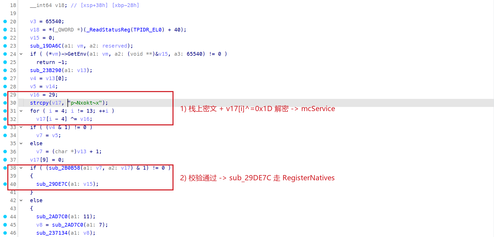

栈字符串采用了多套解密规则，并在同一函数内交叉使用：

```
XOR 常量:        bytes ^ 0x1D / ^0x21 / ^5 / ^37 / ^0x55
running-XOR:     bytes[i] ^= (i + 首字节)          // 位置相关，每字节 key 递增
减常量:          bytes[i] -= 2 / -= 7 / -= 9
```

除常规字符串外，核心 libc 函数名同样加密存放。在 `sub_1D03BC` 中解出符号名后，通过 `dlsym` 动态获取函数地址并缓存，避开 PLT/GOT 导入表，导致常规 PLT hook 失效：

```
qmemcpy(v13, "mlGLEC]TeKNRNZ25;", 17); v13[17]=28; strcpy(v14,"# 2");
for (i=0;i!=21;++i) v13[i] ^= (i + 50);          // ^(i+0x32)
// -> "__system_property_get"
off_4A4D50 = dlsym(NULL, v13);                    // 动态解析，绕过 PLT-hook
```

IDA 中对应解密与 `dlsym` 调用片段如下：

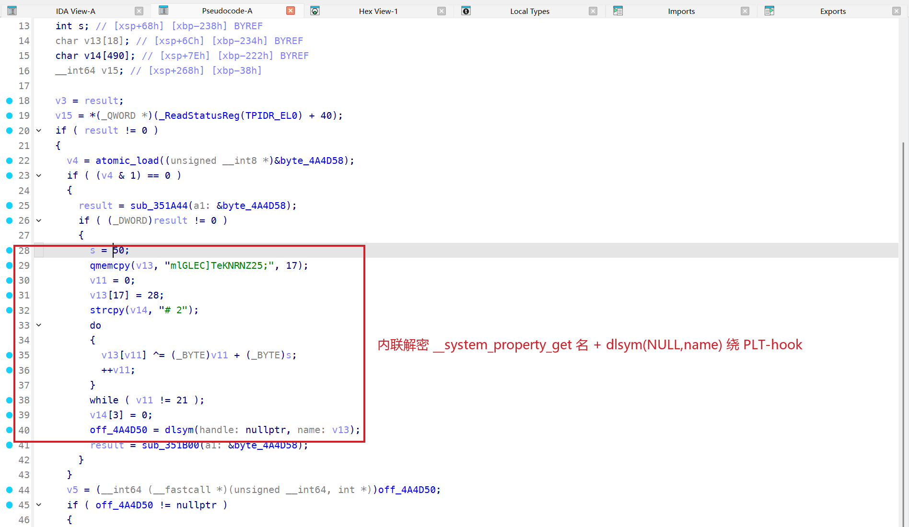

## JNI 动态注册链

跟踪初始化调用链 `JNI_OnLoad → sub_29DE7C → sub_29D878`，发现此处调用了 `RegisterNatives`。注册所需的类名、方法名均经由内联解密还原：

```
bytes ^ 0x21                → "com/netease/htprotect/poly/…"    (目标类)
running-XOR (i+首字节)       → "setCheckResult"                  (方法名)
"M-Z" 逐字节 -4             → "(I)V"                            (方法签名)
```

最终将 `com.netease.htprotect.poly.setCheckResult(I)V` 绑定至 native 函数 `loc_29D5E4`。该接口用于把检测结果回填给 Java 层，采集与判定都在 native 侧，Java 层只拿到加密后的 token。

## 属性采集通路与云机检测判据

SDK 在底层采集设备属性，并在 33 处函数中使用裸 `syscall` 绕过 libc 封装直接读取 `/proc`、`/sys`。系统属性的读取分三条通路：

1. **PLT `__system_property_get`**：仅 `sub_1D6CF0` 一处使用，读取全库唯一的明文属性名 `ro.build.version.sdk`。
2. **dlsym `__system_property_get`（反 PLT-hook）**：`sub_1D03BC` 内联解密符号名后 `dlsym(NULL,…)` 缓存至 `off_4A4D50`，经带缓存的 `sub_1D1334` 供云机检测例程 `sub_16CBDC` / `sub_16DEFC` 调用，读的就是下面的 `wg.cust.*` 判据。
3. **PLT `__system_property_find`**：封装成两个通用助手，`sub_1A0374` 按名读值、`sub_1D15D8` 判存在，被 `sub_167848`、`sub_170488`、`sub_2892E4` 等环境采集器调用；其 key 在各调用点以 libc++ `std::string` 形式在栈上逐字符内联拼装后传入，静态不落 `.rodata`。

除 `ro.build.version.sdk` 外，其余 key 都在栈上动态拼装。数据段中仅残留少量路径字符串，如 `/system/build.prop`（直接解析文件以绕过属性服务接口）、`/system/bin/app_process64`、`/system/bin/linker64` 及 `/proc/self/maps` 等。

在 `sub_16CBDC` 与 `sub_16DEFC` 中包含大量内联加密字符串，逐一还原算法后，确认其为针对某云手机平台（特征前缀 `wg`）的检测判据，用于探测该云机环境改机模块注入的自定义属性和设备节点：

```
/dev/wgzs                              # 云机设备节点
/dev/wgzs/2358
wg.cust.config.phone.id                # 云机改写的 phone id
wg.cust.s_android_id                   # 云机改写的 android_id
wg.cust.config.phone.imei              # 云机改写的 IMEI
wg.cust.config.phone.imeimackey
wg.cust.config.phone.mac               # 云机改写的 MAC
wg.cust.config.phone.mac.rel
wg.cust.sys.prop.filter                # 云机属性过滤表
wg.cust.config.pkg.name
wg.cust.destUids / wg.cust.destUids=%s
wlan0:%s                               # 读真实 wlan0 MAC 做比对
```

在 `sub_16CBDC` 中通过 `^0x55` 异或解密 `wg.cust.*` ：

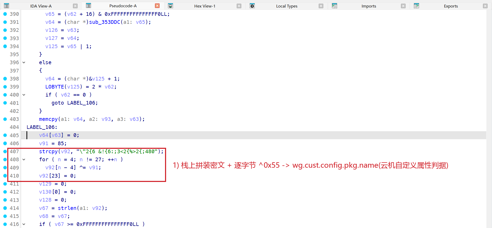

逻辑如下：读取云机属性 `wg.cust.config.phone.mac`（模拟伪造值），并与系统底层获取的真实 `wlan0` MAC 地址比对。若二者不一致，或系统中存在 `wg.cust.*` 系列属性，亦或检测到 `/dev/wgzs` 设备节点，均直接判定运行于该云手机环境中。这些特征全部内联加密，静态字符串检索覆盖不到。

## 环境检测面：模拟器 / 虚拟化 / 定制 ROM / 改机 / 群控 / 云测

同一套内联加密手法还铺在别的检测函数里。`libNetHTProtect` 中有一组按目标环境划分的检测器，一个函数对应一种环境，最终都落到 `sub_1D2378`（文件是否存在）或 `sub_1D15D8`（属性是否存在，即 `__system_property_find`）这两个判断上，其中 `sub_1D2378` 被 21 个函数引用。把各函数的内联密文逐条脚本化还原后，得到如下检测项。

### 模拟器与虚拟化（`sub_170488`，单函数 110 条特征，覆盖约 30 个平台）

该函数是其中最大的检测器，归类如下：

| 目标平台                                                            | 代表特征（内联解密还原）                                                                                                                                                                                                                        |
| --------------------------------------------------------------- | ----------------------------------------------------------------------------------------------------------------------------------------------------------------------------------------------------------------------------------- |
| 雷电 LDPlayer                                                     | `/system/bin/ldinit`、`/system/bin/ldmountsf`、`/system/lib/libldutils.so`、`init.svc.ldinit`                                                                                                                                          |
| 逍遥 MEmu / MicroVirt                                             | `/system/bin/microvirt{-prop,d}`、`/data/data/com.microvirt.{market,tools}`、`microvirt.{memu_version,imsi,simserial,mut}`、`/system/etc/xxzs_prop.sh`                                                                                 |
| 夜神 Nox                                                          | `/system/bin/nox-prop`、`/system/lib/libnoxspeedup.so`、`persist.nox.simulator_version`、`init.svc.noxd`、`com.bignox.*`                                                                                                                |
| BlueStacks                                                      | `/data/bluestacks.prop`、`boot/bstsetup.env`、`system/xbin/bstk`、`/sys/module/bstinput`、`/sys/class/misc/bst_gps`、`bst.version`                                                                                                       |
| 网易 MuMu                                                         | `/system/etc/mumu-configs/device-prop-configs/mumu.config`、`/data/data/com.mumu.{launcher,store}`、`com.netease.mumu.cloner`                                                                                                         |
| 天天 ttVM                                                         | `/system/bin/ttVM-prop`、`init.svc.ttVM_x86-setup`                                                                                                                                                                                   |
| Droid4X                                                         | `/system/lib/libdroid4x.so`、`/system/bin/droid4x-prop`、`init.svc.droid4x`                                                                                                                                                           |
| Genymotion / AndroVM                                            | `/data/data/com.androVM.vmconfig`、`/system/bin/androVM{_setprop,-vbox-sf}`、`ro.genymotion.version`                                                                                                                                  |
| 腾讯手游助手                                                          | `/system/bin/tencent_virtual_input`、`/vendor/bin/init.tencent.sh`、`sys.tencent.{os_version,android_id}`                                                                                                                             |
| Phoenix OS                                                      | `/system/phoenixos`、`/xbin/phoenix_compat`、`ro.phoenix.version.*`                                                                                                                                                                   |
| Remix OS / Andy / Windroy / XCPlayer / Duos / AiVM              | `ro.build.remixos.version`、`ro.andy.version`、`/system/bin/windroyed`、`/system/bin/XCPlayer-prop`、`/system/bin/duosconfig`、`ro.aivm.{fps,gps}`                                                                                       |
| YouWave / XiaoPi / Lybox / MEmu-nemu / dundi / Buildroid / pkVM | `/data/youwave_id`、`/system/bin/xiaopiVM-prop`、`/system/lib/liblybox_prop.so`、`/system/lib/libnemuVMprop.so`、`/dev/nemuguest`、`com.ddmnq.dundidevhelper`、`/init.dundi.rc`、`/system/etc/init.buildroid.sh`、`init.svc.pkVM_x86-setup` |
| Redroid                                                         | `ro.kernel.redroid.{fps,height}`、`ro.boot.redroid_fps`                                                                                                                                                                              |
| 底层虚拟化                                                           | VirtualBox（`/dev/vbox{guest,user}`、`/sys/module/vbox*`、`vbox*.ko`）、Goldfish/AVD（`/dev/goldfish_pipe`、`/sys/module/goldfish_{audio,battery}`）、KVM（`/sys/module/kvm_{intel,amd}`）、x86 Android（`/init.android_x86*.rc`）                |

这些判据覆盖特征二进制、`.so`、`/dev` 设备节点、`/sys/module` 内核模块、`/data/data` 应用目录、`init.*.rc` 与 `ro.*`/`init.svc.*` 系统属性。易盾是照着每个平台跑起来会留下什么痕迹逐个抠的，覆盖面比我一开始预想的全。

### 网易 MuMu / AOSP 模拟器（`sub_16EEBC`）

`sub_16EEBC` 用属性和文件两路确认 MuMu 与标准 AOSP 模拟器：`nemud.system_writable`、`nemud.player_version`（`nemud.*` 为网易 MuMu 的属性命名空间）；以及 `ro.hardware.egl`==`emulation`、`ro.product`==`emu64a`、`/vendor/lib64/egl/libEGL_emulation.so`、`/system_ext/lib64/libemulator_multidisplay_jni.so`。

### 定制 ROM

| ROM       | 函数           | 判据                                                                                   |
| --------- | ------------ | ------------------------------------------------------------------------------------ |
| LineageOS | `sub_128E8C` | `/system/framework/org.lineageos.{platform,hardware}.jar`、`ro.lineage.build.version` |
| nubia     | `sub_188B90` | `ro.product.manufacturer`==`nubia`、`/system/framework/framework-nubia-res.apk`       |

### 改机 / 设备伪造框架特征（`sub_167848`，48 条）

除前面的 `wg.cust.*` 外，`sub_167848` 是另一套改机 / 群控框架的特征库，分三类：

- **伪造设备属性**：`persist.sys.fakeinfo.{sim.id,mac}`、`persist.hw.{btmac,apks}`、`persist.sys.{SamOaid,ConnectWifi_Arp_Ip,virtual_camera_flag}`、`gmt.{phoneid,bootid}`、`sys.xx.state`、`/data/system/fakeinfo`、`/data/android_info.conf`、`/data/mac`；
- **root / hook 授权标记**：`persist.sys.{grantSuUid,hookuid,keep.mprop}`、`/system/bin/wuhen.apk`（无痕改机）、`/dev/fkmem`、`/system/bin/fkcmd`、`/persist/wlan_mac1.bin`；
- **改机工具落地文件与包名**：`/data/local/tmp/{serial.pl,action_result.pl,tmptaskcommand.pl,ppp.pp,lmi,bs}`、`/data/local/{backup,restore}.sh`、`/sdcard/Alarms/{Apkdocument,applist/packages.xml,businessapk}`、`/data/data/{com.crazycompany.arocket,com.android.xqqnews[.lite],com.wjmt.app,com.gmt.app,com.android.flysilkworm}`、`/sdcard/my/*.mp4`、`/sdcard/systemcache/Dict.txt`。

### 自动化 / 群控 / 云测 / 投屏检测（`sub_161244`，64 条）

这个检测器主要针对自动化脚本和远程控制 / 云测工具：

- **投屏 / 屏幕注入**：minicap（`minicap.so`）、minitouch、scrcpy（`oat/arm64/scrcpy-server.odex`、`mqc-scrcpy.jar`）、vysor（`vysor.pwd`）、mirroid（`mirroid-server.jar`、`mirroidinput.apk`）、`gibb-screen.jar`、`screen-shread{5x32,10x64}.so`、`libtxysvr.so` / `txysvr.apk`；
- **自动化框架**：AutoJs（`assets/libautojs.so`、`assets/raw/libautojs.so`、`/sdcard/AutoApp/autoServer.dex`）、按键精灵（`com.cyjh.mobileanjian.id`）、uiautomator（`uiautomator-stub.jar`）、来选（`laixi.jar`）、itestin（`itestin.monkey`）、`juejinScript` / `juejinAzykb/*`、`maxpresent.jar`、`easyagent.apk`、`yijianwanservice.apk`；
- **hook / 调试 / 远程 / 云测**：`re.frida.server`、shizuku（`shizuku`、`shizuku_starter`）、`/data/camera/libshadowhook.so`、鸿蒙远程调试（`deveco_remote_debugging/HdmtStream`）、`cloudtesting/{cloudscreen,touchserver}`（云测平台）、busybox / yadb、`/data/fakeloc`（模拟定位）、`/data/local/tmp/`。

### 多开沙盒 / 重打包检测（`sub_17EF8C`、`sub_28D9B8`、`sub_2B008`）

- **x8zs 多开沙盒**（VirtualApp 系）：`com.x8zs.sandbox`、`/x8/config/{full_vm,root.pkg.blacklist}`、`ro.x8.{version,uuid}`、`com.f1player`；
- **odex / 重打包完整性**：`base.apk`、`oat/arm{,64}/base.odex`、`inline-max-code-units=0`、`strings <file> | grep odex`（检测是否被去优化 / 重编译）、`black_module`、`/.hrecord`。

这些检测项合起来看，HTProtect 的环境检测面覆盖 30 多个模拟器与虚拟化、多款定制 ROM，以及改机 / 群控 / 自动化 / 云测 / 投屏 / 多开沙盒 / 重打包工具，共约 280 条，全部内联加密（本文用脚本批量复现，完整清单见配套解密脚本）。

## 核心安全检测机制还原

`libNetHTProtect.so` 里的环境检测项，大多不走容易被 hook 的接口。

### mounts 遍历检测 Root

`sub_29C678` 负责探测 Root 痕迹。通过 `opendir("/proc/")` 遍历 PID，拼接 `/proc/<pid>/mounts` 读取挂载信息，检索 su 与 Magisk 的挂载记录。相关路径字符串均通过内联算法解密：

```
"2surf2"  逐字节 -3      -> "/proc/"
"k()2&=9" ^(i+0x44)     -> "/mounts"
```

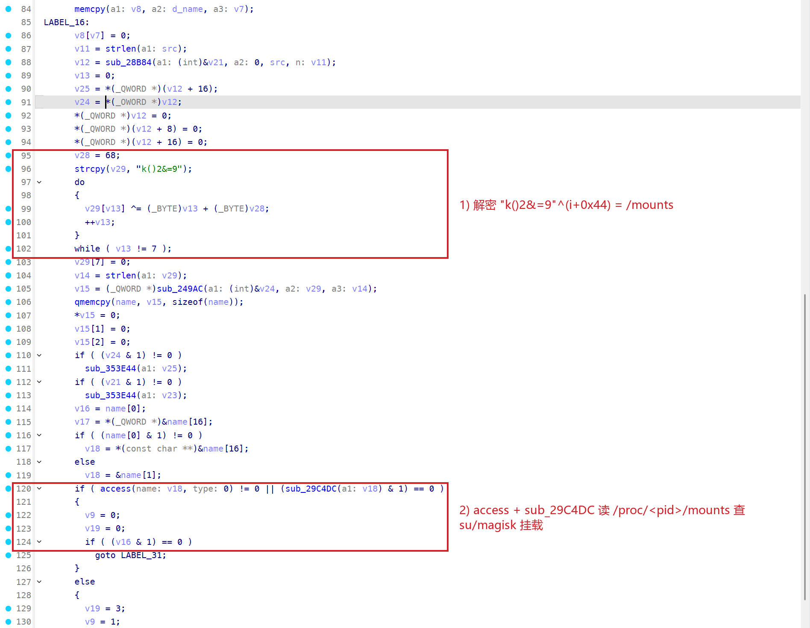

### 时序侧信道反 Inline Hook

`sub_29017C` 通过执行时延差异探测底层 libc 函数是否被 hook。

实现上，针对同一路径分别执行裸系统调用 `syscall(291 /*statx*/, AT_FDCWD, path, …)` 与 libc 封装函数 `fstatat(AT_FDCWD, path, …)` 各 20 次，循环 10 轮，并调用 `clock_gettime` 统计耗时：

```
for (i = 0; i < 10; ++i) {
    t0 = clock_gettime();
    for (j = 0; j < 20; ++j) syscall(291, AT_FDCWD, path, ...);   // 裸 statx
    t1 = clock_gettime();
    for (k = 0; k < 20; ++k) fstatat(AT_FDCWD, path, buf, ...);   // libc 封装
    t2 = clock_gettime();
    diff[i] = (t1 - t0) - (t2 - t1);
}
if (count(|diff[i]| > 1000ns) > 5) -> 判定 libc 被 hook
```

裸 `syscall` 直达内核，执行耗时相对恒定；而 libc 的 `fstatat` 若被 inline hook 或 frida 插入 trampoline 跳转指令，引入的额外开销会导致耗时明显上升。当 10 轮测试中有超过 5 轮的时差绝对值大于 1000ns，即判定存在 hook。该方法通过时序侧信道判断代码完整性，能有效对抗简单的 maps 隐藏。

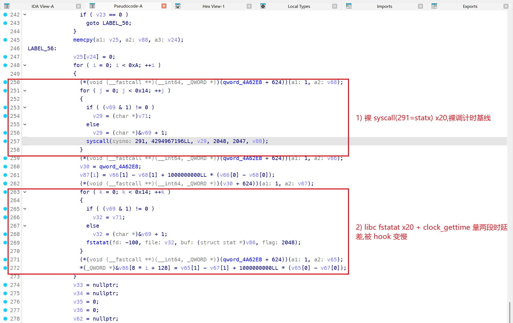

### 辅助环境探测：CPU 核数与内存异常映射

`sub_184DF0` 遍历 `/sys/devices/system/cpu` 目录下的 `cpu%u` 项统计 CPU 核心数，用于辅助识别模拟器配置。

`sub_28B79C` 遍历进程内存映射，比对路径中包含 `[vdso]`、`/dev/zero`、`/memfd:jit-cache`、`jit-zygote-cache` 等特征项的数量，当异常数量超过阈值即判定为注入状态（frida 注入通常伴随异常的 memfd 或匿名可执行段）。

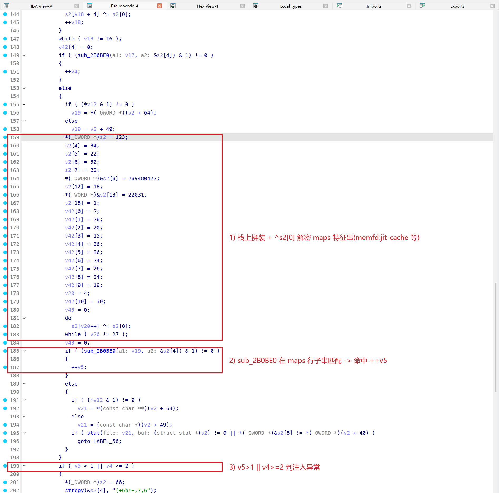

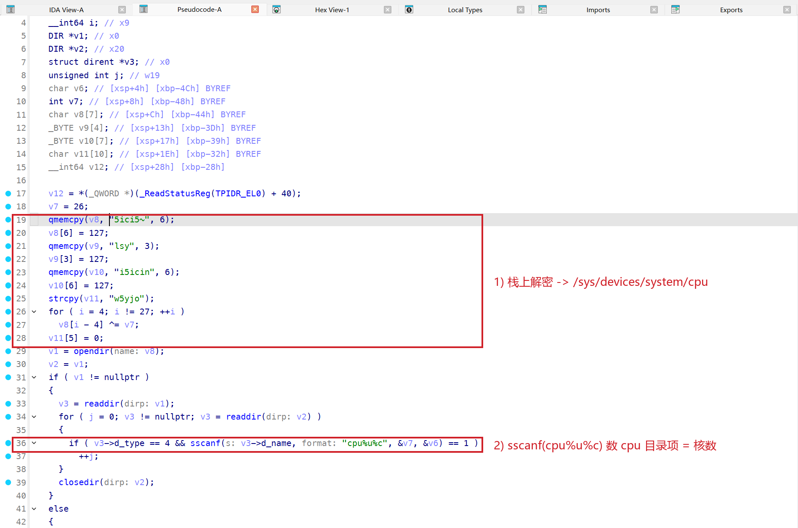

### 检测项汇总

| 类别 | 函数 | 特征（解密还原） |
| --- | --- | --- |
| 云机(wg) | sub_16CBDC / sub_16DEFC | `/dev/wgzs`、`wg.cust.config.phone.{id,imei,mac,mac.rel,imeimackey}`、`s_android_id`、`sys.prop.filter`、`config.pkg.name`、`destUids`；对比真实 `wlan0` MAC |
| root | sub_29C678 | `opendir(/proc/)` → `/proc/<pid>/mounts` 查 su/magisk 挂载 |
| 反 hook(时序) | sub_29017C / sub_28F290 | 裸 `syscall(statx)` vs libc `fstatat` 时序差；另一路裸 `syscall(45=truncate)` 两 length 各 20×10 计时，diff>1000ns 计数>5 判 inline hook |
| 反注入(maps) | sub_28B79C | maps 里 `[vdso]`/`memfd:jit-cache`/`jit-zygote-cache`/`inject` 计数异常 |
| 反模拟 / 反 DBI | sub_2916D0 → sub_290C90 / 290EE8 / 2912A4 | `mincore` 页驻留侧信道 + `execve(221)` 故意 EFAULT argv，探 `mincore`/`execve` 是否被真实内核忠实处理（反 unidbg/QEMU/Frida-broker） |
| 注入 .jar / mnt_id | sub_291C90 | 遍历 `/proc/self/fd` 挑指向 `.jar` 的 fd → 读 `/proc/self/fdinfo/` 的 `mnt_id`，`mnt_id≥1001` 判 Zygisk/Xposed bind-mount 注入 |
| 模拟器/云机 | sub_184DF0 | `/sys/devices/system/cpu` 核数 |
| 调度 / token | sub_23F5C0 | OLLVM 平坦化 + 运行时函数指针表间接分发 → 编码进加密 token |

所有检测结果汇总到 `sub_23F5C0`，由它调度编码成加密 token，回传 Java 层。数据流关系如下：

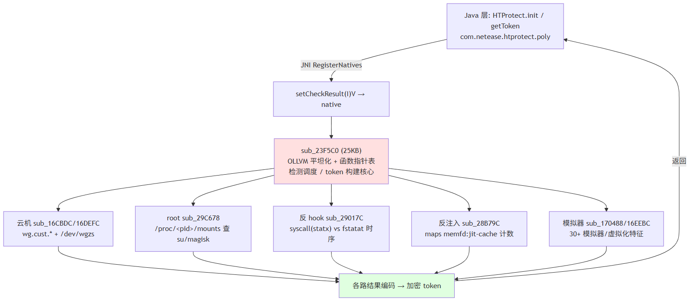

### mincore 页驻留侧信道反模拟执行

`sub_2916D0` 汇总了 `sub_290C90`、`sub_290EE8` 和 `sub_2912A4` 三处子探针的执行结果，核心逻辑如下：

```c
page = mmap(NULL, 2*PAGE, PROT_READ, MAP_ANON|MAP_PRIVATE, -1, 0);
mprotect(page, PAGE, PROT_READ|PROT_WRITE);
memset(page + PAGE - 16, '.', 16);          // 页尾放 canary
// sub_290EE8 / 2912A4 多一步：拿这块 mmap 页当 execve 的 argv
char *argv[] = { "/system/bin/ls", page+PAGE-16, ... };   // 解密得到路径
syscall(221 /*execve*/, path, argv, envp);  // 内核拷 argv 命中 guard → EFAULT，不会真 exec
mincore(page, PAGE, &vec);                    // 看内核有没有把页标为驻留
return vec != 0;
```

该逻辑在 `mmap` 分配的内存页边界构造参数，使内核在从用户空间复制 `argv` 时触发边界越界保护并返回 `EFAULT`，确保 `execve` 必定失败而不会覆盖当前进程。随后调用 `mincore` 检查该内存页的物理驻留状态。

真实 Linux 内核对该异常序列的处理表现是确定的；但在 unidbg、QEMU 或部分基于 Frida 的系统调用拦截环境中，模拟层对 `mincore` 与异常系统调用的处理往往返回默认值（如直接返回 0）或存在行为差异，从而暴露模拟环境。其中路径字符串解密自 `"0tztufn0cjo0mt"`（偏移 -1 得到 `/system/bin/ls`）与 `"1u{uvgo1dkp1vtwpecvg"`（偏移 -2 得到 `/system/bin/truncate`）。函数内部包含大量形如 `dword_4B0020 * dword_4B0020 + 1 - …` 的恒真恒假运算，为典型的 OLLVM 不透明谓词。

### 注入 .jar 检测：通过 fdinfo 检查 mnt_id

`sub_291C90` 通过文件描述符属性检测 Xposed/Zygisk 框架注入：

```c
d = opendir("/proc/self/fd");                       // "2surf2vhoi2ig" - 3
while ((e = readdir(d))) {
    readlink("/proc/self/fd/<n>", buf);
    if (contains(buf, ".jar") && filter(buf, "com.android")) {   // "j/'5"、"ZU_ITR_"^0x3B
        open("/proc/self/fdinfo/<n>");              // "a><!-a=+..." ^ 0x4E
        // 逐行找 "mnt_id:" 字段
        sscanf(line, "mnt_id: %d", &mnt_id);        // "nou`je;!&e" - 1
        if (mnt_id >= 1001) report();               // 非默认 mount namespace → 判注入
    }
}
```

常规进程中打开的文件均隶属于系统默认挂载点。Magisk/Zygisk 模块及 Xposed 插件注入目标进程时，多通过独立 mount namespace 进行 bind-mount，将 `.jar` 或 `.dex` 挂载入进程，使得 `/proc/self/fdinfo/<fd>` 中的 `mnt_id` 明显偏大（通常 $\ge 1001$）。该检测通过遍历文件描述符直接校验挂载命名空间，能在 maps 特征被隐藏时识别框架注入。

## 反调试与反 Hook 机制

除具体检测判据外，`libNetHTProtect` 还有一层反调试 / 反 Hook 机制，作用是让整套检测自身难以被 hook 或调试。

### 反 PLT-hook 函数指针表

前文那处 `dlsym` 只是个开头。初始化函数 `sub_224E78` 把约 90 个 libc 函数地址一次性缓存进运行时单例堆对象 `qword_4A62E8`（`operator new(840)`），之后模块内部统一用 `runtime->fptr[offset](args)` 间接调用，不走 PLT/GOT。缓存里既有普通原语（`fopen`/`open`/`read`/`mmap`/`socket`/`dlsym`…），也有整套反调试工具：

```
obj[16]  = raise          obj[24]  = ptrace 包装(见下)
obj[288] = getpid         obj[296] = getppid
obj[552] = fork           obj[560] = waitpid      obj[584] = execl
obj[784] = gettid
```

单例的构造与调用（`sub_1DF34` / `sub_1DF90`）：

```c
// sub_1DF34 —— 建单例
v0 = operator_new(840);     // 840 字节堆对象
sub_224E78();               // 初始化：dlsym 解析 libc 原语并回填字段
qword_4A62E8 = v0;

// sub_1DF90 —— 调用示例
dword_4A6740 = (*(qword_4A62E8 + 0x190))(0);
__cxa_atexit(dtor, &obj, &__dso_handle);
```

`qword_4A62E8` 是一个 840 字节的堆结构体，成员全是函数指针。所有底层调用都走这张表，常规的 PLT/GOT inline hook 就都失效了，这也是为什么直接用 `Interceptor.attach(Module.findExportByName(...))` 挂不住它的内部行为。

`sub_224E78` 里把 `fork` / `waitpid` / `execl` 等原语连同其它 libc 函数一起缓存进该表：

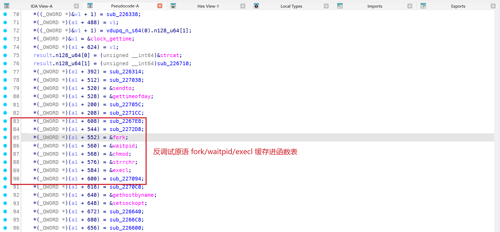

### fork + ptrace 自附加

ptrace 没出现在导入表里，被包成表项 `obj[24]`（`sub_226D8C`），内部用裸系统调用发起：

```c
syscall(117 /*ptrace*/, request, pid, addr, data);   // 经 runtime 函数表间接调用
```

配合表中的 `fork`（`obj[552]`）与 `waitpid`（`obj[560]`）：进程 `fork` 出子进程，由它 `ptrace` 反向附加父进程、占住唯一的 tracer 槽位，之后真实调试器（gdb / frida-server 的 ptrace 附加）再想 attach 就会失败。这是经典的自附加反调试。

`sub_226D8C` 中 ptrace 经函数表指针以裸 `syscall(117)` 发起：

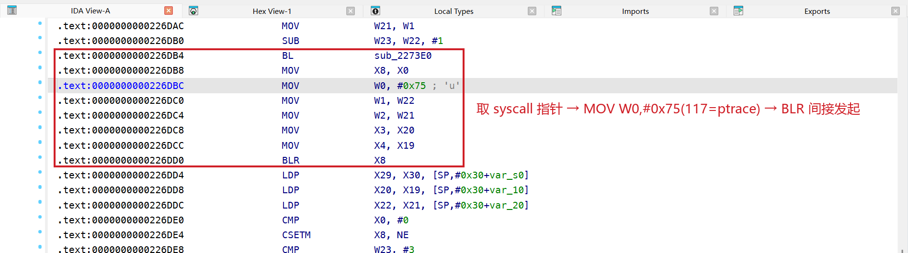

### dl_iterate_phdr 模块枚举（绕过 /proc/maps）

除 `sub_28B79C` 扫 `/proc/self/maps` 外，`sub_1D601C` 另辟一路枚举已加载模块：先 `getauxval(AT_PHDR)` 取主程序 program header、校验 ELF 魔数 `0x464C457F`（`\x7fELF`）、遍历 `PT_LOAD` 求最小 vaddr 定位主模块基址，再 `dl_iterate_phdr` 遍历全部动态库，对每个模块的路径 / 基址交回调判定。

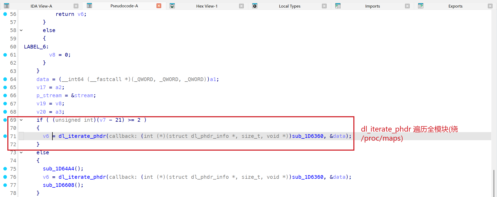

`dl_iterate_phdr` 直接遍历 linker 内部模块链表，不读 `/proc/maps`，所以只隐藏 maps 行的方案对它没用，得从 linker 模块链表这一层把注入库藏掉。

### 裸 syscall 交叉校验与自投信号

33 处裸 `syscall` 中，除时序侧信道（`statx` / `truncate`）与反模拟（`mincore` / `execve`）外，还有数处反 Hook 自检：

- **`gettid` 双路校验**（`sub_1D6CF0`）：先调 libc `gettid`，返回值异常（如被 hook 返回 0）再以裸 `syscall(178)` 复核；
- **`rt_tgsigqueueinfo` 自投信号**（`sub_2FCC18`）：`syscall(240, getpid, gettid, sig, siginfo)` 向自身投递排队信号，配合 `sigaction` / `sigaltstack` 注册的信号处理器（与崩溃捕获模块 `libhtpcrash` 属同一防线）；
- **`futex` 裸调**（`sub_1A0310`）：属性读取路径上以裸 `syscall(98)` 取代可能被 hook 的 libc futex。

## Token 生成核心 sub_23F5C0 结构分析

`sub_23F5C0` 负责 token 的生成与状态编码，采用 OLLVM 控制流平坦化、全内联栈字符串加密以及动态函数指针表实现。具体结构特征如下：

1. **调度与结果落点**：函数入口 `SUB SP, SP, #0xAF0` 开辟 2800 字节栈空间，先经 `runtime->fptr[0x260](10000)` 初始化单例环境，随后在 `arena+0x900` 处调用 `sub_19DA9C` 构造带虚表 `off_442918` 的 C++ 结果对象（负责写入虚表指针并清零偏移 `+8/+16/+24`），再依次通过 `BL` 调用各检测例程（`sub_25CB1C` → `sub_25D56C` → `sub_97B80` → `sub_2285B0` → `sub_239308`）。各例程的裁决结果分散记录在三处：全局最终判定码 `dword_4A671C`、单例对象 `sub_25CB1C()->[0x188]`，以及经虚表分派写入上述 C++ 结果对象的字段中。代码中的 1204 个基本块主要由内联字符串解密小循环及各路状态分支拼接展开而成。
2. **单例运行时函数表间接调用**：函数入口经运行时单例 `qword_4A62E8` 的函数指针字段发起调用（表的构造见前文反 PLT-hook 函数指针表）：

```asm
LDR  X27, [off_44BEA0]      ; X27 = &qword_4A62E8
LDR  X8,  [X27]             ; X8  = qword_4A62E8（对象指针）
LDR  X8,  [X8, #0x260]      ; X8  = obj->fptr[0x260]
MOV  W0,  #0x2710           ; 10000
BLR  X8                     ; obj->fptr_0x260(10000)
```
3. **功能模块分工完整**：该调度函数直接调用的子函数包括 `sub_28B79C`（反注入）、`sub_29017C`（时序检测）、`sub_28F290`、`sub_2916D0`、`sub_291C90` 等独立检测例程，分别承担具体的环境检查。

各检测例程输出的状态位与加密数据在 `sub_23F5C0` 内编码，组装成返回 Java 层的风控 token。

## 动态验证：运行时实际执行的检测

静态分析只能列出检测项全集，实际跑了哪些，得靠运行时监控。利用内核页表层无痕 Hook，在易盾运行期对其属性读取接口（libc `__system_property_get`、`sub_1A0374` / `sub_1D15D8`）及 11 个核心采集器入口进行监控。

实测发现 `libNetHTProtect.so` 是延迟加载的：应用冷启动及未登录阶段均不载入，直到登录后首个受 SafeComm 保护的业务请求触发 `getToken` 时才通过 `dlopen` 装载并执行采集。单轮 `getToken` 的调用监控数据如下。

实际触发的采集例程：

| 采集器 | 职责 |
| --- | --- |
| `sub_23F5C0` | token 核心调度 |
| `sub_28B79C` | maps 反注入 |
| `sub_29017C` / `sub_28F290` | 时序反 hook（statx / truncate） |
| `sub_2916D0` | mincore/execve 反模拟 |
| `sub_291C90` | fd `mnt_id` 注入检测 |
| `sub_1D6CF0` | 读 `ro.build.version.sdk` |

实测中反 hook、反注入、反模拟检测完整执行，与 `sub_23F5C0` 静态分析的直接子调用一致。而静态枚举出的云机检测（`sub_16CBDC`/`16DEFC`）、root 挂载检测（`sub_29C678`）以及 CPU 核数采集（`sub_184DF0`）在常规 `getToken` 中并未触发，表明这几项环境检测很可能属于条件触发机制（由服务端策略或特定风险场景按需激活）。

该轮实读的系统属性全量汇总：

| 属性 | 运行时值 | 用途 |
| --- | --- | --- |
| `ro.build.version.sdk` | `36` | API 级别（Android 16） |
| `ro.build.version.preview_sdk` | `0` | 预览版标记 |
| `ro.build.id` | `CP1A.260405.005` | 构建指纹 |
| `ro.build.tags` | `release-keys` | ROM 完整性（非 `release-keys` 判定为自编译系统） |
| `ro.arch` | 空 | CPU 架构 |
| `debug.atrace.app_number`、`debug.atrace.tags.enableflags` | 空、`0` | atrace 方法追踪检测（探测是否开启 systrace / profiling） |
| `persist.log.tag`、`persist.logd.size{,.main,.crash}` | `0`、`1` … | logd 日志级别检测（探测 verbose 调试环境） |

运行时读的属性主要分两类：系统构建/ROM 完整性与调试追踪环境（atrace、logd）。

## 业务请求加签与 SafeComm 原生托管

反编译业务网络层代码，主接口的数据加密与加签全部交给易盾 HTProtect 原生层的 SafeComm：
- **请求加密与加签**：业务参数通过 `HTProtect.safeCommToServerV30(32, 0, plain, false)` 加密生成 `client_data`，再经 `HTProtect.htpSign(32, 0, client_data)` 计算得到 `sign`，请求载荷直接重构为 `{client_data, sign}`；
- **响应解密**：服务端下发的密文经 `HTProtect.safeCommFromServer(0, 0, result)` 还原为解密数据，再通过 Base64 解码与 GZIP 解压还原明文 JSON；
- **风控 Token**：独立通过 `HTProtect.getToken(...)` 异步获取，附加于特定风控请求上报后端。

加签与验签的完整调用链如下：

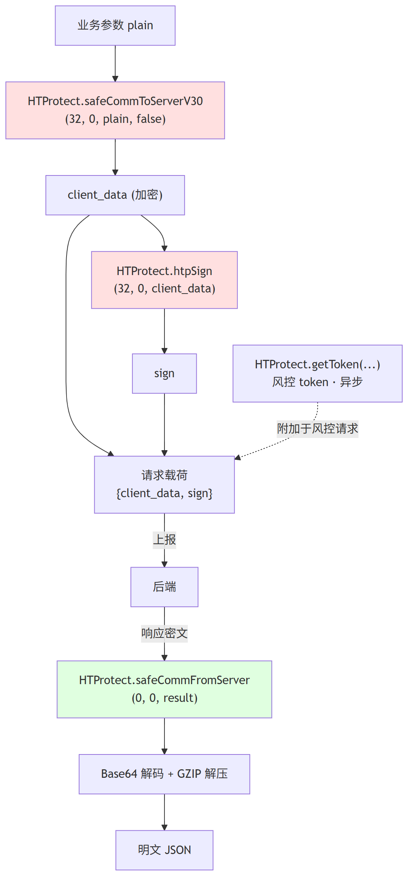

jadx 中可见其加签与解密调用均直接落于易盾原生接口：

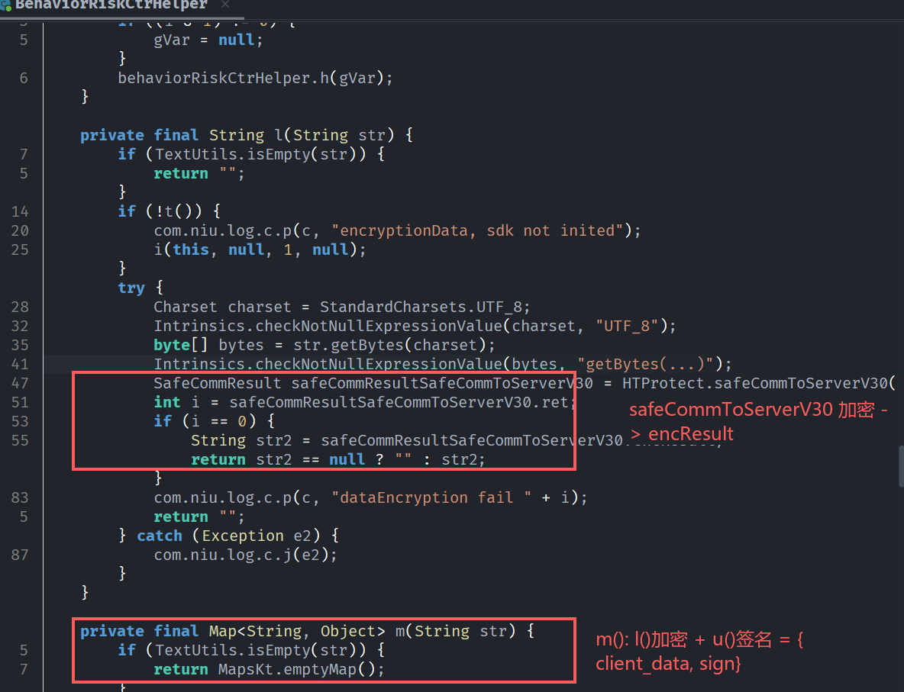

## 总结

1. **加固壳结构**：`libnesec.so` 采用伪造段名混淆，核心方案为整包 DEX 加密加 zlib 压缩，通过内置 zlib `inflate` 算法解压载荷并在内存中动态加载。
2. **反作弊与混淆对抗**：`libNetHTProtect.so` 采用 OLLVM 控制流平坦化与全面内联栈字符串加密，并通过 `dlsym` 动态解析及单例函数表规避 PLT hook。
3. **环境检测机制**：
   - **云手机检测**：针对特定云机环境，通过比对伪造属性（`wg.cust.config.phone.*`）与底层 `wlan0` 真实 MAC 地址，并校验 `/dev/wgzs` 设备节点实现判别。
   - **反 Hook 与反模拟**：利用裸 `syscall` 与 libc 封装函数的执行耗时差（时序侧信道）检测 inline hook；通过内存边界异常传参结合 `mincore` 页驻留状态识别模拟执行环境；通过 `/proc/self/fdinfo/` 中的 `mnt_id` 识别跨 namespace 的 bind-mount 注入。
4. **业务请求安全**：业务主 API 的数据加密与签名计算完全托管于易盾原生层（SafeComm V30），由 native 层统一调度完成参数加签与风控 Token 生成。

## 工具

| 工具                                                                   | 用途                                                  |
| -------------------------------------------------------------------- | --------------------------------------------------- |
| [jadx-headless-mcp](https://github.com/1013503897/jadx-headless-mcp) | 反编译加固壳 dex，分析 `MyApplication` 与脱壳后类结构               |
| [ida-pro-mcp](https://github.com/mrexodia/ida-pro-mcp)               | 逆向 `libNetHTProtect.so`，还原 JNI 注册、dlsym 动态解析、内联字符串等 |
| [Vector](https://github.com/1013503897/Vector)                       | Zygisk + KPM 无痕脱壳框架，通过 `unpack-fart` 提取内存 DEX       |
| [stealth-core](https://github.com/1013503897/stealth-core)           | 内核无痕 hook 与 maps-hide 特征隐藏                          |
