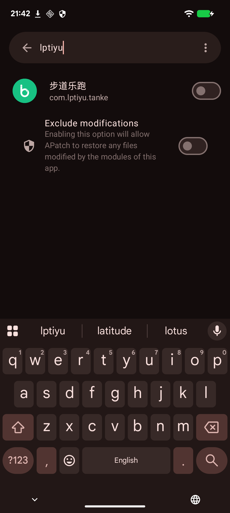

# 前言

目标是一款校园打卡 App（`com.lptiyu.tanke`，版本 4.2.8），用 **SecNeo（梆梆安全）** 加固。它在一台装了注入框架的机器上一打开就自毁，连开屏都过不去。

SecNeo 和易盾 `libnesec` 不同：它把 `libDexHelper.so` 做成一个**几乎全是 `UDF #0` 占位槽的骨架**——函数符号名保留、函数体加密，运行时才由加载器桩解密并材料化到占位槽里。所以静态能看到的是**壳结构、加载器桩的裸-syscall 自检、自建 ELF 符号解析器，以及从符号表 + 导入还原出的检测能力面**；具体判据在加密体里，静态不可得。本文把这条边界说清楚，并逐段还原能还原的部分。

末尾给出工程结论：怎么让 Frida 在 SecNeo 上无痕存活，并把隐身手段逐条对上前面分析出的检测面。

# 现象：启动线程外的自毁

抓 tombstone，签名一眼就是**故意自毁**而非普通崩溃：

```
signal 11 (SIGSEGV), code 1 (SEGV_MAPERR), fault addr 0x000000000000088c
esr 0000000082000006   (Instruction Abort Exception 0x20)
    lr  0000000000000000   sp  0000000000000000   pc  000000000000088c
2 total frames
backtrace:
      #00 pc 000000000000088c  <unknown>
      #01 pc 0000000000000000  <unknown>
pid: 8161, tid: 8189, name: om.lptiyu.tanke  >>> com.lptiyu.tanke <<<
```

- `esr` 是 **Instruction Abort**（取指异常），`pc` 被改成非法小地址 `0x88c` 并跳过去；
- `lr=0`、`sp=0`，回溯只有 2 帧全 `<unknown>`——栈被清空，真实检测点被隐藏；
- 崩溃线程 `tid 8189 ≠ 主线程`——加固壳起的检测子线程在自毁。

tombstone 的 `memory near x15`（指向 `base.apk` 的一块映射）解码后直接露底：`... com.secne o.apkwrapper.H.C LASSPATH ...`——加固壳确切是 **SecNeo（梆梆安全）**。

*（图待补：tombstone_secneo）*

# 壳结构：UDF #0 占位骨架 + 加密体

解包 APK，`lib/arm64-v8a/` 下 SecNeo 三件套：`libDexHelper.so`（加载器 / 反篡改核心，1,066,333 字节）、`libdexjni.so`（壳运行时，7,914,765 字节）、`libDexHelper-x86.so`。只有 1 个 `classes.dex`（外壳，真 dex 加密）。启动日志印证壳流程，自毁发生在业务代码之前的检测子线程里：

```
Load ... base.apk!/lib/arm64-v8a/libDexHelper.so ... ok
ClassNotFoundException: Didn't find class "com.lptiyu.tanke.lp"      # 壳的正常加载流程
Load ... base.apk!/lib/arm64-v8a/libdexjni.so ... ok
F/libc: Fatal signal 11 (SIGSEGV) ... 0x88c in tid 8189             # ~66ms 后自毁
```

IDA 载入 `libDexHelper.so`：509 个函数，符号名大量保留（`commonExpCheck`、`ArtMethod::isHooked`、`DexFileLoader`、自建解析器类等），**但函数体几乎全是 `__udf(0)` 占位**。随手反编译几个：

```c
void __noreturn commonExpCheck(_JNIEnv *a1)                 { __udf(0); }   // 检测总入口
void __noreturn catchMethod(_JNIEnv *a1)                    { __udf(0); }
void __noreturn ...::GnuLookup(basic_string_view, unsigned) { __udf(0); }   // ELF 符号解析
```

`UDF #0`（`0x0000`）是未定义指令占位。SecNeo 的做法是：**保留符号名与占位槽，把真实机器码加密**；加载器桩在运行时解压（内置 `unxz` / `xz_crc64`）并借自建 ELF 解析器就位后，把真实代码材料化到这些占位槽。所以**静态唯一的真实代码，是 rx 段那一小块加载器桩**——它负责解壳前的自检与解密引导。下面分三块还原：加载器桩自检、自建符号解析器、检测面。

# 加载器桩：解壳前的裸-syscall 自检

加载器桩在解密 payload **之前**先跑一轮 maps / cmdline 自检，入口是 `sub_12876C`：

```c
// v5 指向打包时可被替换的占位缓冲；参考占位串 = "__bangcle__check1234567_"
v6 = memcmp(v5,      "__b_a_n_g_", 10);
v7 = memcmp(v5 + 10, "c_l_e__che", 10);
v8 = memcmp(v5 + 20, "ck1234567_", 10);
if ((v6 == 0) <= (v7 != 0) || v8 != 0)
    sub_128380(v5);                               // 占位串已被替换 -> 用真实 pattern 扫 maps
if (memcmp(qword_128D10, "__p_k_g_n_a_m_e__", 17) != 0)
    sub_128454();                                 // 占位串已被替换 -> 扫 cmdline
// ... 之后才是 ELF 解析 / mprotect / xor 解密（真正脱壳）
```

要匹配的 pattern 是**打包时烧进 APK 的配置**，`libDexHelper.so` 里只留占位串 `__bangcle__check1234567_` / `__pkgname__`，真值加密，静态拿不到明文。

maps 读取 `sub_128380`：

```c
result = sub_1281C4(0xFFFFFF9C, "/proc/self/maps", 0, 0);   // sub_1281C4 = syscall(openat, AT_FDCWD, ...)
sub_128224(v8);                                             // 清行缓冲
while (1) {
    v4 = v8;
    do {                                                   // sub_1281B8 = syscall(read)，逐字节读到 '\n'
        if (sub_1281B8(fd, &c, 1) != 1) break;
        *v4++ = c;
        if (c == '\n') break;
    } while (v4 != v8 + 1103);
    *v4 = 0;
    if (v4 == v8) break;
    if (sub_1282F8(v8, pattern) != 0)                      // 每行做子串匹配，命中即返回
        return sub_1281D0(fd);
    sub_128224(v8);
}
```

关键在这一层全用**裸系统调用**，绕过 libc 封装（对应的 hook 拦不住）：

| 封装 | 实现 |
| --- | --- |
| `sub_1281C4` | `syscall(__NR_openat, AT_FDCWD, path, flags)` |
| `sub_1281B8` | `syscall(__NR_read, fd, buf, n)` |
| `sub_1281A0` | `syscall(__NR_mprotect, addr, len, prot)` |
| `sub_1282F8` | 手写 `strstr`（`sub_1282DC` 求长度、`sub_1281E8` 逐段 memcmp） |

`sub_128454` 与之同构，读 `/proc/self/cmdline` 与 `qword_128D10`（cmdline pattern）比对。这轮自检的意义是：**在壳解密前就先确认 maps / cmdline 干净**，任何用户态 open/read hook 都拦不住它。

*（图待补：ida_loader_selfcheck）*

# 自建 ELF 符号解析器：反 PLT / dlsym hook

SecNeo 解析 libc / libart 符号不走 `dlsym`，而是自带一套 ELF 解析器（混淆类名 `p5lS5...`），从符号表能还原出它的方法集：

```
findModuleBase(...)          // 走 /proc/self/maps 定位目标库基址
parse(elf64_hdr *)           // 解析 ELF 头 / program header
ElfHash / GnuHash            // 两套符号哈希
GnuLookup / ElfLookup        // 按哈希查 .gnu.hash / .hash 表
LinearLookup / LinearRangeLookup / PrefixLookupFirst
getSymbOffset(view, j, j)    // 取符号在库内偏移
xzdecompress()               // 载荷 XZ 解压
```

也就是说，它**自己走目标库的 `.dynsym` / `.hash` / `.gnu.hash` 哈希表取符号地址**——`dlsym` hook、PLT/GOT hook 一律失效（比常见的"内联解密符号名 + `dlsym`"更彻底）。解析器就位后，它把 libc 原语地址填进内部函数表，后续所有底层调用都经这张表间接发起。从符号表可见它解析的原语：

```
__system_property_get   access   dlopen   dlsym   fopen   fscanf   sscanf
mprotect   readlink   getpid   gettid   sigaction   ptrace   pthread_*
```

（`dlopen`/`dlsym` 仍解析，是给它自己按需用；核心符号走上面的哈希解析。）

# 检测面还原（符号表 + 导入）

检测函数体是 `UDF #0` 占位（加密），静态**取不到具体判据**；但**符号名 + 导入表**完整勾出了检测能力面。这里如实列出静态可确认的部分：

| 检测项 | 静态证据（符号 / 导入） | 机制推断 |
| --- | --- | --- |
| 检测总入口 | `commonExpCheck(_JNIEnv*)` → `catchMethod(_JNIEnv*)` | 通用异常检查调度，回填结果 |
| Java 方法 hook | `ArtMethod::isHooked(_JNIEnv*, _jobject*)` + `entry_point_offset` / `data_offset` / `art_method_size` / `art_method_field` / `FromReflectedMethod` / `Init` | 读 `ArtMethod` 的 entry_point 与字段布局比对，检出 LSPlant / Xposed / frida-Java hook |
| 时序反 hook | `scan_gettimeofday(void*)` | `gettimeofday` 计时侧信道，比对裸 syscall 与 libc 封装耗时差（同易盾的 statx/fstatat 时序法） |
| 内存签名扫描 | `_yr_scanner_scan_mem`、`memmem` | 内置 **YARA** 引擎扫进程内存，匹配 frida / gum / hook 特征 |
| 反调试 | 导入 `ptrace`、`prctl`、`sigaction`、`kill` | TracerPid / ptrace 自附加、`sigaction` 装 SIGSEGV/SIGTRAP handler、异常自毁 |
| 网络探测 | 导入 `socket`、`connect` | 探测 frida 默认端口（27042 一类）/ 本地服务 |
| 正则匹配 | 导入 `regcomp`、`regexec`、`regfree` | 对 maps 行 / 属性做正则判定 |
| read / 函数完整性 | `hookFunAddr_read`、`wrapHook`、`g_sdkVer_forhook` | 校验关键 libc 函数（read 等）首字节是否被 inline hook |
| 加载器桩自检 | `sub_12876C` / `sub_128380` / `sub_128454`（已还原） | 裸 openat 读 maps / cmdline + 子串匹配（解壳前先跑） |

`ArtMethod::isHooked` 那组符号值得单独说：SecNeo 保留了对 `ArtMethod` 内部布局的探测（`entry_point_offset`、`data_offset`、`art_method_size`），说明它会**从 `jobject`/`jmethodID` 反射到 `ArtMethod`、读其 entry_point 与预期比对**——这是检出 Java 层 hook（改 entry_point 的 LSPlant/Xposed、以及 frida 的 Java 桥）的经典手法，静态只能看到它有这个能力，具体查哪些方法在加密体里。

# 脱壳链与 DEX 注入

从符号表还能拼出解壳链：加载器桩用**自建 ELF 解析器**就位符号 → **`unxz` / `xz_crc64`** 解压加密载荷 → **`DexFileLoader::LoadV26 / LoadV28 / LoadV34_BETA1 / LoadV34_D`**（按 ART 版本注入 DEX）→ **`safejni::invoke / invokeStatic`**（把检测结果与解壳产物回填 Java 层）。`DexFileLoader` 的多版本 `Load*` 正对应不同 Android 的 `DexFile` 内部结构差异。

# 自毁机制

前面 tombstone 已给出自毁的可观测形态：命中检测后，SecNeo **把执行流导向非法小地址 `pc=0x88c`（触发 Instruction Abort）、清空 `lr`/`sp`**，让崩溃发生在一个检测子线程上、栈回溯全 `<unknown>`——刻意隐藏真实检测点，避免逆向者从崩溃栈回溯到判据。配合导入的 `sigaction`（装信号 handler）、`abort` / `_exit` / `android_set_abort_message`，构成"命中即自毁、且不留线索"的闭环。这也是把它归为**主动自毁**而非普通空指针崩溃的依据。

# 应用：让 Frida 在 SecNeo 上无痕存活

静态分析出的检测面，正好逐条对应到隐身要点。把这台机器上的无痕基础设施对上去：

**① 启动检测：加载器层排除**
启动期自毁的触发源，是注入框架（Zygisk 系）在目标进程留下的足迹。用加载器层的 denylist 把目标排除即可——这台是 superkey-less 的 APatch + ZygiskNext（`enforce_denylist=1`），在管理器给目标 App 开 "Exclude modifications"（写 `package_config` 的 `exclude=1`），ZygiskNext 就对它跳过所有模块注入 + unmount。实测目标从开屏一路进 `MainActivity`、进程存活，且其它 app 的 hook 不受影响。



**② 无痕 hook：目标 `.text` 一字不改**
用 traceless-frida：保持 Frida 的 `replace/attach` API，但每个 hook 由 KPM 安装——目标代码页置 `PTE_UXN`，`do_page_fault` 路由进一个整区域、位置无关的 DBI 克隆，函数入口 override 到替换函数。**目标库 `.text` 不写、不可写、无 rwx 蹦床**，正对上 SecNeo 的 `hookFunAddr_read`（函数首字节完整性）与 maps 扫描。原生 only、不碰 Java，绕开 `ArtMethod::isHooked`。

**③ 藏 Frida 自身：内核 autocloak**
无痕 hook 只保证目标干净；Frida 自己（agent / Gum JIT 的 memfd）还在 maps 里，正是 SecNeo 的 YARA 内存扫描 + maps memfd 计数要抓的。selfCloak 走自身 maps 把这些 memfd 加进 KPM 隐藏集；进一步把它沉进内核——给 shpte KPM 加 `autocloak`：`show_map`/`show_smap` 钩子里 owner-mm 门控 + 对刚写进 seq 缓冲的行做 frida 标记匹配（`/memfd:` / `frida` / `gum` / `jvmti`）+ 回退 `seq->count` 丢整行。相比 selfCloak：一次调用、无用户态轮询、无启动窗口、lazy JIT memfd 现读现藏。

实测（denylist 下存活的目标，attach 后进程内触发）：

```
[1] Traceless.init  armed=true
[2] maps before autocloak: {"memfd":15,"frida":4}
[3] Traceless.autocloak() ret=0
[4] maps after  autocloak: {"memfd":1,"frida":0}
[5] traceless hook on libc open @ 0x7c44b5bc40    # 目标真实 I/O 实时触发，进程存活
```

外部 root 从 `/proc/<pid>/maps` `grep -ci frida` 也回 0——内核层过滤，连外部读者都看不到。把三点对回检测面：`.text` 不改过完整性与 `isHooked`（原生 only）；maps 无 zygisk / frida 痕迹过 maps-scan 与 YARA memfd；配合 KPM 的 TracerPid spoof 可过 `ptrace` / `/proc/self/status`。

*（图待补：verify_autocloak）*

# 小结：清证据，而不是击败检测

这套方案的本质：**Frida 脚本本身是素的**——没有针对 SecNeo 的反检测代码，只是把 `Interceptor.attach` 换成 `Traceless.attach`、多调一句 `autocloak()`。SecNeo 的检测（commonExpCheck 那套：isHooked、时序、YARA、ptrace、maps）**照跑不误**，只是每次都扫了个空：denylist 让 maps 没有注入框架痕迹、无痕 hook 让 `.text` 不被改、autocloak 让 maps 没有 frida memfd。**赢在下层的隐身基础设施，不在上层的脚本机灵**——对不断加判据的加固壳，这比脚本级逐项对抗更耐久。

# 总结

1. **壳结构**：`libDexHelper.so` 是 **UDF #0 占位骨架 + 加密体**——符号名保留、函数体几乎全是 `__udf(0)`，运行时由加载器桩解密材料化。静态唯一真实代码是 rx 段的加载器桩。
2. **加载器桩自检**：解壳前先用**裸 openat/read**读 `/proc/self/maps` 与 `/proc/self/cmdline`，对**打包时烧入的 pattern**（占位 `__bangcle__check` / `__pkgname__`）做手写 strstr 子串匹配，绕过一切用户态 open/read hook。
3. **反 PLT/dlsym hook**：自带 ELF 解析器（`findModuleBase` / `parse(elf64_hdr)` / `GnuHash` / `ElfHash` / `GnuLookup`），自己走目标库哈希表取符号地址。
4. **检测面**（符号 + 导入，判据在加密体）：`commonExpCheck` 总入口、`ArtMethod::isHooked`（Java hook）、`scan_gettimeofday`（时序）、YARA 内存签名扫描、`ptrace`/`prctl`/`sigaction`（反调试/自毁）、`socket`/`connect`（网络探测）、正则、`hookFunAddr_read`（read 完整性）。
5. **自毁**：命中即把执行流导向非法地址 `pc=0x88c`、清 `lr`/`sp`、崩在检测子线程，栈全 `<unknown>` 隐藏判据。
6. **无痕存活**：denylist（加载器层排除）过启动检测；traceless KPM hook（`.text` 不改）过完整性与 `isHooked`；`selfCloak` / 内核 `autocloak`（show_map 行匹配丢行）过 maps-scan 与 YARA memfd。清证据而非击败检测。

# 工具

| 工具 | 用途 |
| --- | --- |
| [ida-pro-mcp](https://github.com/mrexodia/ida-pro-mcp) | 逆向 `libDexHelper.so`：定位 UDF 占位骨架、加载器桩裸-syscall 自检、自建 ELF 解析器与检测面符号 |
| [stealth-core](https://github.com/1013503897/stealth-core) | shpte KPM：无痕 inline hook、maps-hide；本文新增 `autocloak` verb |
| [traceless-frida](https://github.com/1013503897/traceless-frida) | Frida 前端无痕 hook（`Traceless.replace/attach`）+ `selfCloak` / `autocloak` |
| ZygiskNext / APatch | superkey-less 的 KPM 管理与加载器层 denylist |
