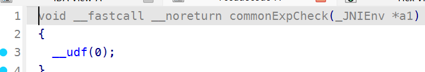
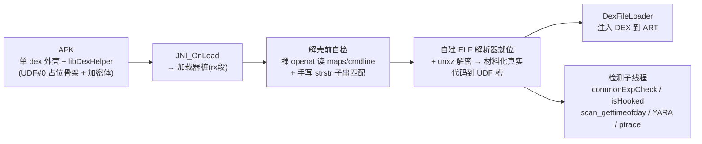
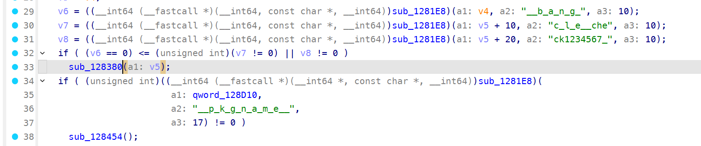
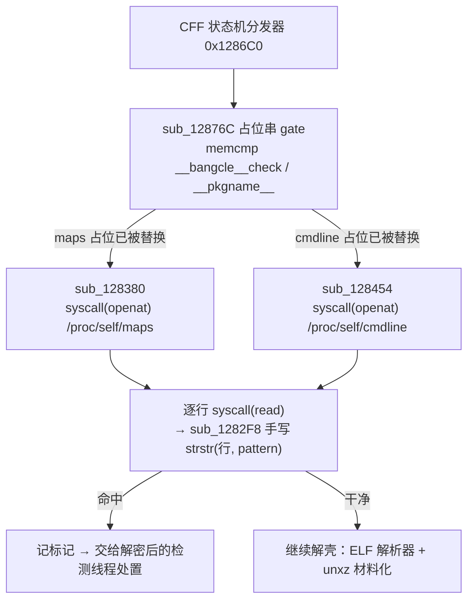
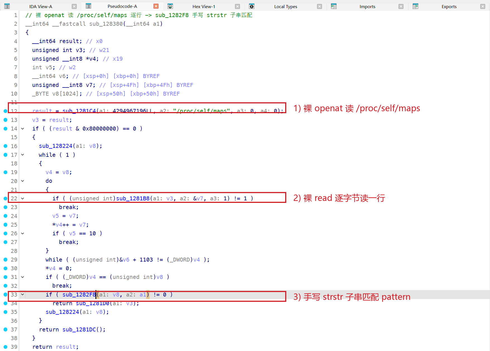
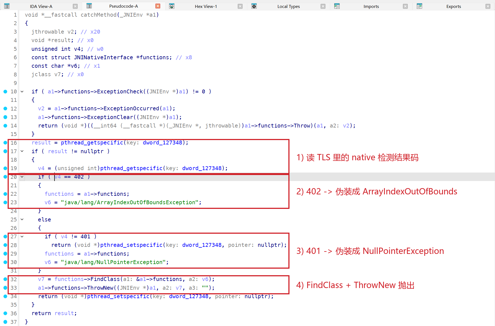
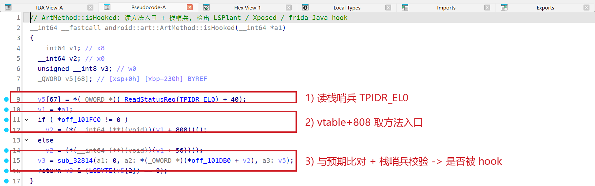
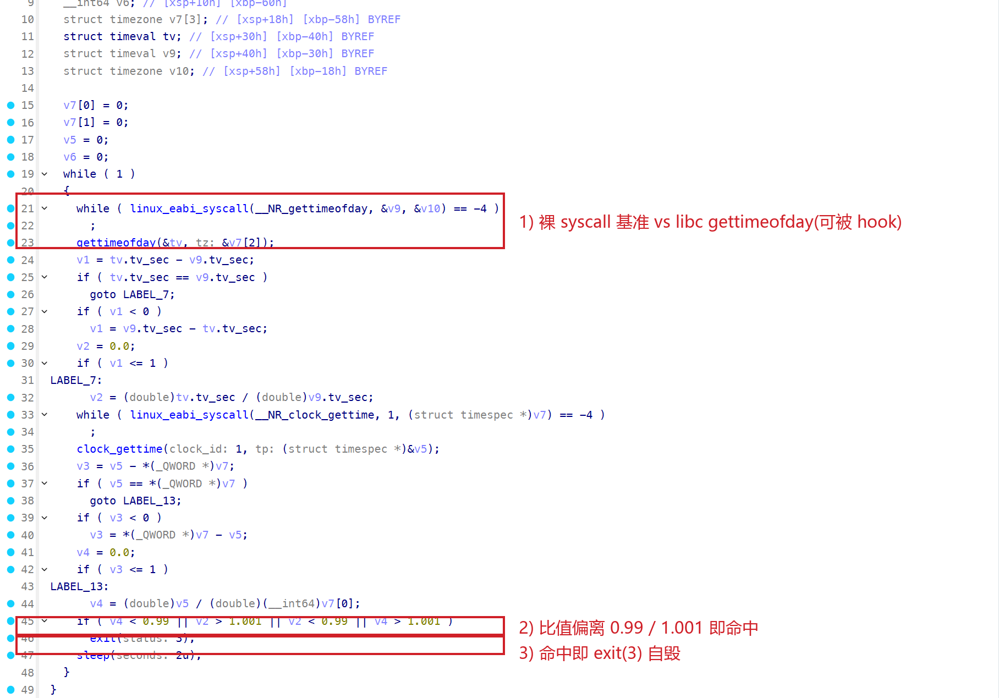
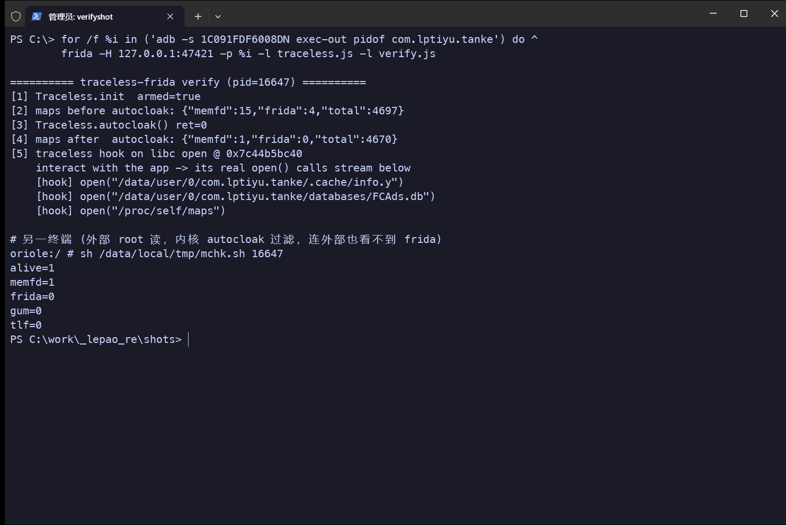

## 前言

目标是**步道乐跑**（`com.lptiyu.tanke`，版本 4.2.8），一款校园跑步打卡 App，用 **SecNeo（梆梆安全）** 加固。用官方 frida 一 attach，进程 1 秒内自毁：`Fatal signal 11 (SIGSEGV)`、`fault addr` 是个页内小地址、栈被清空、崩在启动阶段。这是加固壳**检测到 frida 后主动投毒自毁**，不是普通闪退。`lib/arm64-v8a/` 下是 SecNeo 三件套：`libDexHelper.so`（加载器 / 反篡改核心）、`libdexjni.so`（壳运行时）、`libDexHelper-x86.so`，只有一个加密的 `classes.dex` 外壳。

SecNeo 和某盾 `libnesec` 不同：它把 `libDexHelper.so` 做成一个**几乎全是 `UDF #0` 占位槽的骨架**：函数符号名保留、函数体加密，运行时才由加载器桩解密并材料化到占位槽里。所以**纯静态**能看到的只有两块真实代码：rx 段的加载器桩（裸-syscall 自检 + 自建 ELF 符号解析器），以及从符号表 + 导入勾出的检测能力面（能看到 `isHooked` / `scan_gettimeofday` 这些名字，但函数体是 `__udf(0)`，判据静态不可得）。

本文没有停在这条边界上。既然真实代码只在运行时材料化，那就**从运行中的进程把解密后的 `libDexHelper` dump 出来**，再把加密体里的检测函数一个个反编译：`ArtMethod::isHooked`、`scan_gettimeofday`、`commonExpCheck`、以及 SecNeo 自带的 inline-hook 引擎，全部拿到真实逻辑与具体阈值。dump 本身也不轻松：SecNeo 关了 `PR_SET_DUMPABLE`、自附加 ptrace，`/proc/pid/mem` 读不了；这里用的是"先让进程活下来、再让 Frida 在它眼皮底下隐身读内存"的组合，后半篇的无痕方案也借此做了现场验证。

全文脉络：现象（frida 自毁）→ 壳结构（UDF 占位）→ 加载器桩自检（静态）→ 自建 ELF 解析器（静态）→ **dump 还原加密体 → 检测面逐个反编译**（本文重点）→ 工程结论：让 Frida 在 SecNeo 上无痕存活，并把隐身手段逐条对回真实检测面。

## 现象：frida 一碰就自毁

拿官方 **stock frida-server 17.18.0** `spawn` / `attach` 步道乐跑，进程 **1 秒内自毁**。tombstone 一眼就是**故意投毒**，不是普通空指针崩溃：

```
signal 11 (SIGSEGV), code 1 (SEGV_MAPERR), fault addr 0x000000000000097c
    x0  0000000000000000  x1  00000000b6a2897f  x2  0000000000000fff
    x8  00000000b6a2897f  x9  000000000000097c  x10 00000000b6a2897f
    lr  0000000000000000  sp  0000000000000000  pc  000000000000097c
2 total frames
      #00 pc 000000000000097c  <unknown>
      #01 pc 0000000000000000  <unknown>
pid: 17049, tid: 17049, name: om.lptiyu.tanke  >>> com.lptiyu.tanke <<<
```

三点定死这是**寄存器投毒的间接跳转**：

1. **`sp = 0`、`lr = 0`**，回溯只剩 2 帧全 `<unknown>`，栈被显式清零，让 unwinder 无从回溯，真实检测点被抹掉。
2. **`pc = x9 = 0x97c`**，一个**页内偏移量级（<0x1000）的垃圾地址**，未映射且不可执行 → `esr` 为取指异常（Instruction Abort）。
3. **`x1 = x8 = x10 = 0xB6A2897F`**（重复出现的"本应调用"的函数指针）配 **`x2 = 0xFFF`**（页掩码）：手法是**取一个函数指针的低位偏移当跳转目标**（`0xB6A2897F` 低 12 位 `0x97F`，落点 `0x97C` 同页量级），掩掉高位一跳，必落未映射小地址而崩。

**烟枪**就在同一份 tombstone 的 maps 里：

```
00000079'0cd0f000-...  r-x  /memfd:frida-agent-64.so (deleted)
00000079'0e3df000-...  r-x  /memfd:frida-agent-64.so (deleted)
...
```

stock frida 的 agent 以 **`/memfd:frida-agent-64.so`（带名）** 落在进程 maps 里，SecNeo 一扫就中 → 投毒自毁。**对照**：换成隐身注入的 frida（agent 落成匿名 `rwx`、maps 里无 `frida`/`gum`/`memfd` 名），同样 `spawn`/`attach`，进程**存活进 `MainActivity`**，杀点就是"maps 里有没有带名的 frida"。这条线怎么扫、还有哪些别的检测线（时序、ART hook、函数完整性），接下来从**解密后的 libDexHelper** 里逐个逆出来。

## 壳结构：UDF #0 占位骨架 + 加密体

解包 APK，`lib/arm64-v8a/` 下 SecNeo 三件套：`libDexHelper.so`（加载器 / 反篡改核心，1,066,333 字节）、`libdexjni.so`（壳运行时，7,914,765 字节）、`libDexHelper-x86.so`。只有 1 个 `classes.dex`（外壳，真 dex 加密）。启动日志印证壳的加载流程：

```
Load ... base.apk!/lib/arm64-v8a/libDexHelper.so ... ok
ClassNotFoundException: Didn't find class "com.lptiyu.tanke.lp"      # 壳的正常加载流程
Load ... base.apk!/lib/arm64-v8a/libdexjni.so ... ok
```

IDA 载入 `libDexHelper.so`：509 个函数，符号名大量保留（`commonExpCheck`、`ArtMethod::isHooked`、`DexFileLoader`、自建解析器类等），**但函数体几乎全是 `__udf(0)` 占位**。随手反编译几个：

```c
void __noreturn commonExpCheck(_JNIEnv *a1)                 { __udf(0); }   // 检测总入口
void __noreturn catchMethod(_JNIEnv *a1)                    { __udf(0); }
void __noreturn ...::GnuLookup(basic_string_view, unsigned) { __udf(0); }   // ELF 符号解析
```



`UDF #0`（`0x0000`）是未定义指令占位。SecNeo 的做法是：**保留符号名与占位槽，把真实机器码加密**；加载器桩在运行时解压（内置 `unxz` / `xz_crc64`）并借自建 ELF 解析器就位后，把真实代码材料化到这些占位槽，即**原地覆盖**：`.text` 里 `commonExpCheck` 入口那 4 字节从 `00 00 00 00`（`__udf(0)`）在运行时变成 `ff 83 01 d1`（`SUB SP, SP, #0x60`，标准函数序言）。这一步是本文后半"dump 还原"的字节级依据：占位槽在运行时确实被真实序言填满。

所以纯静态唯一可读的真实代码是 rx 段那一小块加载器桩，它负责解壳前的自检与解密引导。检测函数体（`isHooked` / `scan_gettimeofday` / `commonExpCheck` …）要等材料化之后才有内容，本文用内存 dump 把它们取回来逐个还原（见后文"还原加密体"）。

从加载到检测面材料化的总览如下（本文聚焦解壳前自检与解密后的检测面两段）：



下面依次还原：加载器桩自检（静态）、自建符号解析器（静态）、**dump 出加密体后逐个反编译检测面**（重点）。

## 加载器桩：解壳前的裸-syscall 自检

加载器桩在解密 payload **之前**先跑一轮 maps / cmdline 自检，入口是 `sub_12876C`：

```c
// v5 指向打包时可被替换的占位缓冲；参考占位串 = "__bangcle__check1234567_"
v6 = memcmp(v5,      "__b_a_n_g_", 10);
v7 = memcmp(v5 + 10, "c_l_e__che", 10);
v8 = memcmp(v5 + 20, "ck1234567_", 10);
if ((v6 == 0) <= (v7 != 0) || v8 != 0)
    sub_128380(v5);                               // 占位串已被替换 -> 用真实 pattern 扫 maps
if (memcmp(qword_128D10, "__p_k_g_n_a_m_e__", 17) != 0)
    sub_128454();                                 // 占位串已被替换 -> 扫 cmdline
// ... 之后才是 ELF 解析 / mprotect / xor 解密（真正脱壳）
```

要匹配的 pattern 是**打包时烧进 APK 的配置**，`libDexHelper.so` 里只留占位串 `__bangcle__check1234567_` / `__pkgname__`，真值加密，静态拿不到明文。一个反取证细节：连**比较用的字面量本身也被下划线打散**：比的是 `"__b_a_n_g_"` + `"c_l_e__che"` + `"ck1234567_"` 三段，而不是连续的 `bangcle`；`strings | grep -i bangcle` 一无所获，得看反编译才能拼回占位串原形。



maps 读取 `sub_128380`：

```c
result = sub_1281C4(0xFFFFFF9C, "/proc/self/maps", 0, 0);   // sub_1281C4 = syscall(openat, AT_FDCWD, ...)
sub_128224(v8);                                             // 清行缓冲
while (1) {
    v4 = v8;
    do {                                                   // sub_1281B8 = syscall(read)，逐字节读到 '\n'
        if (sub_1281B8(fd, &c, 1) != 1) break;
        *v4++ = c;
        if (c == '\n') break;
    } while (v4 != v8 + 1103);
    *v4 = 0;
    if (v4 == v8) break;
    if (sub_1282F8(v8, pattern) != 0)                      // 每行做子串匹配，命中即返回
        return sub_1281D0(fd);
    sub_128224(v8);
}
```

这一层从头到尾不碰一个 libc 函数：文件 I/O 全走裸系统调用，字符串操作全部手写内联，任何 libc 层 hook（`open`/`read`/`strstr`/`memcmp`）都拦不住它：

| 封装 | 实现 | 类型 |
| --- | --- | --- |
| `sub_1281C4` | `syscall(__NR_openat, AT_FDCWD, path, flags)` | 裸 syscall |
| `sub_1281B8` | `syscall(__NR_read, fd, buf, n)` | 裸 syscall |
| `sub_1281D0` | `syscall(__NR_close, fd)` | 裸 syscall |
| `sub_1281A0` | `syscall(__NR_mprotect, addr, len, prot)` | 裸 syscall |
| `sub_1282DC` | `strlen`（手写循环） | 手写 libc |
| `sub_1281E8` | `memcmp`（逐字节，带长度上限） | 手写 libc |
| `sub_128224` | `memset(buf, 0, 1024)`（4 路展开清缓冲） | 手写 libc |
| `sub_1282F8` | `strstr`（`sub_1282DC` 求长 + `sub_1281E8` 逐段比） | 手写 libc |

`sub_128454` 与 `sub_128380` 同构，读 `/proc/self/cmdline` 与 `qword_128D10`（cmdline pattern）比对：`__pkgname__` 占位对应的是**进程名 / 包名一致性**校验（防重打包、防跑在错误宿主进程里）。

还有一处细节：连这段加载器桩本身也套了 **OLLVM 控制流平坦化**，`sub_12876C` 的调用要经一段状态机分发器（`0x1286C0`：`CMP W0,#0x46 / #0x105 / #0x111 / #0x15` + `MUL W0,W0,W3; ADD W0,#0x74` 的不透明状态转移）绕进去的。

解壳前自检链：



这轮自检的作用是在壳解密之前先确认 maps / cmdline 干净，且全程零-libc，把"先 hook 住 `open`/`read` 再放行脱壳"这条常规路直接堵死。



## 自建 ELF 符号解析器：反 PLT / dlsym hook

SecNeo 解析 libc / libart 符号不走 `dlsym`，它自带一套 ELF 解析器（混淆类名 `p5lS5...`），从符号表能还原出它的方法集：

```
findModuleBase(...)          // 走 /proc/self/maps 定位目标库基址
parse(elf64_hdr *)           // 解析 ELF 头 / program header
ElfHash / GnuHash            // 两套符号哈希
GnuLookup / ElfLookup        // 按哈希查 .gnu.hash / .hash 表
LinearLookup / LinearRangeLookup / PrefixLookupFirst
getSymbOffset(view, j, j)    // 取符号在库内偏移
xzdecompress()               // 载荷 XZ 解压
```

它**自己走目标库的 `.dynsym` / `.hash` / `.gnu.hash` 哈希表取符号地址**，`dlsym` hook、PLT/GOT hook 一律失效（比常见的"内联解密符号名 + `dlsym`"更彻底）。解析器就位后，它把 libc 原语地址填进内部函数表，后续所有底层调用都经这张表间接发起。从符号表可见它解析的原语：

```
__system_property_get   access   dlopen   dlsym   fopen   fscanf   sscanf
mprotect   readlink   getpid   gettid   sigaction   ptrace   pthread_*
```

（`dlopen`/`dlsym` 仍解析，是给它自己按需用；核心符号走上面的哈希解析。）

## 还原加密体：从运行进程 dump 解密后的 payload

检测函数体是加密的，静态只有符号名。要拿到真实判据，唯一的办法是**在它材料化之后、从进程内存把解密后的 `libDexHelper` 取回来**。这一步本身就撞上 SecNeo 的反调试：

- `/proc/<pid>/mem` 直接读 → 0 字节。SecNeo 在启动早期 `prctl(PR_SET_DUMPABLE, 0)` 并**自附加 ptrace**，把自己变成不可 dump；`toybox dd` / `busybox dd` 走 `/proc/pid/mem` 一律失败。
- 常规 frida dump → `abort was called`：进程里一出现可见的 frida，`commonExpCheck` 那套检测立刻命中并把进程打断（正是本文要逆的东西）。

所以 dump 的前提，是让 frida 在进程里隐身、检测扫了个空：

1. **autocloak 让 frida 在它眼皮下隐身**：`Traceless.init({autocloak:true})` 由 KPM 在内核层把 frida 自身的 memfd 从 maps 抹掉，YARA / maps-scan 扫不到，检测不触发。
2. **用 frida `readByteArray` 读内存**（绕开 `/proc/pid/mem` 的 dumpable 限制）：定位 `libDexHelper` 的 rwxp 解密段（`base` 起 `0xF9000`），整段读回本地。

```js
Traceless.init({ autocloak:true });                // 内核隐身，检测扫空
var m = Process.getModuleByName('libDexHelper.so');
var buf = m.base.readByteArray(0xF9000);           // 读解密后的 .text
send({tag:'dump'}, buf);                            // 落地本地文件
```

dump 回 1,019,904 字节，拼回 ELF（解密段覆盖静态文件对应偏移、清 section header 让 IDA 按 program header 的 `R+X` 段分析），验字节：`commonExpCheck` 入口从静态的 `00 00 00 00`（UDF）变成 `ff 83 01 d1 f7 13 00 f9 f6 57 03 a9`（`SUB SP,#0x60` / `STR X23` / `STP X22,X21`），材料化得到确认。IDA 里对每个检测函数 `undefine → define code → define func` 即可反编译。下面逐个还原。

## 检测面还原（解密体反编译）

以下全部来自 dump 回的解密体反编译，是真实函数逻辑与具体阈值，不再是符号名推断。

### commonExpCheck / catchMethod：把"检测命中"伪装成普通 Java 异常

检测结果的出口是相邻的两个函数：`commonExpCheck` 在有 pending 异常时构造一个内部状态串（明文 `"COMMON EXP found"`），真正把结果翻成 Java 异常抛回去的是紧随其后的 `catchMethod`。`catchMethod` 反编译出来只有一屏，逻辑完整，抛的是伪装过的普通异常：

```c
void *__fastcall catchMethod(_JNIEnv *a1)
{
  if ( a1->functions->ExceptionCheck(a1) )              // JNIEnv+0x720
  {
    v2 = a1->functions->ExceptionOccurred(a1);          // +0x78
    a1->functions->ExceptionClear(a1);                  // +0x88
    return a1->functions->Throw(a1, v2);                // +0x68   透传已有异常
  }
  result = pthread_getspecific(dword_127348);           // 读 TLS 里的 native 检测结果码
  if ( result != NULL ) {
    v4 = (unsigned int)pthread_getspecific(dword_127348);
    if ( v4 == 402 )      v6 = "java/lang/ArrayIndexOutOfBoundsException";
    else if ( v4 != 401 ) return pthread_setspecific(dword_127348, NULL);
    else                  v6 = "java/lang/NullPointerException";
    v7 = a1->functions->FindClass(a1, v6);              // +0x30
    a1->functions->ThrowNew(a1, v7, "");                // +0x70   抛出，message 为空
    return pthread_setspecific(dword_127348, NULL);
  }
}
```

native 检测 worker（`sub_D42BC`）把命中结果写进一个 **TLS 槽**（`pthread_getspecific(dword_127348)`），`catchMethod` 读出来：`402` → 抛 `ArrayIndexOutOfBoundsException`，`401` → 抛 `NullPointerException`，其余清 TLS 返回。JNIEnv 偏移全部对得上（`+0x720`=`ExceptionCheck`、`+0x78`=`ExceptionOccurred`、`+0x88`=`ExceptionClear`、`+0x68`=`Throw`、`+0x70`=`ThrowNew`、`+0x30`=`FindClass`）。

命中检测后它抛的是 **`NullPointerException` / `ArrayIndexOutOfBoundsException`**，不是 `SecurityException("hook detected")` 那种一眼能定位的异常，且 `ThrowNew` 的 message 是空串，在业务栈里看着就像一次普通的空指针 / 数组越界，把"检测命中"藏进最常见的崩溃噪声里，专门迷惑分析者。



### ArtMethod::isHooked：ART 方法 hook 检测 + 栈哨兵

`android::art::ArtMethod::isHooked(JNIEnv*, jobject)`：

```c
guard = _ReadStatusReg(TPIDR_EL0);              // 线程栈哨兵
saved = *(guard + 40);
v12 = (*(*(void**)artMethod + 808))(artMethod, ...);   // vtable+0x328 虚调用：取方法入口
v13 = sub_32814(0, *(v12 + K), &out);           // 比对入口指针 vs 预期
if ( *(guard + 40) != saved )                   // 栈哨兵被动过
    abort_path(v13);                             // → 自毁
return (v8)v13 & (arg == 0);                     // 返回是否被 hook
```

它从 `jobject`/`jmethodID` 取到 `ArtMethod`，经 vtable 偏移 `0x328` 的虚方法读方法入口点与预期比对，改了 entry_point 的 **LSPlant / Xposed** 与 **frida 的 Java 桥**都会被抓到。全程套**栈哨兵**（`TPIDR_EL0+40`），检测途中栈一旦被别的 hook 动过就直接走自毁。符号表里配套的 `entry_point_offset` / `data_offset` / `art_method_size` / `FromReflectedMethod` 印证了它对 `ArtMethod` 内部布局的完整建模。



### scan_gettimeofday：裸-syscall vs libc 的时序比值

时序反调试/反 hook，判据很具体：同一时刻用裸 syscall 和 libc 封装各取一次时间，求比值，偏离 1 超阈值即命中：

```c
while (1) {
    while (syscall(__NR_gettimeofday, &t_raw, 0) == -EINTR) ;   // 裸 syscall 基准
    libc_gettimeofday(&t_lib, 0);                              // 可能被 hook 的 libc
    r1 = (double)t_lib.sec / (double)t_raw.sec;

    while (syscall(__NR_clock_gettime, CLOCK_MONOTONIC, &c_raw) == -EINTR) ;
    libc_clock_gettime(CLOCK_MONOTONIC, &c_lib);
    r2 = (double)c_lib / (double)c_raw;

    if ( r2 < 0.99 || r1 > 1.001 || r1 < 0.99 || r2 > 1.001 )  // 命中
        exit(3);                                              // 直接退出（noreturn）
    sleep(2);                                                 // 干净则继续轮询
}
```

两条独立时钟（`gettimeofday` + `CLOCK_MONOTONIC`）交叉验证，**阈值写死 `0.99` / `1.001`**（±1% / ±0.1%）。libc 时间函数若被 hook（改返回值）或进程被 ptrace 单步/断点拖慢，libc 与裸 syscall 的读数就会偏离，比值越界即 `exit(3)` 自毁；裸 syscall 不经 libc，骗不过。自毁分支里反复出现常量 `0x10102464C457F`，低 4 字节 `7F 45 4C 46` = `\x7fELF` 魔数，被复用作混淆加数（`isHooked` 里同一个常量），OLLVM 常量混淆的痕迹。



### wrapHook / hookFunAddr_read：SecNeo 自带的 ARM64 inline-hook 引擎

这两个函数属于 SecNeo 的**反 hook 军备**，不是检测项：它自己实现了一套 ARM64 inline-hook，用来抢先占坑关键函数、或校验函数首字节是否已被别人 `B` 覆盖。`hookFunAddr_read` 是安装器：

```c
ps = sysconf(_SC_PAGESIZE);
mmap(page_of(target), ..., PROT_READ|PROT_WRITE|PROT_EXEC);      // 目标页改可写
if ( (target[0] & 0x1C000000) != 0x14000000                     // 首指令不是 B
     || (target[0] & 0xFFC0001F) == 0xD500001F ) {              // 或是 NOP/hint
    save2 = *(u128*)target;                                      // 备份 2 条原指令
    tramp = build_trampoline(...);
    *(u128*)tramp = save2;  cacheflush();                        // 原指令搬到蹦床
    target[0] = 0x14000000 | (((tramp-target) >> 2) & 0x3FFFFFF); // 首指令改写为 B tramp
}   // else: 目标本身就是 B → 直接改分支目标
```

`wrapHook` 造蹦床：`mmap` 208 字节 → 拷入模板机器码（`qword_E46A0..E4720`）→ 回填被 hook 地址/原函数/参数 → 末尾写魔数 `0xD65F03C0F94017DE`（`LDR X30,[X30,#0x28]; RET`）→ `mprotect` 置可执行 + 刷 cache，标准的"改首指令为 `B`、原指令重定位到蹦床"。它的存在也解释了 SecNeo 为何对**别人**的 inline-hook 敏感：它自己就这么干，`hookFunAddr_read` 读关键函数首字节判断是否已被 `B` 覆盖，是同一套思路的反向应用。

### 其余检测面（解密体符号 + 导入佐证）

剩余几项在解密体里有对应符号，判据方向可确证：

| 检测项 | 解密体证据 | 机制 |
| --- | --- | --- |
| 内存签名扫描 | `_yr_scanner_scan_mem` / `memmem` | 内置 **YARA** 引擎扫进程内存，匹配 frida / gum / hook 特征串 |
| 反调试 | 导入 `ptrace` / `prctl` / `sigaction` / `kill` | `PR_SET_DUMPABLE=0` + 自附加 ptrace（本文 dump 时实测撞上）；`sigaction` 装 SIGSEGV/SIGTRAP handler 接管信号 |
| 网络探测 | 导入 `socket` / `connect` | 探测 frida 默认端口（27042 一类）/ 本地服务 |
| 正则匹配 | 导入 `regcomp` / `regexec` / `regfree` | 对 maps 行 / 系统属性做正则判定 |
| 加载器桩自检 | `sub_12876C` / `sub_128380` / `sub_128454`（已还原） | 裸 openat 读 maps / cmdline + 手写 strstr（解壳前先跑） |

## 脱壳链与 DEX 注入

从符号表还能拼出解壳链：加载器桩用**自建 ELF 解析器**就位符号 → **`unxz` / `xz_crc64`** 解压加密载荷 → **`DexFileLoader::LoadV26 / LoadV28 / LoadV34_BETA1 / LoadV34_D`**（按 ART 版本注入 DEX）→ **`safejni::invoke / invokeStatic`**（把检测结果与解壳产物回填 Java 层）。`DexFileLoader` 的多版本 `Load*` 正对应不同 Android 的 `DexFile` 内部结构差异。

## 应用：让 Frida 在 SecNeo 上无痕存活

还原出的检测面是分条独立的，隐身也就得分条对付。这里如实分开说：对本例（步道乐跑），实测决定性的是第一层，即**隐身注入**；第二、三层针对的是检测面里确实存在、但本次未在它身上观测到触发的检测线，作为加固与通用性兜底。

**① 隐身注入：agent 不带名落进 maps（本例实测决定性）**
文首那个 0x97c 自毁，杀点就是 stock frida 的 agent 以 `/memfd:frida-agent-64.so`（带名）暴露在 maps 里。用 patch 过的 frida-server（injector 命名空间改名、不走 jvmti、agent 落成**匿名 `rwx` 段、无 `frida`/`gum`/`memfd` 名**），SecNeo 的 maps 按名扫描就扫了个空。**实测同款对照**：stock frida `spawn` → 1 秒 0x97c 自毁；隐身注入的 frida `spawn`/`attach` → 进程存活进 `MainActivity`。**只靠这一层**，普通 frida 就已经能在 lptiyu 上存活，甚至用 plain `Interceptor` 改了它自己库 80 个函数的 `.text` 也没被杀（见下）。所以本例的自毁触发线，就是这一条 maps 按名扫描。

**② 无痕 hook：目标 `.text` 一字不改（加固；本例实测未被触发）**
隐身注入只解决"查无此名"，可一旦 `Interceptor.attach` 装 hook，仍会把目标函数首指令改写成 `LDR X16;BR X16` 跳板（实测：首字节从正常序言变成 `50 00 00 58 00 02 5f d6`，页变 `rwx`），这是一切 `.text` 完整性 / CRC 自检要抓的痕迹。但对 SecNeo（步道乐跑）要如实说明：我用 plain `Interceptor` 改了它自己库 80 个导出、又精确改了它自己那 6 个检测函数（`scan_gettimeofday`/`isHooked`/`commonExpCheck`/`catchMethod`/`hookFunAddr_read`/`wrapHook`）的 `.text`，进程都没被杀，说明 SecNeo 在本例里没有一个盯 native `.text` 的完整性自检（`hookFunAddr_read` 反编译看是它自己装 inline-hook 的安装器，不是检测器）。所以 traceless 的 `.text` 不改在 lptiyu 上是**没打响的加固**：它真正救命是在有 CRC / 首字节完整性自检的壳上（如 libc CRC 一被改就 `SIGSEGV` 的那类），那时 plain frida 的 `LDR X16;BR X16` 必被抓，traceless 的 KPM 区域克隆（`PTE_UXN` + `do_page_fault` 路由进位置无关 DBI 克隆、`.text` 不写不可写无 rwx 蹦床）才是唯一解。此外 traceless 原生 only、不碰 Java，规避走 ART 的 `isHooked`；用 Morphida 时 agent 本就无 Java bridge，这一条自动满足。

**③ 藏 Frida 自身：内核 autocloak（加固，非本例必需）**
无痕 hook 只保证目标干净；Frida 自己（agent / Gum JIT 的 memfd）还在 maps 里，正是 SecNeo 的 YARA 内存扫描 + maps memfd 计数要抓的。selfCloak 走自身 maps 把这些 memfd 加进 KPM 隐藏集；进一步把它沉进内核，给 shpte KPM 加 `autocloak`：`show_map`/`show_smap` 钩子里 owner-mm 门控 + 对刚写进 seq 缓冲的行做 frida 标记匹配（`/memfd:` / `frida` / `gum` / `jvmti`）+ 回退 `seq->count` 丢整行。相比 selfCloak：一次调用、无用户态轮询、无启动窗口、lazy JIT memfd 现读现藏。

实测（attach 到目标进程后进程内触发）：

```
[1] Traceless.init  armed=true
[2] maps before autocloak: {"memfd":15,"frida":4}
[3] Traceless.autocloak() ret=0
[4] maps after  autocloak: {"memfd":1,"frida":0}
[5] traceless hook on libc open @ 0x7c44b5bc40    # 目标真实 I/O 实时触发，进程存活
```

外部 root 从 `/proc/<pid>/maps` `grep -ci frida` 也回 0，内核层过滤，连外部读者都看不到。对回检测面：本例实测打响的只有 maps 按名扫描这一条（agent 无名即过，就是文首 0x97c 那条）；`.text` 完整性/`isHooked`、memfd 计数/YARA、`ptrace`/TracerPid 这些检测面里确实存在的线，本次未在 lptiyu 上观测到触发，`.text` 不改、autocloak 藏 memfd、TracerPid spoof 是对这些线的加固与通用性兜底（换个会全量查完整性、或注入不够隐身的场景就用得上），不是本例存活的必要条件。



## 小结：清证据，而不是击败检测

这套方案里，**Frida 脚本本身是素的**：没有针对 SecNeo 的反检测代码，只是跑在隐身注入的 frida-server 上，把 `Interceptor.attach` 换成 `Traceless.attach`、多调一句 `autocloak()`。就本例而言，真正打响、决定存活的是隐身注入这一层（agent 在 maps 里查无此名，否则就是文首的 0x97c 自毁）；无痕 hook 与 autocloak 是对检测面里其余线（`.text` 完整性、memfd/YARA）的加固，本次未在 lptiyu 上观测到触发。存活靠的是下层的隐身基础设施，把已还原的每条检测线都备好对策，比脚本级逐项对抗更耐久，哪怕本例只用上了第一条。

## 总结

1. **壳结构**：`libDexHelper.so` 是 **UDF #0 占位骨架 + 加密体**：符号名保留、函数体几乎全是 `__udf(0)`，运行时由加载器桩解密材料化（`commonExpCheck` 入口 `00 00 00 00` → `ff 83 01 d1` 字节级验证）。纯静态可读的真实代码只有 rx 段加载器桩。
2. **加载器桩自检**：解壳前先用**裸 openat/read**读 `/proc/self/maps` 与 `/proc/self/cmdline`，对**打包时烧入的 pattern**（占位 `__bangcle__check` / `__pkgname__`，且比较字面量被下划线打散躲 `strings`）做手写 strstr 子串匹配，绕过一切用户态 open/read hook。
3. **反 PLT/dlsym hook**：自带 ELF 解析器（`findModuleBase` / `parse(elf64_hdr)` / `GnuHash` / `ElfHash` / `GnuLookup`），自己走目标库哈希表取符号地址。
4. **dump 还原加密体**：`autocloak` 让 frida 在进程里隐身（检测扫空），用 `readByteArray` 绕开被 `PR_SET_DUMPABLE=0` 封死的 `/proc/pid/mem`，把解密后的 `libDexHelper` 取回反编译。
5. **检测面（真实判据，非推断）**：`catchMethod` 读 TLS 结果码把命中伪装成 `NullPointerException`/`ArrayIndexOutOfBoundsException`（空 message）；`ArtMethod::isHooked` 读方法入口 + 栈哨兵；`scan_gettimeofday` 裸-syscall vs libc 时序比值（阈值 `0.99`/`1.001`，命中 `exit(3)`）；`wrapHook`/`hookFunAddr_read` 自带 ARM64 inline-hook 引擎；外加 YARA 内存扫描、ptrace/prctl 反调试、socket 网络探测。
6. **自毁触发（实测可复现）**：stock frida-server `spawn`/`attach` → 1 秒内 `fault addr 0x97c` 投毒自毁（`lr=sp=0`、栈清空、2 帧全 `<unknown>`，与历史 `0x88c` 同款机制）；tombstone 的 maps 里 `/memfd:frida-agent-64.so` 即杀点：SecNeo 扫到带名 frida agent 即投毒跳转。
7. **无痕存活（隐身层备齐，本例只用上第一层）**：① 隐身注入让 agent 在 maps 里无名，**本例实测决定性**（过 maps-name 扫描，否则即 0x97c）；② traceless KPM hook `.text` 不改（过 `hookFunAddr_read` 完整性与 `isHooked`）、③ 内核 `autocloak` 过 memfd 计数/YARA，是对已还原检测线的加固，本次未在 lptiyu 上观测到触发（hook 它自己库 80 个函数改了 `.text` 也没被杀）。清证据而非击败检测。

## 工具

| 工具 | 用途 |
| --- | --- |
| [ida-pro-mcp](https://github.com/mrexodia/ida-pro-mcp) | 逆向 `libDexHelper.so`：静态定位 UDF 占位骨架 / 加载器桩裸-syscall 自检 / 自建 ELF 解析器；对 dump 回的解密体 `undefine→define func→decompile` 还原检测函数 |
| [stealth-core](https://github.com/1013503897/stealth-core) | shpte KPM：无痕 inline hook、maps-hide；本文新增 `autocloak` verb |
| [traceless-frida](https://github.com/1013503897/traceless-frida) | Frida 前端无痕 hook（`Traceless.replace/attach`）+ `selfCloak` / `autocloak`；autocloak 隐身下 `readByteArray` dump 解密体 |
| ZygiskNext / APatch | superkey-less 的 KPM 加载与管理 |
