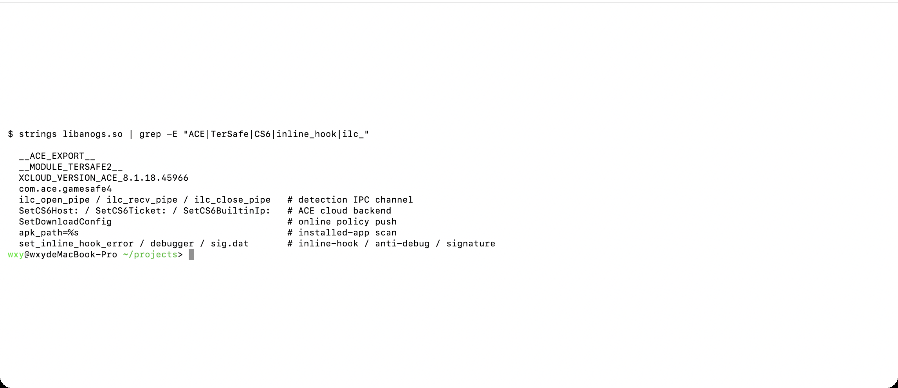
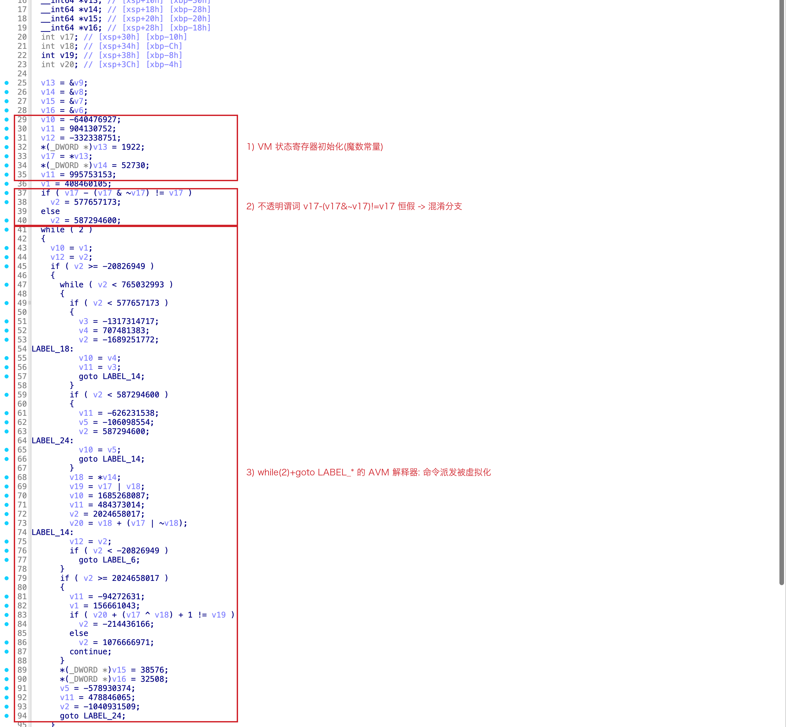
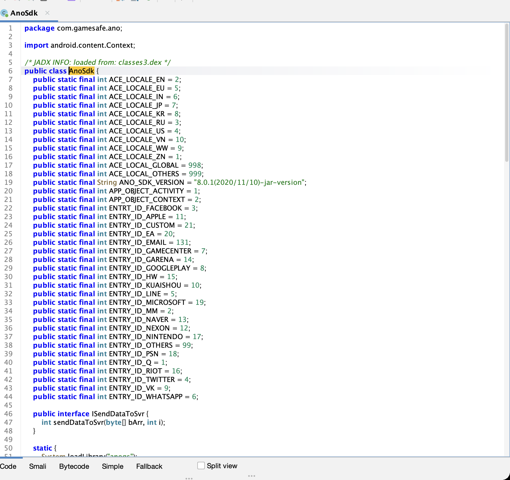
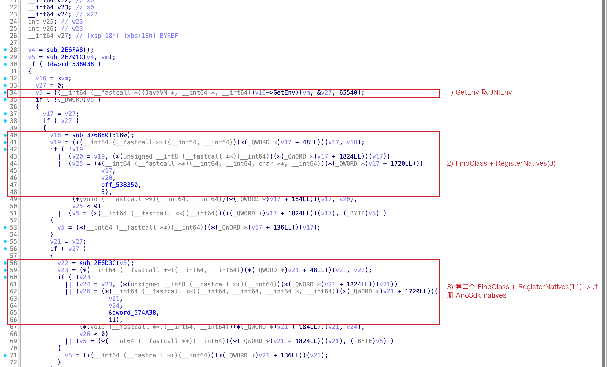
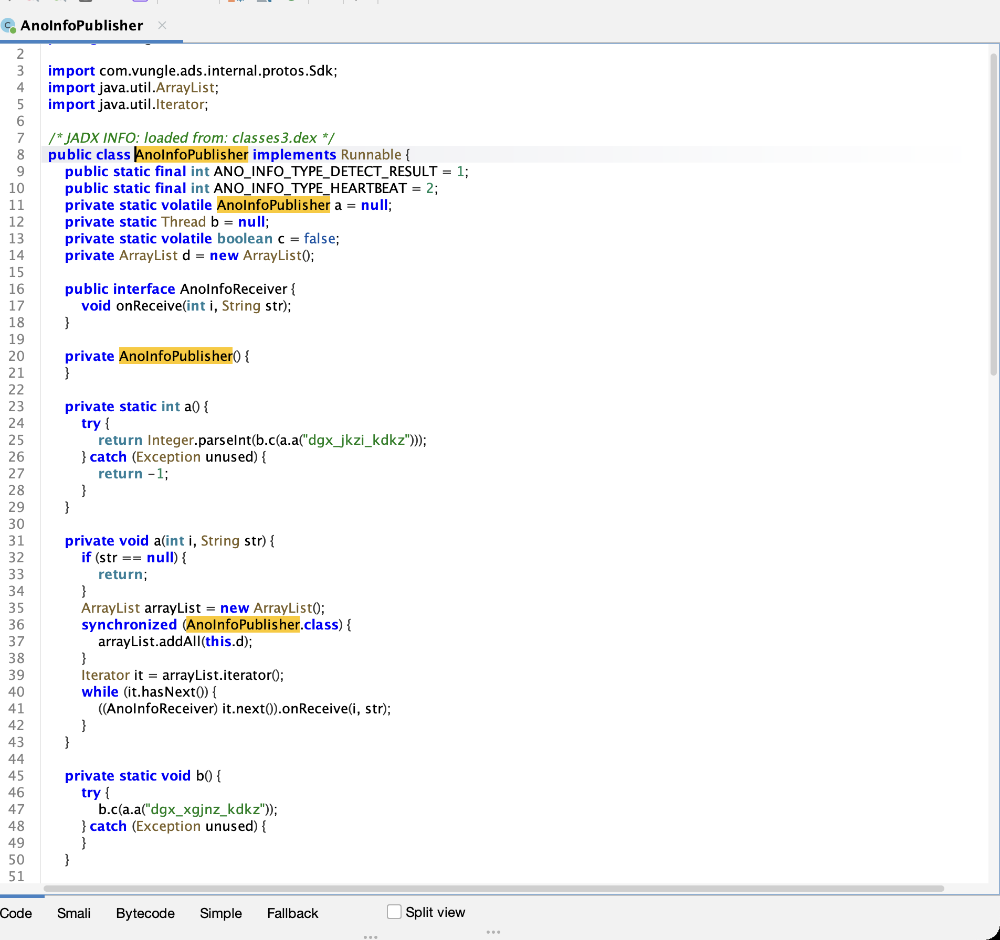
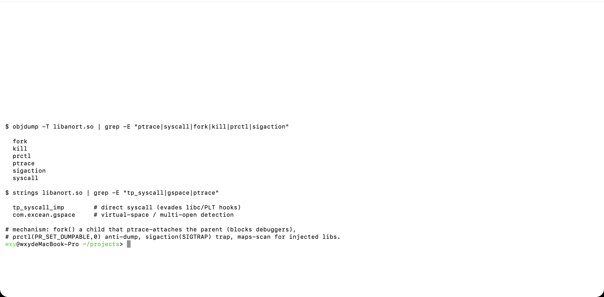
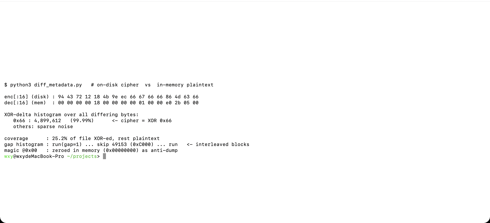
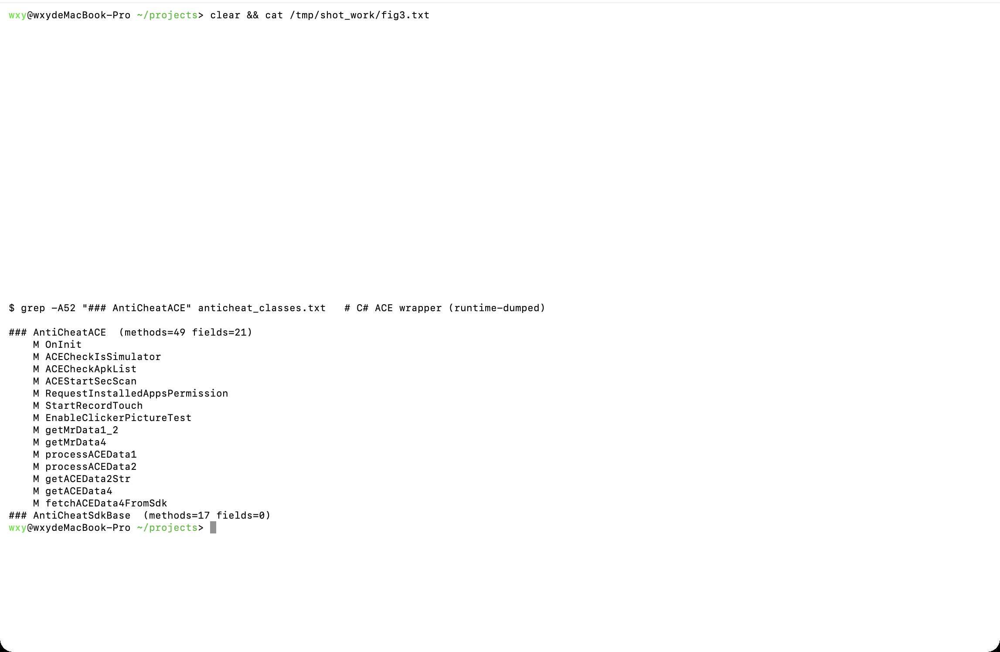

一款 Unity(IL2CPP, Unity 2020.3.49f1) 海外枪战手游，端上叠了四层防护。本文按"先摸清防护栈 → 再攻破最硬的两层"的顺序，重点复盘两件有看点的事：

1. **绕过腾讯 ACE 的反注入**：直接 attach frida 会被 ACE 秒杀，改用纯 root 的**被动内存取证**拿到解密后的 IL2CPP metadata；
2. **逆加固对 metadata 的混淆**：还原它 XOR-0x66 交错块 + 内存抹零 magic 的手法，把静态 dumper 认不了的 metadata 重建成可解析格式，进而直接重建反作弊层的 C# 类结构。

## 防护栈总览

| 层 | 组件 | 载体 | 职责 |
|---|---|---|---|
| L0 应用壳 | **Google PairIP**(license-check) | `com.pairip.*`、`res/raw/license`、`CHECK_LICENSE` | 防重打包/防盗版/来源完整性 |
| L1 反作弊 | **腾讯 ACE / GameSafe v8.1.18** | `libanogs.so`+`libanort.so`、Java 桥 `com.gamesafe.ano.AnoSdk`、C# `AntiCheatACE` | 反调试/模拟器/多开/内存扫描/设备风险数据 |
| L2 反静态 | **IL2CPP metadata 混淆** | `global-metadata.dat`(XOR-0x66 交错块 + 内存抹零 magic) | 阻断静态 Il2CppDumper |
| L3 内存反作弊 | **CodeStage ACTk** | C# `SpeedHackDetector/WallHackDetector/Obscured*` | 抗内存改值/变速/透视 |

> 顺带纠一个易混点：包内 `libpglarmor.so`/`*_pgl.so` 是**字节 Pangle 广告 SDK 的加密组件**(`Java_com_bytedance_sdk_component_pglcrypt_PglCryptUtils_bc`)，不是加固，与反作弊无关。

## L1：腾讯 ACE 的身份与命令面

`libanogs.so` 的字符串直接暴露了它的出身——ACE(Anti-Cheat Expert) 8.1.18，含 TerSafe2 模块，导出 `AnoSDK*` 全套 C-API；命令字里能看到检测用的 IPC 管道(`ilc_*_pipe`)、云端后台配置(`SetCS6*`)、在线策略下发(`SetDownloadConfig`)、装机扫描(`apk_path`)、inline-hook 检测(`set_inline_hook_error`)与签名校验(`sig.dat`)：

这些命令字在 native 侧进入 `AnoSDKIoctl` 分发。但用 IDA F5 反编译它，出来的不是干净的分支，而是一坨状态机：`v10/v11/v12` 充当 VM 状态寄存器、满屏魔数常量、`while(2)` + `goto LABEL_*` 的解释器循环，中间还夹着 `v17-(v17&~v17)!=v17` 这类**恒假的不透明谓词**做混淆。这就是 ACE 的 **AVM(自研字节码虚拟机)**——命令派发与检测逻辑被整体虚拟化，静态读不到真实分支：

Java 侧桥类 `com.gamesafe.ano.AnoSdk` 负责 `loadLibrary("anogs")` 与全部 native 调用。它的 ioctl 命令字用 **+5 凯撒**做了轻混淆——`a.a("bzo_mzkjmo_yvov")` → `get_report_data`、`a.a("vkk_fzt:")` → `app_key:`、`dec_tss_info`(tss = TenProtect Security)：

native 侧的引导落在 `JNI_OnLoad`(F5)：取 `JavaVM` → `GetEnv` → 两次 `FindClass` + `RegisterNatives`（分别注册 3 个和 11 个 native，即上面 `AnoSdk` 那批），随后启动 ACE：

检测结果经 `AnoInfoPublisher` 这条异步管道回吐给游戏：后台线程开一条到 native 的 IPC 管道(`ilc_open_pipe`/`ilc_recv_pipe`/`ilc_close_pipe`)，循环 `recv` 检测报文，`type=1` 为命中、`2` 为心跳，派发给注册的 `AnoInfoReceiver`，最终触发踢人：

反调试与反注入放在 `libanort.so`。它 import 了一整套原语：`ptrace`+`fork`+`kill`(子进程 ptrace 看护父进程，堵住调试器)、`syscall`+`tp_syscall_imp`(直系统调用，绕开 libc/PLT 上的 hook)、`prctl`(PR_SET_DUMPABLE 反 dump)、`sigaction`(SIGTRAP 陷阱)、`strcasestr` 配合 maps 扫描找注入库，并显式检测虚拟空间/多开(`com.excean.gspace`)：

所以 `libanort` 里 `ptrace`/`fork`/`syscall` 这些 import 虽在，调用点却和 `AnoSDKIoctl` 一样经 AVM 分发，直接反汇编到不了逻辑层——这也是静态扫 `libanogs.so` 只能漏出零星特征串的原因。不 devirtualize AVM，静态深度到此为止。

## L2：加固对 metadata 做了什么，以及怎么绕过

游戏是 IL2CPP，真正的业务/反作弊 C# 逻辑在 `libil2cpp.so` + `global-metadata.dat` 里。但静态 Il2CppDumper 直接失败——`global-metadata.dat` 头部 magic 是 `0x12724394`，不是标准的 `0xFAB11BAF`。

### 被动内存取证绕过反注入

直接 attach frida 会被 ACE 检测并**秒杀进程**（预期的反注入）。换思路：以 root 直接读 `/proc/<pid>/mem`——这是**被动读取**，不 ptrace、不注入，ACE 难以感知。

在内存里解密后的 metadata 独占一个 `rw-s /dev/zero`、大小正好等于磁盘 metadata 页对齐后尺寸(19468288)的 mmap。dump 出来一看：magic 被**抹成了 0**，但 `version=24`、各 section offset 完全连续(`off_{n+1}=off_n+size_n`)——这是完好的 v24.5 metadata，加固只是校验后把 magic 抹零来防 dump：

### 逆 XOR-0x66 交错块混淆

把磁盘密文和内存明文逐字节对比，混淆算法就现形了：

- 差异字节的 `enc^dec` **99.99% 是 `0x66`** —— 即 **XOR 0x66**；
- 只有约 **25%** 的字节被 XOR，其余是明文(所以 `strings` 一直能读到方法名/类名)；
- 差异位置不是稀疏散布，而是**连续块**：一段 XOR 块、跳过约 `0xC000`(49152) 字节明文、再一段——**交错块混淆**；
- magic 则在内存里单独抹零。

手法轻量，但足以让 Il2CppDumper 的头部识别与结构解析全线崩掉。

### 重建为可解析布局

这颗 metadata 是个**非标 64-int(256B) header**(没有 rgctx、也没有 exportedTypeDefinitions)，Il2CppDumper 认不了。做法是把它**重构成标准 24.2 布局**：在 header 末尾补上 `exportedTypeDefinitions` 对——这样 `stringLiteralOffset` 从 256 变 264，正好触发 Il2CppDumper 的 24.2 识别；所有 section offset 统一 +8，数据整体后移 8 字节；再把加密的 `metadataUsage`/`customAttribute` 计数清零跳过。

之后 metadata 完整解析：**21567 类 / 183271 方法 / 102255 字段**（结构体尺寸用"段大小整除"验证：TypeDef=88B、MethodDef=32B、FieldDef=12B）。二进制侧 `MetadataRegistration` 因加固仍加密，但类/方法/字段结构不依赖它——写个 60 行的解析器直接从 metadata 提取即可。

## L1(C# 层)：从解密 metadata 重建反作弊逻辑

反作弊抽象基类 `AntiCheatSdkBase` 唯一被实现的子类是 `AntiCheatACE`(49 方法/21 字段)。它的方法名把 ACE 的检测/采集面铺得清清楚楚——模拟器检测、装机列表采集、安全扫描、自动点击器检测、触摸轨迹录制，以及 MrData(设备风险数据) 的采集/缓存/上报：

对局内检测由 `AntiCheatMgr` 负责，其 cheat-reason 枚举就是一份**检测点清单**：

- 穿墙 `ShootCrossWall/ValidCrossWall`、变速 `InvalidSpeed/ClientSpeedCheat`、飞天 `InvalidAirFly/GravityException`
- 内存修改 `MemoryCheating`、弹药 `AmmoCheat/AmmoFreeze/InvalidInfiniteAmmo`
- 伤害/位置/技能 `DamageOverDist/InvalidHitPosition/SkillDamageException` …命中即 `onServerKickOutPlayer` 踢人。

一个有意思的细节：枚举里 **`YD*` 与 `ACE*` 成对出现**(`YDTokenTimeOut`↔`ACETokenTimeOut`、`YDData2IsNull`↔`ACEData2IsNull`)，并且存在数据模型类 `ModelAntiCheatYD`——说明这套反作弊框架**在架构上按"某盾 or 腾讯 ACE 双后端"设计**，但本包里只有 `AntiCheatACE` 是被实现、被网络协议(`NetClientMrDataACE`)接上的实活后端；某盾一侧只剩休眠的模型与枚举码路，端上没有它的任何 SDK。

## 设备指纹采集面

C# 侧的指纹采集集中在 `Sdk.SDKHelper`(108 方法)：`GetAndroidID`、`GetMacAddress`、`GetAndroiOaid`(OAID)；此外 `ThinkingAnalytics` 取 `GetDeviceId`、CodeStage 的 `DeviceIdHolder`/`AndroidRoutines.GetPackageInstallerName`(校验安装来源)。底层还叠了 MSA OAID(`miitmdid`) 与 GAID。这些指纹一路喂给 ACE 的 MrData 做设备风险核验，以及埋点上报。

## 小结

- 端上真实防护 = **PairIP(壳) + 腾讯 ACE(反作弊，含 TerSafe2/AVM) + metadata 混淆(反静态) + CodeStage ACTk(内存)**，四层职责不重叠。
- ACE 的强项是**反注入 + AVM 虚拟化**：frida 直连即死，检测逻辑藏在 VM 里静态读不到；但它**挡不住被动的 `/proc/mem` 读取**——解密后的 metadata 在内存里是现成的。
- 加固对 metadata 的保护是**轻量但有效**的：XOR-0x66 交错块 + 抹零 magic + 非标 header，三招合起来废掉现成 dumper，却挡不住"对比密文明文还原变换 + 重构标准布局"这条路。
- 方法学上：**先广度铺清防护栈，再对最硬的层做定点深挖**；能被动取证就不硬刚反注入，能离线还原就不在设备上和反作弊拉锯。

*本文为对外技术稿，已脱敏——目标匿名、隐去业务动机与运行环境细节，只讲可公开考证的防护机制。*
